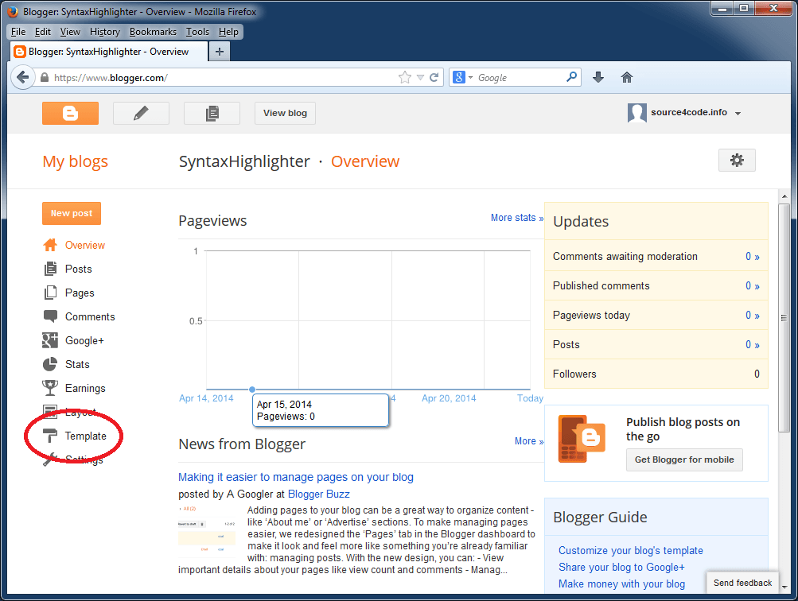
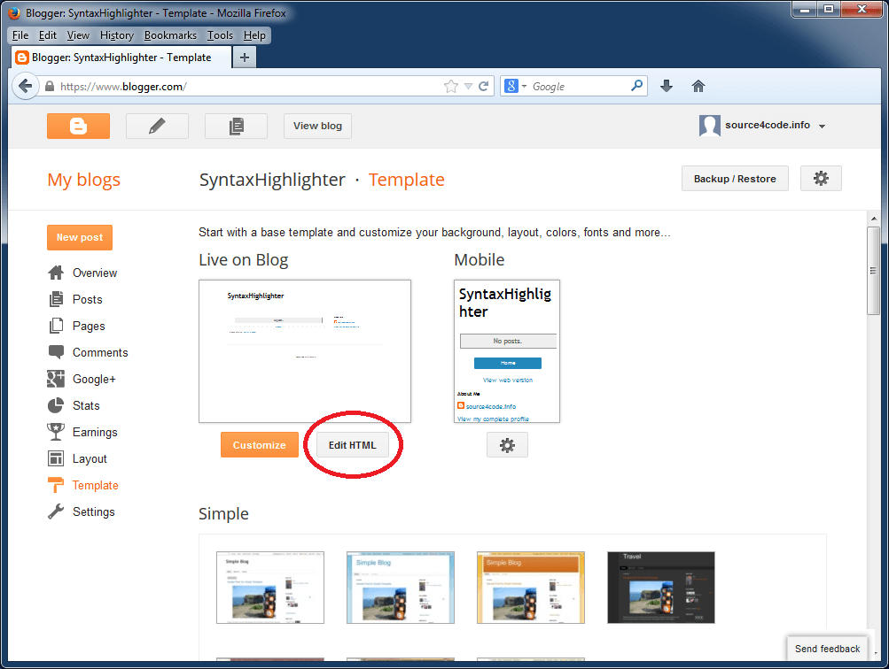
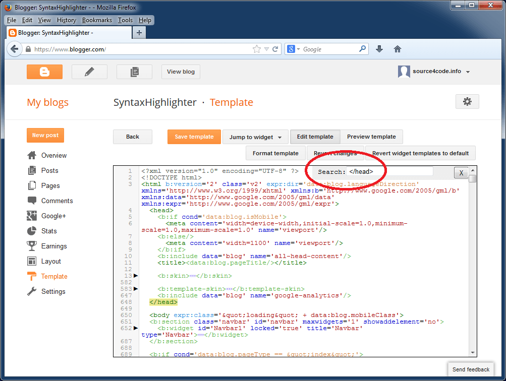
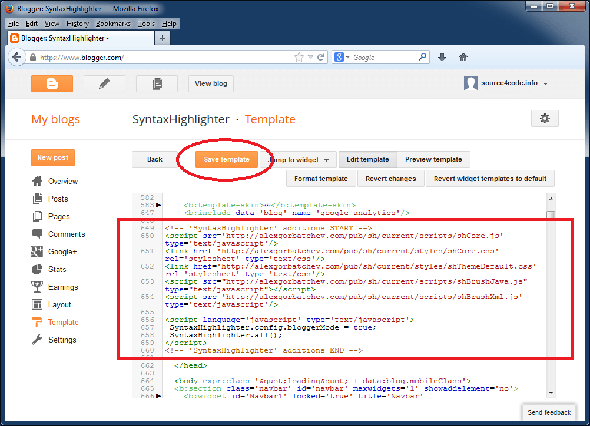
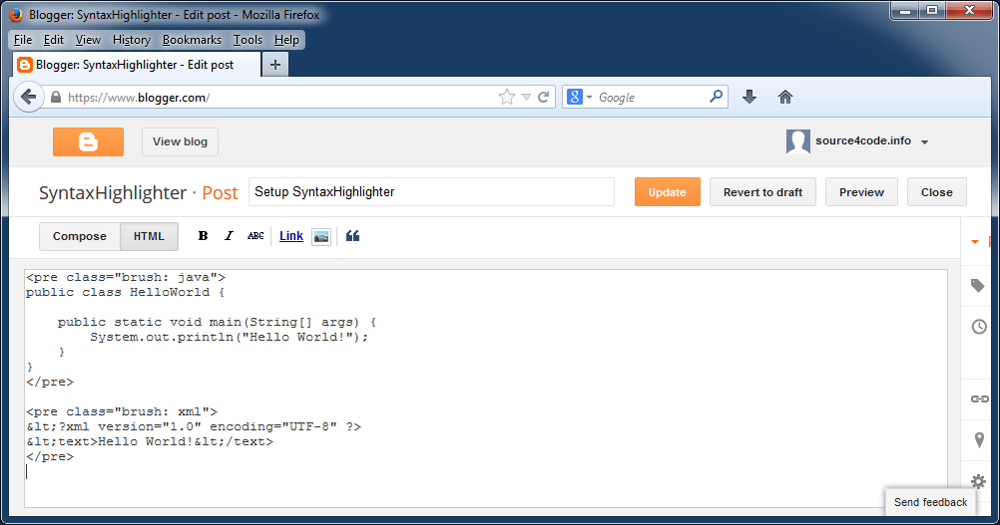
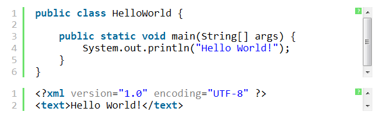
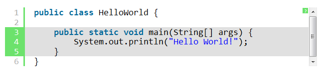

[Blogger](https://www.blogger.com/), the blog-publishing service from Google, does not provide a syntax highlighter out of the box. This means you need to resort to third-party solutions in order to have syntax highlighting in your posts. One of those solutions is the syntax highlighter created by Alex Gorbatchev which is called [SyntaxHighlighter](http://alexgorbatchev.com/SyntaxHighlighter/).

One of the advantages of this highlighter is that it is purely written in JavaScript and as a result, it does not need a server-side component. SyntaxHighlighter can be easily integrated into your Blogger blog as we will detail in this tutorial.

## SyntaxHighlighter Install

The first thing to do is to open the dashboard of your Blogger blog as shown below. On the left-hand side find the menu that says `Template` and click on it.



This will open the template page of your blog. Click on the button that says `Edit HTML` in order to open up the HTML editor as shown below.



Click anywhere inside the editor window and press `CTRL+F`. A search box should now appear in the upper right hand corner as shown below. In the search box enter `&lt;/head&gt;` (without quotes) and press `ENTER`.



The editor window will now jump the end of the HTML header tag where we will add the needed style sheets and JavaScript files. The SyntaxHighlighter configuration consists out of four parts:

1. The core files
2. The SyntaxHighlighter theme
3. The specific brush(es) needed for the blog
4. The configuration script

## The core files

The core files consist out of the following JavaScript file and style sheet:

``` xml
<script src="http://alexgorbatchev.com/pub/sh/current/scripts/shCore.js" type="text/javascript"></script>
<link href="http://alexgorbatchev.com/pub/sh/current/styles/shCore.css" rel="stylesheet" type="text/css"></link>
```

## The SyntaxHighlighter theme

There are [a number of themes available for SyntaxHighlighter](http://alexgorbatchev.com/SyntaxHighlighter/manual/themes/), the style sheet below is the default theme.

``` xml
<link href="http://alexgorbatchev.com/pub/sh/current/styles/shThemeDefault.css" rel="stylesheet" type="text/css" />
```

## The specific brush(es) needed for the blog

Depending on the structured language that needs to be highlighted, the corresponding brush needs to be imported. The SyntaxHighlighter site contains [a complete list of all available brushes](http://alexgorbatchev.com/SyntaxHighlighter/manual/brushes/). In this example we will add the brushes for `Java` and `XML`.

``` xml
<script src="http://alexgorbatchev.com/pub/sh/current/scripts/shBrushJava.js" type="text/javascript"></scrip>
<script src="http://alexgorbatchev.com/pub/sh/current/scripts/shBrushXml.js" type="text/javascript"></script>
```

> Only add the needed brushes as for each page the brushes are retrieved from alexgorbatchev.com (the SyntaxHighlighter site) and this increases your blog page load times!

## The configuration script

After all needed dependencies have been added we need to enable a specific mode for Blogger and instruct SyntaxHighlighter to highlight all code blocks found on the web page. This is done by adding a JavaScript snippet as shown below.

``` xml
<script language="javascript" type="text/javascript">
    SyntaxHighlighter.config.bloggerMode = true;
    SyntaxHighlighter.all();
</script>
```

The complete script to be inserted in the Blogger template is shown below. Copy and paste right before the `'&lt;/head&gt;'` tag as shown on the screenshot.

``` xml
<!-- 'SyntaxHighlighter' additions START -->
<script src="http://alexgorbatchev.com/pub/sh/current/scripts/shCore.js" type="text/javascript"></script>
<link href="http://alexgorbatchev.com/pub/sh/current/styles/shCore.css" rel="stylesheet" type="text/css" />
<link href="http://alexgorbatchev.com/pub/sh/current/styles/shThemeDefault.css" rel="stylesheet" type="text/css" />
<script src="http://alexgorbatchev.com/pub/sh/current/scripts/shBrushJava.js" type="text/javascript"></script>
<script src="http://alexgorbatchev.com/pub/sh/current/scripts/shBrushXml.js" type="text/javascript"></script>

<script language="javascript" type="text/javascript">
    SyntaxHighlighter.config.bloggerMode = true;
    SyntaxHighlighter.all();
</script>
<!-- 'SyntaxHighlighter' additions END -->
```

Click the `Save template` button to save the changes made to your Blogger template. This concludes the setup, in the next section, will see how to use SyntaxHighlighter.



## SyntaxHighlighter Usage

In order to use SyntaxHighlighter we need to wrap the section to be highlighted with an XML tag called `&lt;pre&gt;`. This tag has one required parameter called `brush` which is the same brush that was added in section 3 of the above setup.

For this example we will add a `HelloWorld` Java class to a `&lt;pre&gt;` tag with a `Java` brush and a Hello World XML file to a `&lt;pre&gt;` tag with a `'XML'` brush. Copy the below code and paste it inside a Blogger post as shown.

> Make sure all right angle brackets within the &lt;pre&gt; tags are HTML escaped, in other words, all < (less than character) must be replaced with "&amp;lt;" (without quotes, as shown below)!

``` xml
<pre class="brush: java">
public class HelloWorld {

    public static void main(String[] args) {
        System.out.println("Hello World!");
    }
}
</pre>

<pre class="brush: xml">
&lt;?xml version="1.0" encoding="UTF-8" ?>
&lt;text>Hello World!&lt;/text>
</pre>
```



Save and publish the page and the result should look like:



## SyntaxHighlighter Options

In addition to the mandatory `brush` parameter, the `&lt;pre&gt;` tag has a number of optional parameters. For example it is possible to highlight one or more lines to focus the reader's attention by adding the `highlight` parameter as shown below. Checkout the [full list of additional parameters that can be configured](http://alexgorbatchev.com/SyntaxHighlighter/manual/configuration/).

``` xml
<pre class="brush: java; highlight: [3,4,5]">
public class HelloWorld {

    public static void main(String[] args) {
        System.out.println("Hello World!");
    }
}
</pre>
```

The result of above snippet:



This concludes setting up SyntaxHighlighter on Blogger. If you found this post helpful or have any questions or remarks, please leave a comment.
