[GitHub](https://github.com/) is a web-based hosting service for software development projects that use the [Git revision control system](https://git-scm.com/). It is used to share code with other people and a GitHub account is free for open source projects.

Following tutorial will show you how to setup and configure Git Gui on your Windows computer so you can upload code towards a remote GitHub repository.

> Note that we have switched to [Sourcetree](https://www.sourcetreeapp.com/) which is another free Git GUI alternative for Mac and Windows. We highly recommend you check it out as it is simple to use and very powerful in terms of features.

## Git GUI Install

First, let's start by going to the [Git downloads page](http://git-scm.com/downloads) and download the Git installer for your operating system. In this tutorial, we will use Windows.

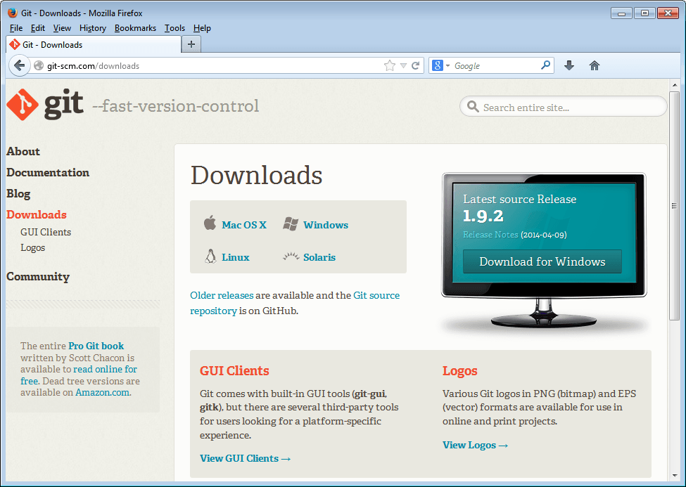
Double click to run the downloaded `'.exe'` file and click `Next` keeping the default settings on the different installer steps. At the end click `Finish` and Git should be successfully installed.

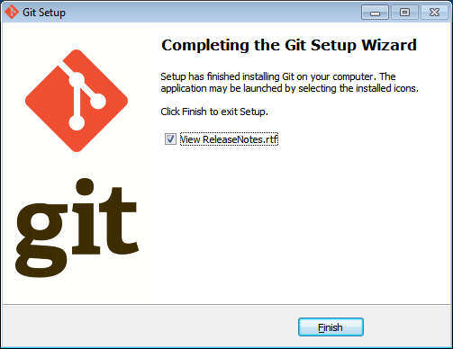

Start the Git command processor by clicking on the `Git Bash` link inside the Git program group `Start&gt;All Programs&gt;Git`. A bash window should appear as shown below.

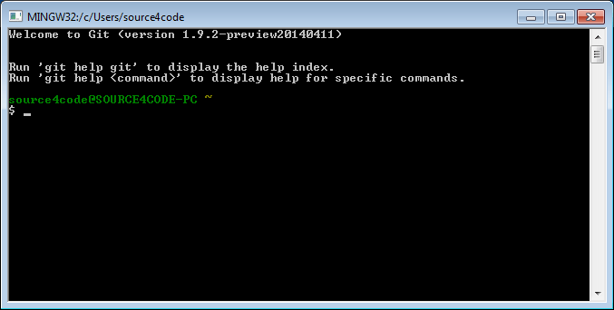

## Configure Git

The first thing that needs to be done is to setup some basic Git parameters like user name and email address. In order to do so enter following commands and replace the value between the quotes with your own values.

``` bash
git config --global user.name "<user_name>"
git config --global user.email "<user_email>"
```

Shown below is the execution of the two commands.

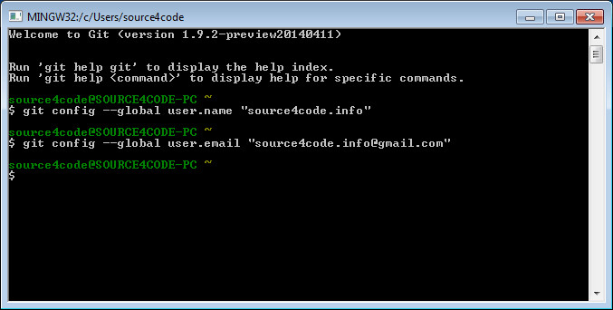

In order to verify if the values are set correctly enter the following command:

``` bash
git config --list
```

The result is a list of configuration parameters as shown below.

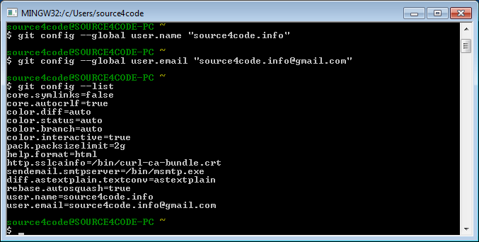

## Generating SSH keys

It is strongly recommended to use an SSH connection when interacting with GitHub. SSH keys are a way to identify trusted computers, without involving passwords. To generate a new SSH key pair, copy and paste the command below, making sure to substitute the email value between the quotes with your own.

``` bash
ssh-keygen -t rsa -C "<user_email>"
```

When asked to `Enter file in which to save the key` just press `ENTER` to continue. Then a passphrase is requested which acts as a password you need to enter each time you want to use your key with SSH. Enter your password twice and the result should be as shown below.

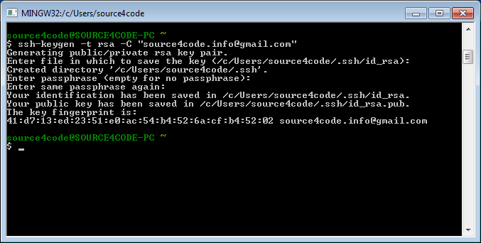

Locate the generated keys by going to the location as shown in the console output. In the above example the location is: `C:\Users\source4code\.ssh`.

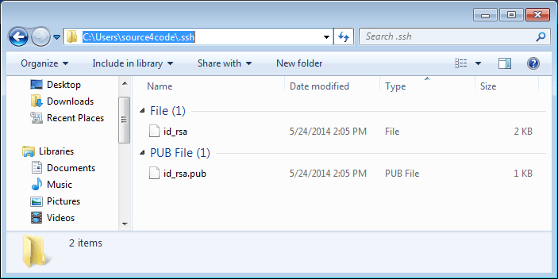

The `id_rsa` file contains your private key and the `id_rsa.pub` file contains your public key.

## Configure GitHub

Create an account at [GitHub](https://github.com/) and sign in. Add a new remote repository by clicking the `+ New repository` button. Enter a repository name and check the `'Initialize this repository with a README'` checkbox so a `README.md` is automatically added as shown below.

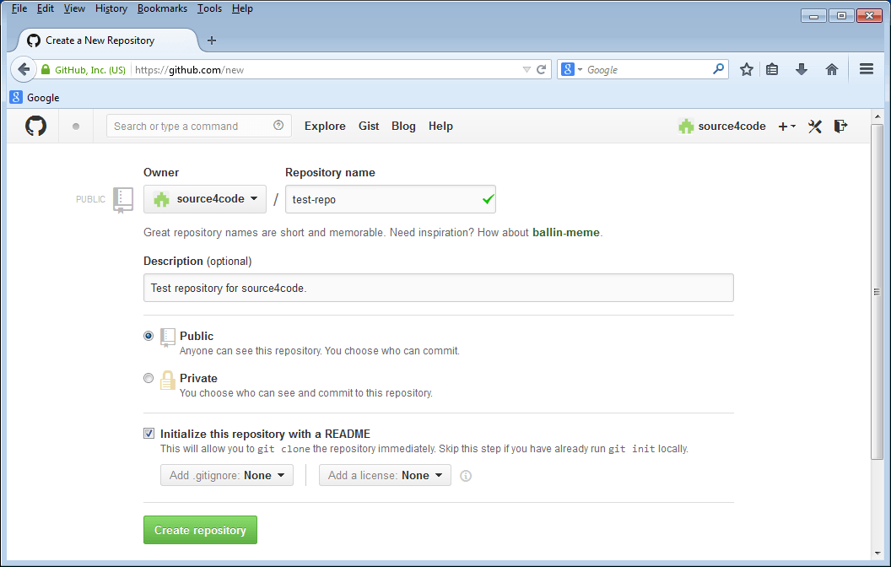
Next step is to add the public SSH key to your GitHub account. To do so access the GitHub account settings by clicking on the wrench/screwdriver icon in the top right-hand corner. Then on the left-hand side menu click on the [SSH keys](https://github.com/settings/ssh) link.

Click on the `Add SSH key` button in the top right hand corner. In the `Title` text field enter a name for the public key that we will add (in the example below the name `test-repo` is used). Then open the `id_rsa.pub` file that was generated in the previous section and copy paste the contents in the `Key` text field as shown below. Save the SSH key by clicking the `Add key` button.

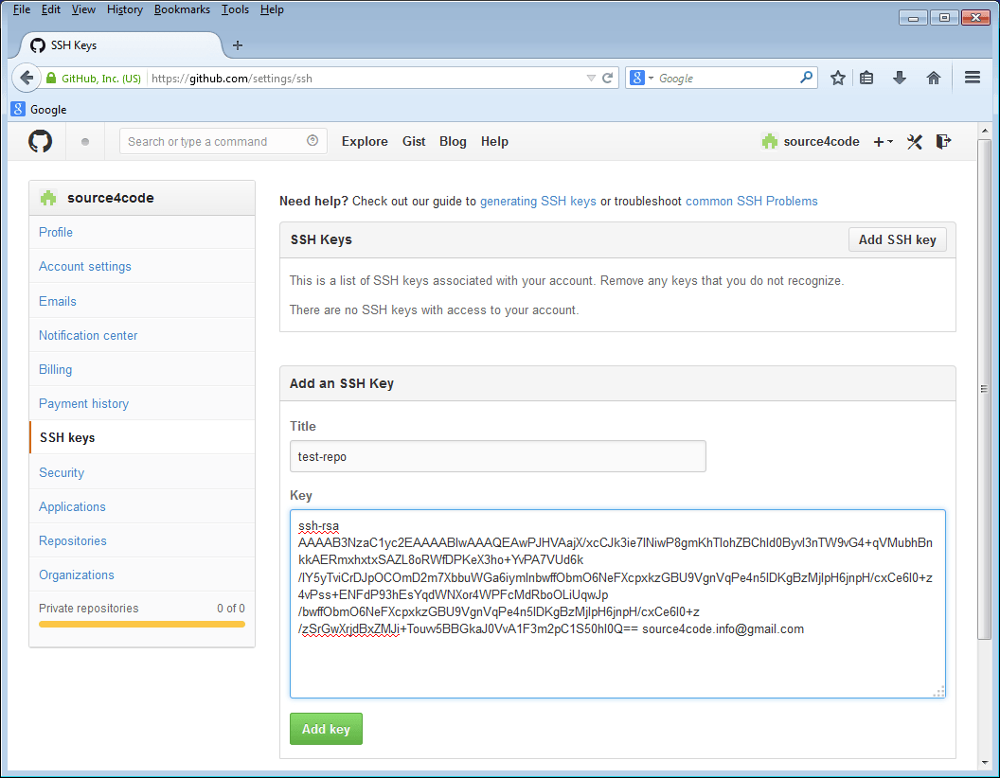

The newly added key is part of the SSH keys that are associated with your account as shown below.

> Note that the key fingerprint shown should be the same as the one that was printed during SSH keys creation in the previous section: 41:d7:ed:23:51:e0:ac:54:b4:52:6a:cf:b4:52:02

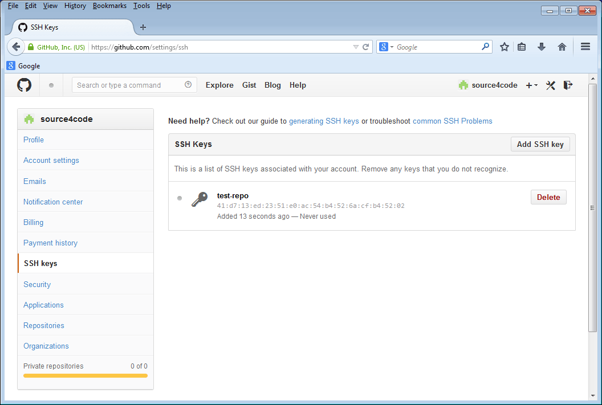

## Configure Git GUI

Start Git GUI by clicking on the `Git GUI` link inside the Git program group. Following window should appear.


The first thing to do is to create a new local Git repository. Click on the `Create New Repository` link and select a folder in which you would like to create a new local repository. In the example below the local repository is created at `C:/source4code/code/test-repo`. Click the `Create` button to complete the repository creation.

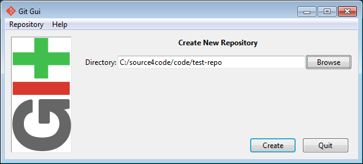

A new window will open which shows the newly created Git repository.


Next step is to add the remote Git repository at GitHub. Click on the `Remote` menu and select `Add`. A new window will pop-up in which a name for the remote repository and the location need to be added. In this example we will enter `test-repo` as name and `git@github.com:source4code/test-repo.git` as location as shown below.

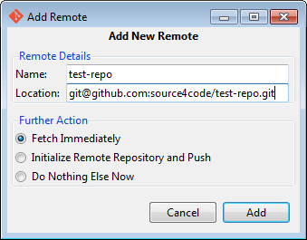

> The location for the remote GitHub repository can be found by logging into GitHub, selecting the repository to be added and then clicking on the SSH link at the bottom right-hand side of the screen.

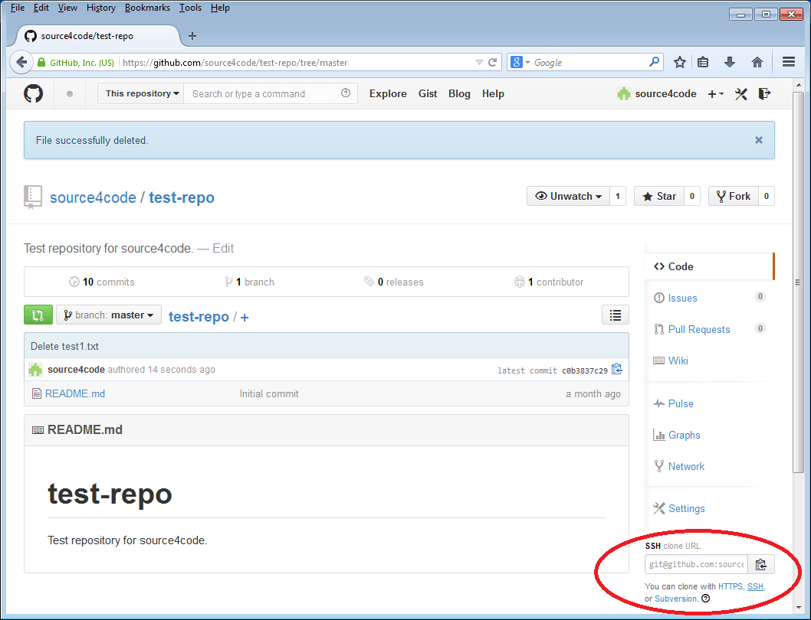

If the `'Fetch Immediately'` action in the popup window was left selected, the first thing Git GUI will do is fetch the content of the remote GitHub repository. Enter the passphrase of the SSH keys generated in the previous section and press `OK`. The result should be a success status as shown below. Click the `Close` button to finish.

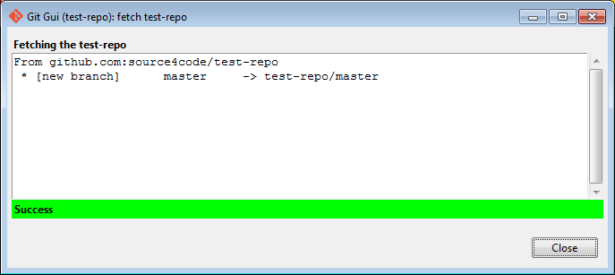

## Git GUI Usage

Now that the remote repository was fetched we need to merge it with the local repository. Before this can be done, a local baseline is needed to merge with. Open the local repository location, in this example it was `C:/source4code/code/test-repo` and add a file `test1.txt`.

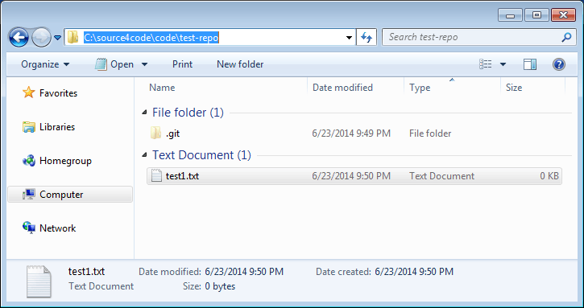

Switch back to Git GUI and press the `Rescan` button. The added file should now appear under the `'Unstaged Changes'` section. Then click on the `Stage Changed` button to tag the added file to be part of the files on which we will create a baseline and click `Yes` to confirm the untracked file. The file should now appear in the `'Staged Changes'` section as shown below.

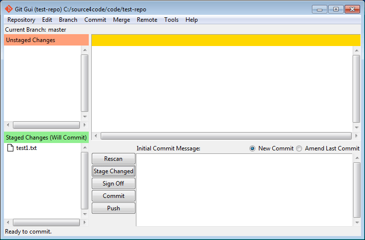

> You can move files between the `'Unstaged Changes'` and `'Staged Changes'` section by using the `Commit` menu.

Add an initial commit message in the corresponding text box as shown below.

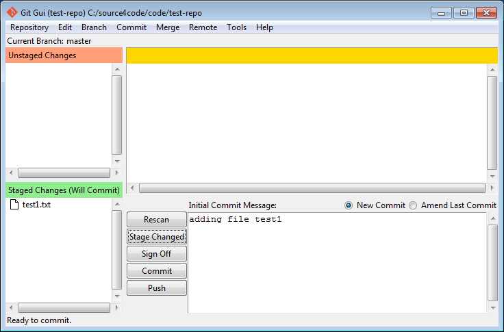

Press the `Commit` button. The file will disappear from the `'Staged Changes'` section and at the bottom of the screen a `"Created commit"` message should appear.

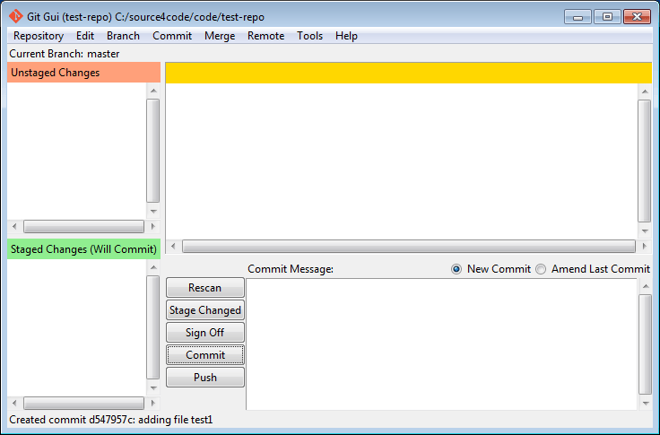

Now the local and remote baseline need to be merged. Click on the `Merge` menu and select `Local Merge`. A new window will pop-up that shows the possible baselines that can be merged with the local master baseline.

> If the remote `'test-repo/master'` does not show as below, make sure to restart Git GUI!

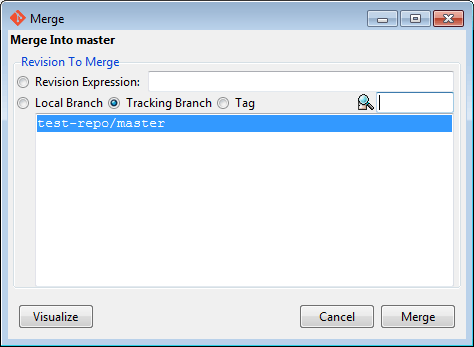

Click on the `Merge` button and a success status should be appear which shows that the `README.md` file from the remote repository was successfully added.

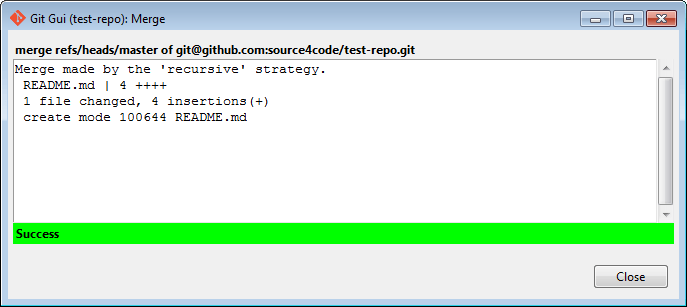

The last thing left to do is to push the merged local baseline to GitHub. In order to do so select the `Remote` menu and click on the `Push` menu item. A new window is shown which shows the local master that will be pushed to the remote `test-repo`.

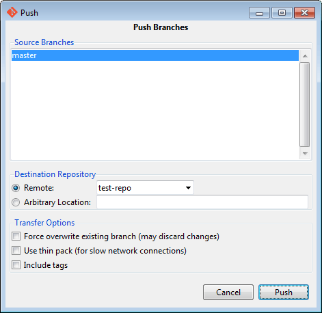

Click the `Push` button and enter the passphrase of the SSH keys. A success message should be shown. Close the message by clicking on the `Close` button and open your GitHub account. Select your repository and the `test1.txt` file should be present as shown below.

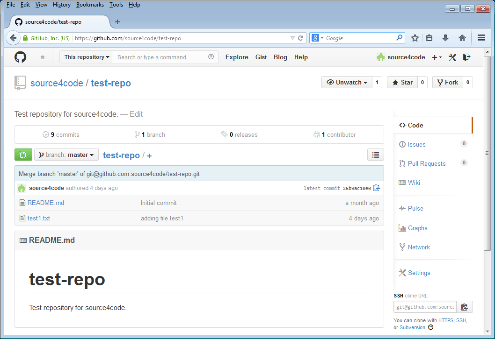

From now on you can add/change files on your local repository that can then be pushed to GitHub once committed.

This concludes our tutorial on adding a remote repository to Git GUI so that code files can be uploaded to GitHub. If you found this post helpful or have any questions or remarks, please leave a comment.
