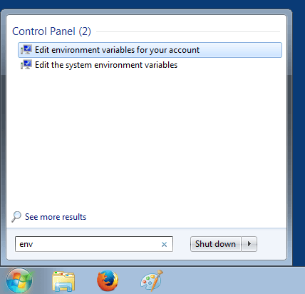
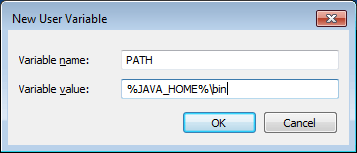

[Java](https://www.java.com/en/) is a computer programming language that is concurrent, class-based and object-oriented. It was originally developed by James Gosling at Sun Microsystems. Java applications are compiled to bytecode (class file) that can run on any Java virtual machine (JVM) regardless of computer architecture.

Java is currently owned by the Oracle Corporation which acquired Sun Microsystems in 2010. Following tutorial will show you how to setup and configure Java 1.5 on Windows so you can develop and run Java code.


Check following guides if you are looking to download and install [JDK 1.6](), [JDK 1.7](), [JDK 1.8](), [JDK 1.9]() or [JDK 1.10]().


## JDK Download & Install

Java can be obtained from the Oracle Java download page. There are a number of [different Java packages available](https://docs.oracle.com/javaee/6/firstcup/doc/gkhoy.html), for this tutorial we will be installing Java Standard Edition (SE) on Windows.

In order to be able to compile Java code, we need the Java Development Kit (JDK) package that comes with a Java compiler. The JDK package also comes with a Java runtime environment (JRE) that is needed to run compiled Java code.

As we are installing an older Java version, you need to scroll all the way down to the bottom of the [Oracle Java download page](http://www.oracle.com/technetwork/java/javase/downloads/index.html) and click on the `Download` button in the `Java Archive` section. Then look for the `Java SE 5` link and after clicking on it, select the correct operating system under `Java SE Development Kit 5.0u22`.

> Here is the direct link to [download the jdk 1.5.0_22 installer for Windows](http://www.oracle.com/technetwork/java/javasebusiness/downloads/java-archive-downloads-javase5-419410.html).

Accept the License Agreement and pick the correct download for your operating system. In this example, we will use the Windows 64 bit version.


Sign in using your Oracle account (or create a new one) and the download should start. Once the download is complete, locate the `jdk-1_5_0_22-windows-i586-p.exe` file and double-click to run the installer.


Click on the `I accept the terms in the license agreement` radio button and then click on `Next`. On the following screen optionally change the installation location by clicking on the `Change...` button. In this example the install location was changed to `'C:\Java\jdk1.5.0_22'`. From now on we will refer to this directory as: `[java_install_dir]`.


Next, the installer will present the installation of some optional features. We will skip this part of the installer as the JDK installed in the previous step comes with everything to run and develope code. Just press `Cancel` and confirm by clicking `Yes` in the popup window.


Click `Next` and then `Close` to finish installing Java.


## JDK Configuration

In order for Java applications to be able to run we need to setup a `JAVA_HOME` environment variable that will point to the Java installation directory. In addition, if we want to run Java commands from a command prompt we need to setup the `PATH` environment variable to contain the Java bin directory.

When using Windows the above parameters can be configured on the Environment Variables panel. Click on the `Windows Start` button and enter `env` without quotes as shown below.



Environment variables can be set at account level or at system level. For this example click on `Edit environment variables for your account` and following panel should appear.


Click on the `New` button and enter `JAVA_HOME` as variable name and the `[java_install_dir]` as variable value. In this tutorial the installation directory is `'C:\Java\jdk1.5.0_22'`. Click `OK` to to save.


Click on the `New` button and enter `PATH` as variable name and `%JAVA_HOME%\bin` as variable value. Click `OK` to save.

> Note that in case a `'PATH'` variable is already present you can add `;%JAVA_HOME%\bin` at the end of the variable value.



The result should be as shown below. Click `OK` to close the environment variables panel.


In order to test the above configuration, open a command prompt by clicking on the Windows Start button and typing `cmd` followed by pressing `ENTER`. A new command prompt should open in which the following command can be entered to verify the installed Java version:

``` bash
java -version
```

The result should be as shown below.


This concludes the setting up and configuring JDK 1.5 on Windows.

If you found this post helpful or have any questions or remarks, please leave a comment.
