

In this guide, I'm going to show you exactly **how to download and install JDK 1.7 on Windows**.

(Step-by-step)

First, I'll show you where you can get JDK 7.

Then you'll see how to configure it.

And finally **how to verify if everything is working**.

Let's dive right in…


Check following guides if you are looking to download and install [JDK 1.5](), [JDK 1.6](), [JDK 1.8](), [JDK 1.9]() or [JDK 1.10]().


## What is a JDK?

When you want to create a Java application you need a [Java Development Kit](https://en.wikipedia.org/wiki/Java_Development_Kit) (JDK). It contains tools that allow you to develop and run your Java program.

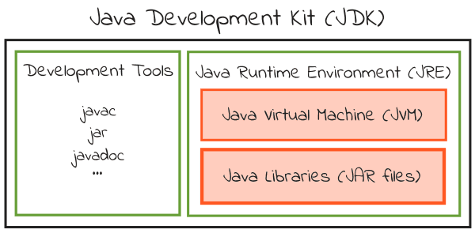

One of these development tools is a **compiler** (javac) that converts Java source code (`.java` files) into Java bytecode (`.class` files). Other tools include an archiver (jar) and a documentation generator (javadoc).

The JDK also contains a **Java Runtime Environment** (JRE) that is able to run compiled Java code. To do this the JRE uses Java libraries and a Java Virtual Machine (JVM) that executes the compiled Java code.

Different JDK implementations are available. The official reference implementation is maintained by [Oracle](https://www.oracle.com/index.html).

## Download Oracle JDK 7

Head over to the [Oracle Java SE 7 archive download page](https://www.oracle.com/java/technologies/javase/javase7-archive-downloads.html).

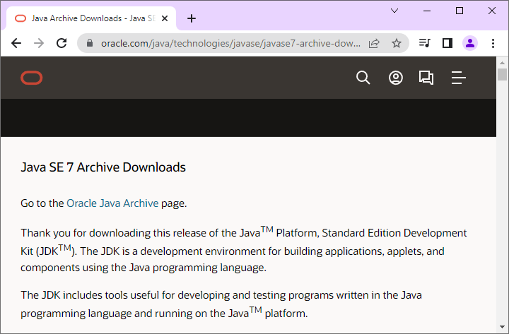

Look for the `Java SE Development Kit 7u80` section.

[Verify your windows bit version](https://support.microsoft.com/en-us/windows/32-bit-and-64-bit-windows-frequently-asked-questions-c6ca9541-8dce-4d48-0415-94a3faa2e13d) and click on the corresponding link:

* For 32-bit = Windows x86 installer
* For 64-bit = Windows x64 installer

In this guide, we will download the 64-bit installer: `jdk-7u80-windows-x64.exe`.

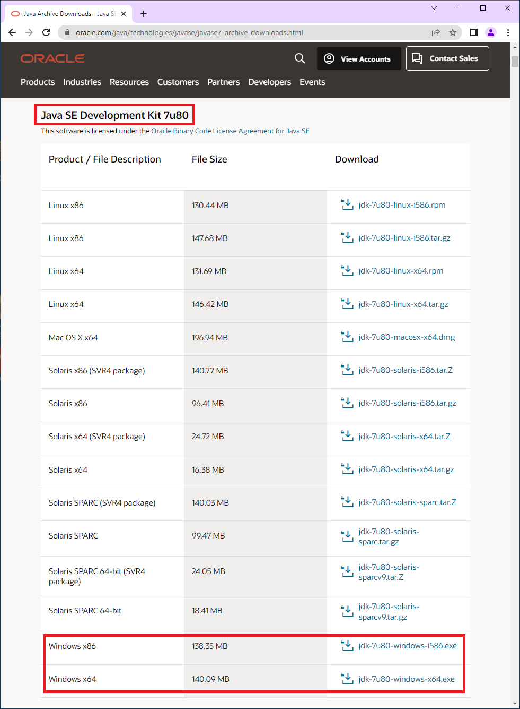

Accept the license pop-up and click on the `Download jdk-7u80-windows-x64.exe` button.

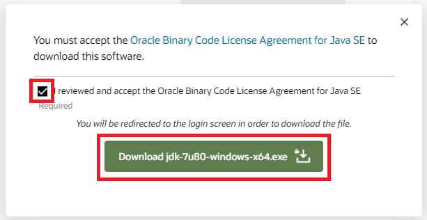

You will need an Oracle account in order to download the JDK. Sign in with an existing account or create a new account to continue.

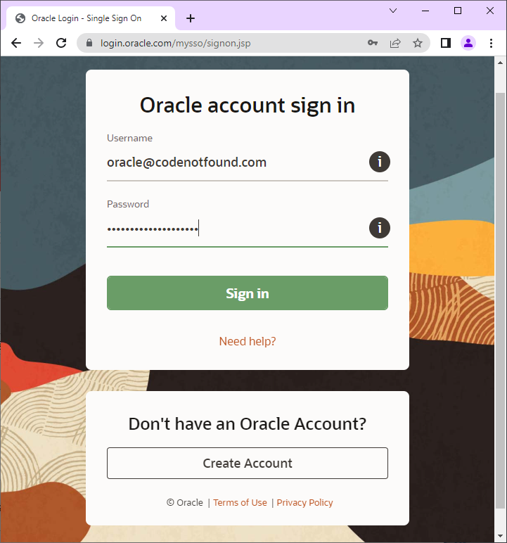

Wait for the download to complete.

## Install Oracle JDK 7

Open the location of the downloaded executable.

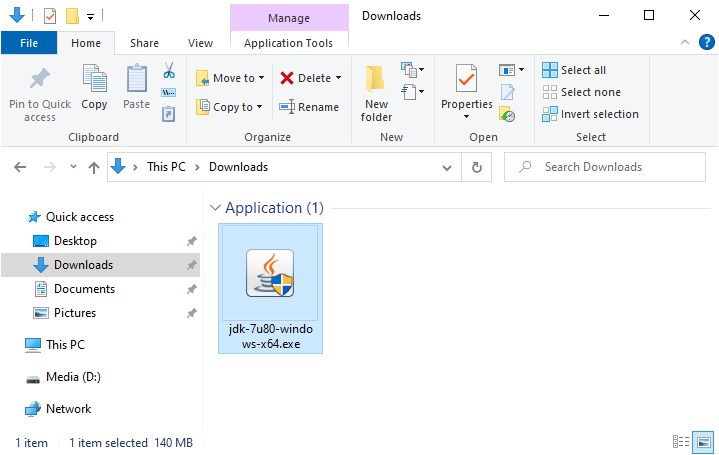

Double-click to run the installer.

On Windows 10 a pop-up window will appear: `The app you're trying to install isn't a Microsoft-verified app`

Click on `Install anyway`.


The JDK installer will start. Click `Next`.

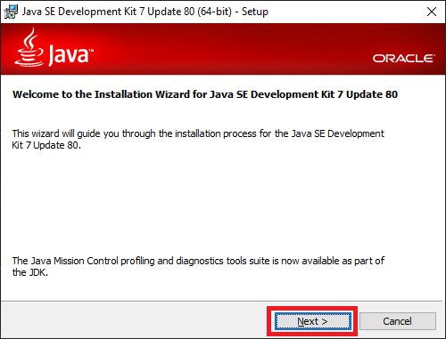

You can change the installation location by clicking on the `Change…` button.

In this example, we keep the default install location of `C:\Program Files\Java\jdk1.7.0_331`. From now on we will refer to this directory as `[JAVA_INSTALL_DIR]`.

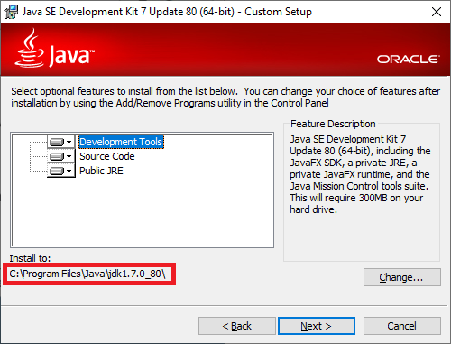

We will not install the public JRE as the JDK development tools already include a private JRE.

Select the `Public JRE` dropdown and click on `This feature will not be available`. as shown below.

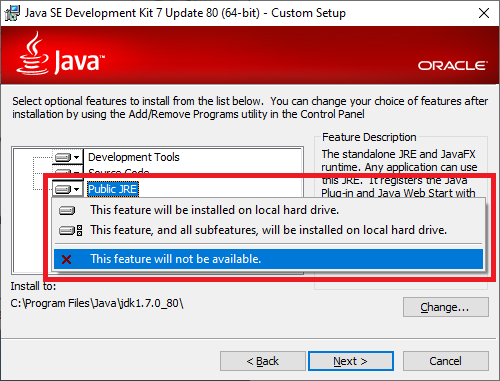

Click `Next` to start the installation.

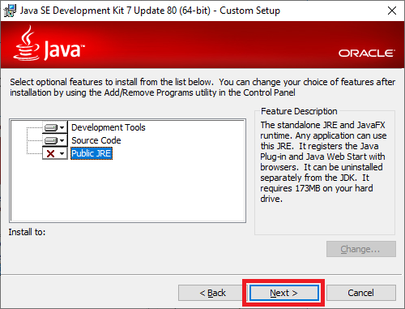

The JDK installation will now start.

A progress bar shows the various steps that are executed.

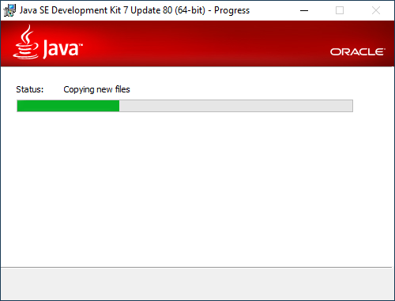

Once the installation is complete, click `Close`.

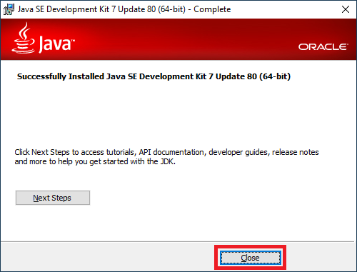

## Configure Oracle JDK 7

Now that the JDK is installed we need to configure it.

First we set up an environment variable that will point to our JDK installation.

In the Windows search box type `env`.

Click on the `Edit environment variables for your account` shortcut.

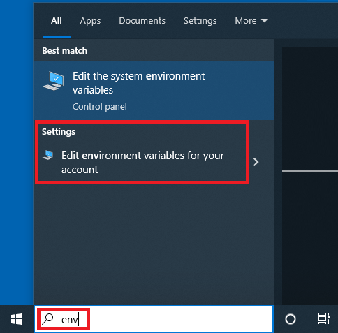

Wait for the environment variables window to open.

Click on `New…`.

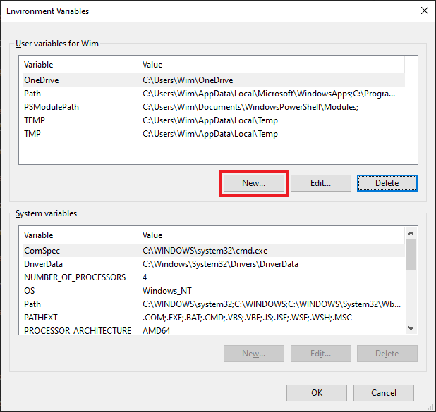

Enter `JAVA_HOME` as variable name. Enter the `[JAVA_INSTALL_DIR]` as variable value.

In this tutorial, the Java installation directory is `C:\Program Files\Java\jdk1.7.0_80`.

Click `OK`.

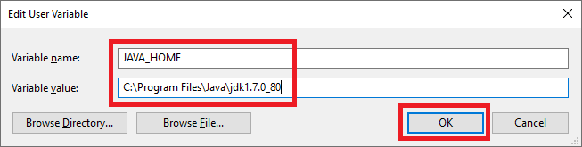

Next, we need to configure the PATH environment variable so we can run Java from a command prompt.

Select the `Path` variable. Click on `Edit…`.

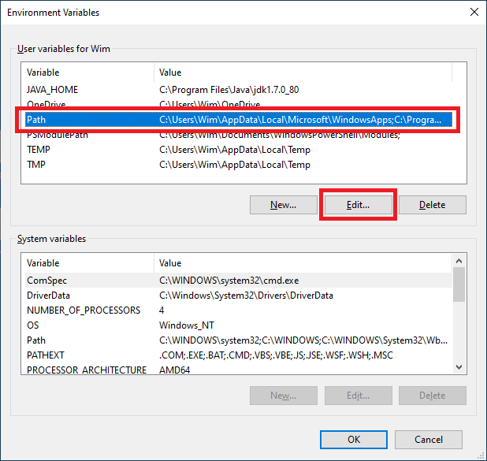

Click on `New` and type `%JAVA_HOME%\bin` as shown below.

Click `OK`.

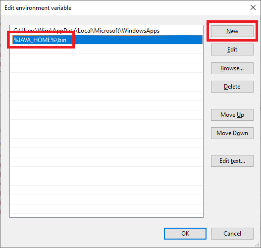

Click `OK` once more to close the environment variables window.

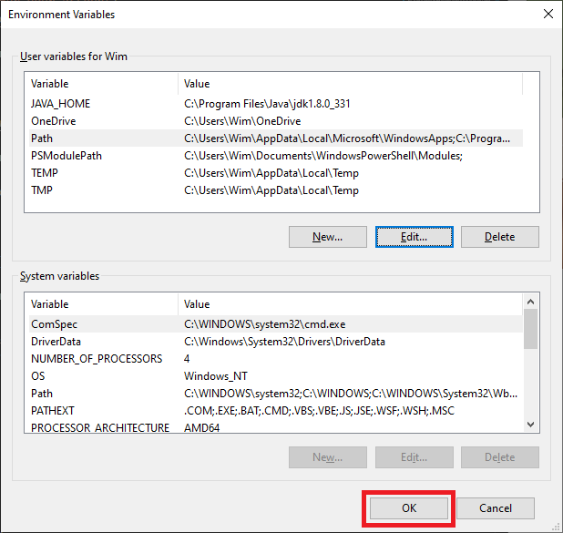

> If a Path variable does not exist you need to create it. Use `Path` as variable name and `%JAVA_HOME%\bin` as variable value.

## Test the Oracle JDK 7 Installation

Let's test the setup.

In the Windows search box type `cmd`.

Click on the `Command Prompt` shortcut.

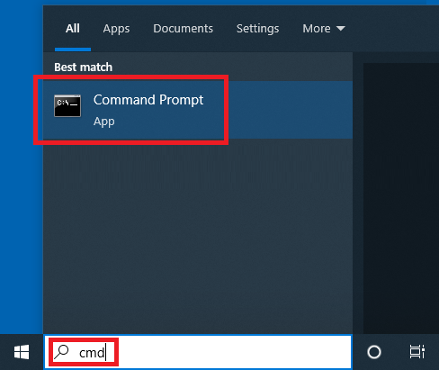

Wait for the command prompt to open.

Type below command and press ENTER.

``` shell
java -version
```

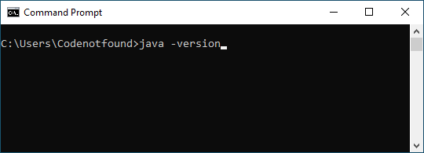

The above command prints the installed JDK version: **1.7.0_80**.

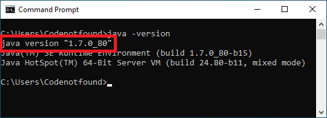

**Congratulations, you have installed and configured JDK 1.7 on Windows 10!**

Go ahead and take the next step to [write your first Java program](https://introcs.cs.princeton.edu/java/11hello/).

Let me know if this post was helpfull for you.

Leave a comment below.

Cheers!
