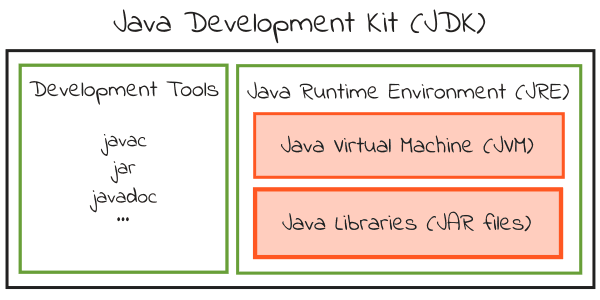
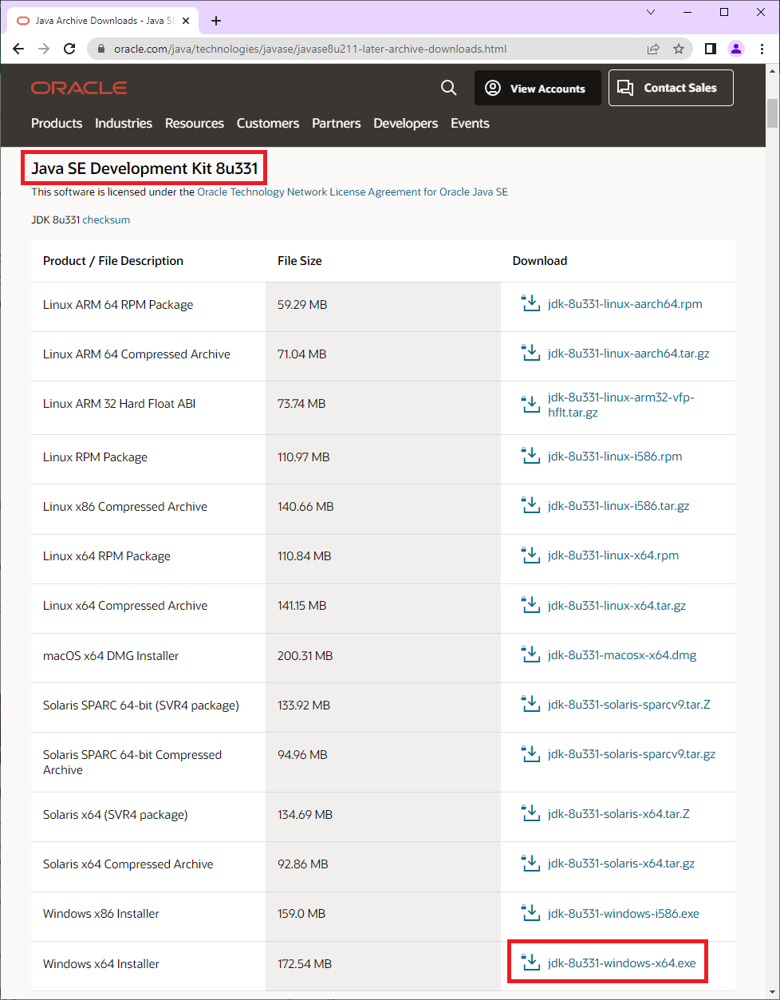
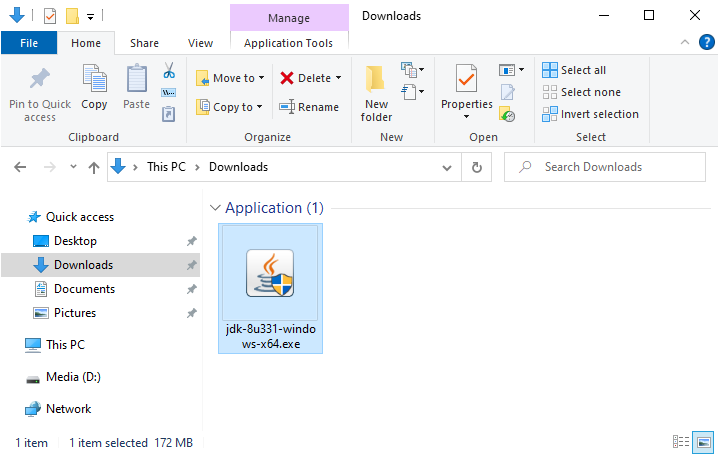
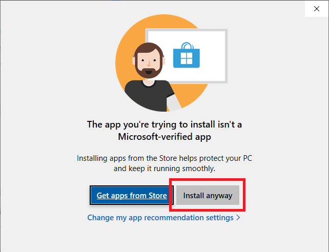
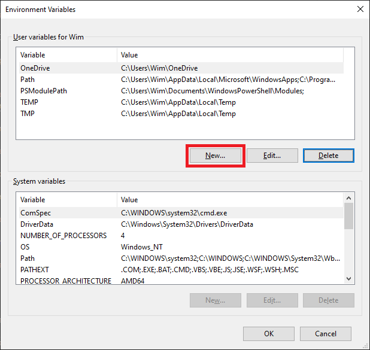



This tutorial has **everything you need to know** about installing JDK 8 on Windows.

If you're new to Java, I'll show you how to setup the Java Development Kit.

And if you're a Java pro? I'll highlight the needed links that you can use to download the installer.

Bottom line:

If you want to get up and running with Java, **you'll love this tutorial**.


Check following guides if you are looking to download and install [JDK 1.5](), [JDK 1.6](), [JDK 1.7](), [JDK 1.9]() or [JDK 1.10]().


## What is a JDK?

When you want to create a Java application you need a [Java Development Kit](https://en.wikipedia.org/wiki/Java_Development_Kit) (JDK). It contains tools that allow you to develop and run your Java program.



One of these development tools is a **compiler** (javac) that converts Java source code (`.java` files) into Java bytecode (`.class` files). Other tools include an archiver (jar) and a documentation generator (javadoc).

The JDK also contains a **Java Runtime Environment** (JRE) that is able to run compiled Java code. To do this the JRE uses Java libraries and a Java Virtual Machine (JVM) that executes the compiled Java code.

Different JDK implementations are available. The official reference implementation is maintained by [Oracle](https://www.oracle.com/index.html).

> Note that [Oracle has changed the license of their JDK](https://www.oracle.com/java/technologies/javase/jdk-faqs.html). Instead of having a single JDK build which you can use for free, they now have two different JDK builds:

* [Oracle's JDK](https://www.oracle.com/java/technologies/downloads/) (commercial) – you can use this in development and testing for free, but if you use it in production you have to pay for it.
* [Oracle's OpenJDK](https://jdk.java.net/java-se-ri/8-MR3) (open source) – you can use this for free in any environment.

## Download Oracle JDK 8

Head over to the [Oracle Java SE 8 download page](https://www.oracle.com/java/technologies/javase/javase8u211-later-archive-downloads.html).


Look for the `Java SE Development Kit 8u331` section.

[Verify your windows bit version](https://support.microsoft.com/en-us/windows/32-bit-and-64-bit-windows-frequently-asked-questions-c6ca9541-8dce-4d48-0415-94a3faa2e13d) and click on the corresponding link:

* For 32-bit = Windows x86 installer
* For 64-bit = Windows x64 installer

In this guide, we will download the 64-bit installer: `jdk-8u331-windows-x64.exe`.



Accept the license pop-up and click on the `Download jdk-8u331-windows-x64.exe` button.


You will need an Oracle account in order to download the JDK. Sign in with an existing account or create a new account to continue.


Wait for the download to complete.

> Check the [Java Archive section](https://www.oracle.com/java/technologies/javase/javase8-archive-downloads.html) for older versions like 1.8.0_202.

## Install Oracle JDK 8

Open the location of the downloaded executable.



Double-click to run the installer.

On Windows 10 a pop-up window will appear: `The app you're trying to install isn't a Microsoft-verified app`

Click on `Install anyway`.



The JDK installer will start. Click `Next`.


You can change the installation location by clicking on the `Change…` button.

In this example, we keep the default install location of `C:\Program Files\Java\jdk1.8.0_331`. From now on we will refer to this directory as `[JAVA_INSTALL_DIR]`.


We will not install the public JRE as the JDK development tools already include a private JRE.

Select the `Public JRE` dropdown and click on `This feature will not be available`. as shown below.


Click `Next` to start the installation.


The JDK installation will now start.

A progress bar shows the various steps that are executed.


Once the installation is complete, click `Close`.


## Configure Oracle JDK 8

Now that the JDK is installed we need to configure it.

First we set up an environment variable that will point to our JDK installation.

In the Windows search box type `env`.

Click on the `Edit environment variables for your account` shortcut.


Wait for the environment variables window to open.

Click on `New…`.



Enter `JAVA_HOME` as variable name. Enter the `[JAVA_INSTALL_DIR]` as variable value.

In this tutorial, the Java installation directory is `C:\Program Files\Java\jdk1.8.0_331`.

Click `OK`.


Next, we need to configure the PATH environment variable so we can run Java from a command prompt.

Select the `Path` variable. Click on `Edit…`.


Click on `New` and type `%JAVA_HOME%\bin` as shown below.

Click `OK`.


Click `OK` once more to close the environment variables window.


> If a Path variable does not exist you need to create it. Use `Path` as variable name and `%JAVA_HOME%\bin` as variable value.

## Test the Oracle JDK 8 Installation

Let's test the setup.

In the Windows search box type `cmd`.

Click on the `Command Prompt` shortcut.


Wait for the command prompt to open.

Type below command and press ENTER.

``` shell
java -version
```


The above command prints the installed JDK version: **1.8.0_331**.


**Congratulations, you have installed JDK 1.8 on Windows 10!**

Now take the next step and [write your first Java program](https://introcs.cs.princeton.edu/java/11hello/).

Let me know if you liked this post.

Leave a comment below.

Thanks!!
