[HermesJMS](http://hermesjms.com/) is a graphical user interface that helps you interact with many of the popular JMS providers. It allows to publish and edit messages, browse or search queues and topics, copy messages around and delete them. Hermes JMS is an open source project hosted by [Sourceforge](https://sourceforge.net/projects/hermesjms/).

Following tutorial shows how to install Hermes JMS on Windows or Unix and perform a start/stop of the application.

## Prerequisites & Downloading the Installer

Hermes JMS is written in Java. It needs [a Java runtime environment (JRE) of version 1.6 or higher to be installed and configured](http://www.oracle.com/technetwork/java/javase/downloads/index.html) (with JAVA_HOME correctly set). If you are not sure what Java version is installed on your machine, open a console and execute following command:

``` bash
java -version
```

Let's get started by downloading the HermesJMS installer Java archive (JAR). Go the the [HermesJMS download page](http://www.hermesjms.com/confluence/display/HJMS/Home) and click on the Sourceforge link in the `Downloading and Webstarting` section. This will redirect to a Sourceforge page, click on the `hermes-installer-X.XX.jar` link and download the JAR file.

Seeing as Hermes JMS is written in Java, the installer will run on both 32-bit and 64-bit systems.

> Update: it looks like the HermesJMS home page is currently not available. You can however still [download the latest stable release: 'hermes-installer-1.14.jar' from SourceForge](http://sourceforge.net/projects/hermesjms/files/hermesjms/1.14/hermes-installer-1.14.jar/download).

## Installation Procedure for Windows & Unix

Open a console window and navigate to the location of the downloaded `hermes-installer-1.14.jar`. Execute the following command to start the Hermes JMS installer:

``` bash
java -jar hermes-installer-1.14.jar
```

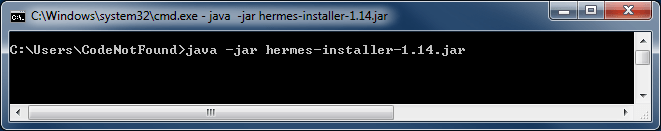

A HermesJMS installation window will open as shown below:

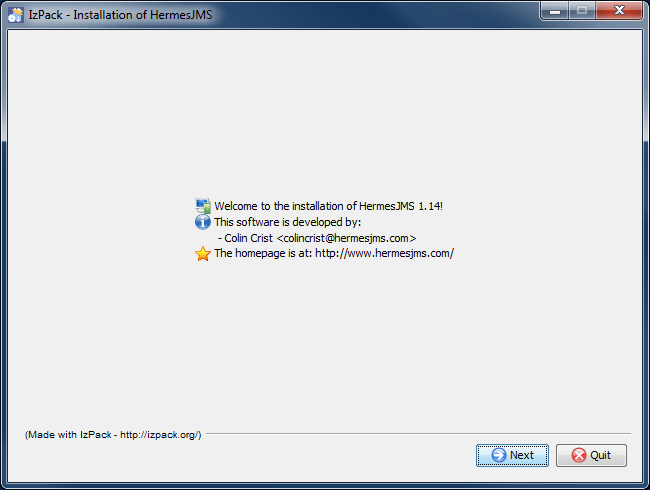

Clicking `Next` will show some best practices on how to use HermesJMS configuration files (which we will cover later in this tutorial). Click `Next` again and review the license agreement. Select the `I accept the terms of this license agreement` radio button in order to be able to continue the installation.

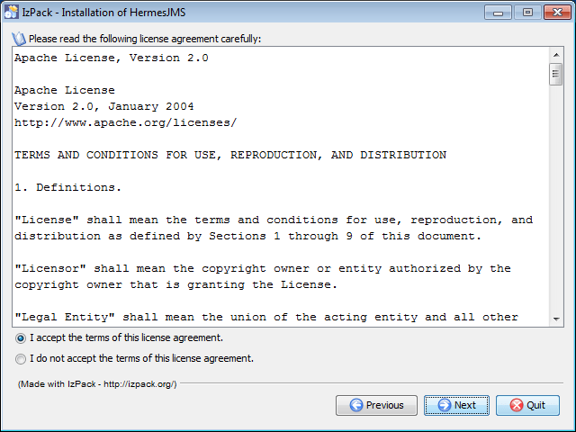

Click `Next` and change the default installation path (if needed). If prompted to create the target directory, click `OK`. From now on we will refer to this directory as: `[hermesjms_install_dir]`.

> Do **not** install Hermes with a **path with spaces** in, some JNDI implementations bundled with JMS providers have problems with this.

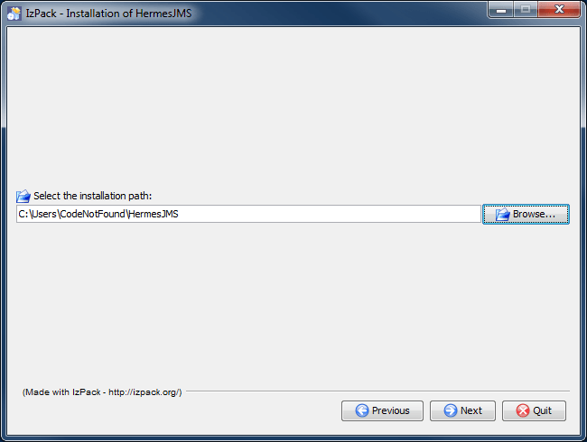

Click `Next` twice and review the installation settings (there should be a single HermesJMS installation pack that is selected by default). If the settings are correct click `Next` to start the installation. The progress of the installation will be indicated by a progress bar as shown below.

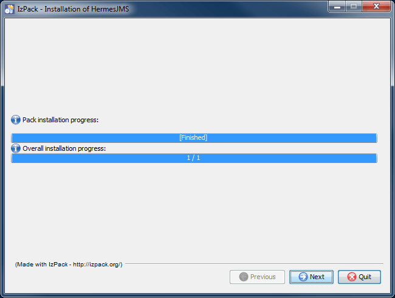

Once the `'Pack installation progress'` bar mentions mentions `'[Finished]'`, click on `Quit` to exit the installer. Alternatively click `Next` twice to also create application shortcuts for starting and uninstalling HermesJMS.

> When installing Hermes JMS on a 64-bit Windows machine, clicking next after the pack installation progress has finished will result in a "_Can't load IA 32-bit .dll on a 64-bit platform_" error being thrown. This is linked to the next step that creates the shortcuts but does not impact the correct installation of HermesJMS. Simply click on "Quit" to exit the installer.

An alternative way of creating a shortcut on Windows is to navigate to the `[hermesjms_install_dir]\bin` directory using the Windows explorer. Right click on the `hermes.bat` file and select `Send to > Desktop(create shortcut)` as shown below.

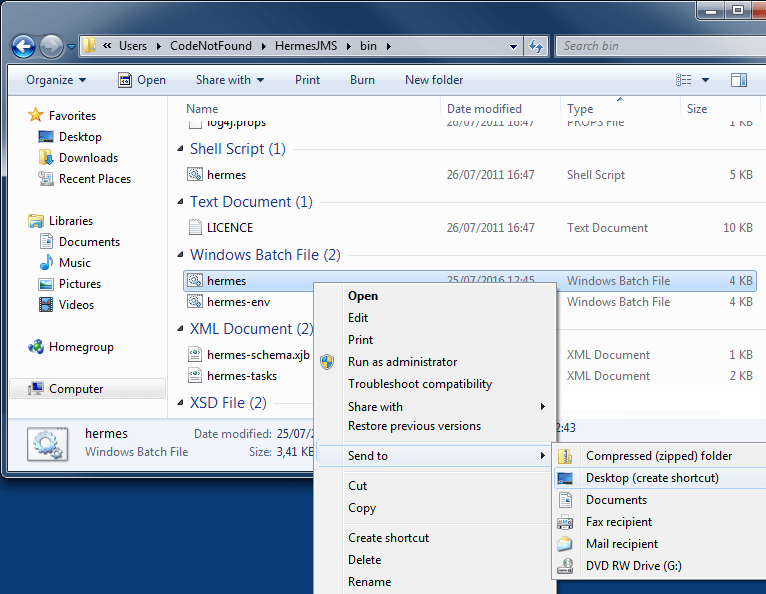

## Startup & Exit on Windows

Open a console window and navigate to the `[hermesjms_install_dir]`. Change to the `bin` subdirectory and execute the following command to start Hermes JMS:

``` bash
hermes.bat
```

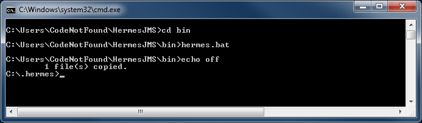

The Hermes JMS application should startup and open as shown below:

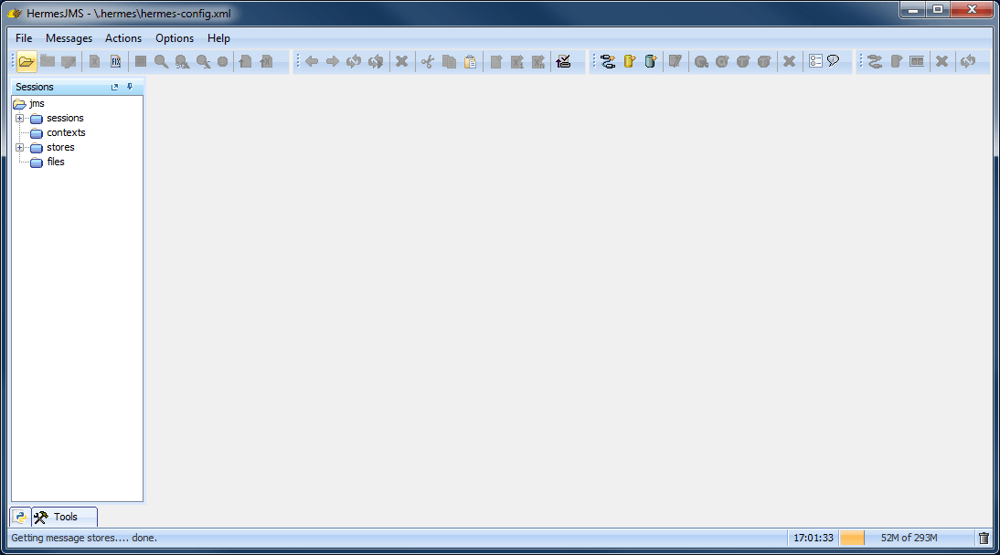

> On first startup, HermesJMS will create a `.hermes` directory that contains the default configuration XML, log files and a messages directory. If for some reason the application does not start as shown above, search for this directory (it will probably be located in your user's home directory or in the root where Windows is installed, typically C\:) and have a look at the `hermes.log` file for more information on what went wrong.

In order to exit HermesJMS simply select `File > Exit` from the console top menu as shown below.

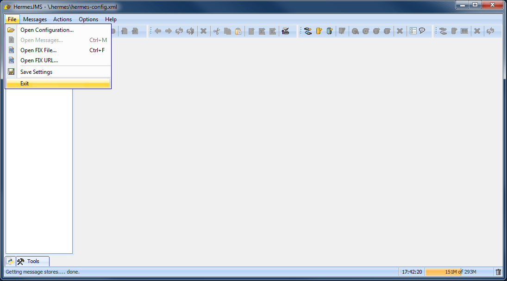

## Startup & Exit on Unix

Open a terminal window and navigate to the `[hermesjms_install_dir]`. Change to the `bin` subdirectory and execute the following command to start Hermes JMS:

``` bash
./hermes.sh
```

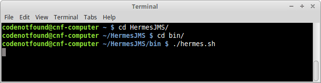

The Hermes JMS application should startup and open as shown below:

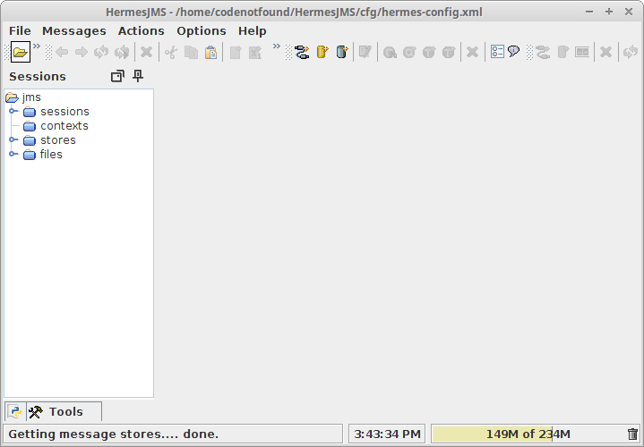

> If HermesJMS does not start correctly, check the 'hermes.log' file located in the `[hermesjms_install_dir]/bin` directory for more information on what went wrong.

In order to exit HermesJMS simply select `File > Exit` from the console top menu (same as on Windows).

## Changing the Default Configuration Location on Windows

It is recommended to keep your `hermes-config.xml` (by default located in a `.hermes` directory) separate from the installation. This way you can easily share or replicate your configuration on different machines. In addition, it will allow for easier upgrades without affecting your existing configuration.

Changing the default location of the configuration on Windows can be done by setting the `'HERMES_CONFIG'` environment variable. There are [a number of ways to edit the environment variables of a standard user](http://superuser.com/a/25038). One of them is to open a command prompt and enter the following command:

``` bash
rundll32 sysdm.cpl,EditEnvironmentVariables
```

This will open the `Environment Variables panel`. Click on `New` and enter `HERMES_CONFIG` as variable name and a location for the configuration directory as variable value. In the below screenshot the variable value is `C:\Users\CodeNotFound\hermes_config`. Click `OK` to to save.

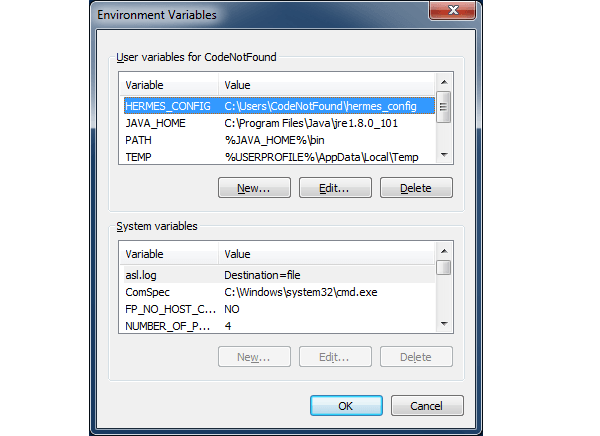

Last thing to do is to copy the `hermes-config.xml` from `.hermes` to the newly created configuration directory. Go ahead and start HermesJMS and this time the log files will appear under the configuration directory indicating the configuration was successful. You can also see the new location in the title of the HermesJMS application window.

> Make sure the `hermes-config.xml` is copied otherwise a `_NoConfigurationException_` will be thrown in the logs and the application will not start.

## Changing the Default Configuration File on Unix

You can change the default configuration file used by the `hermes.sh` shell script by by setting the `'HERMES_CFG'` environment variable.

Go to your user's home directory and create (or edit if already exists) a `.bashrc` file. Add the below line and change the value between brackets to the path of the configuration file you want to use.

``` bash
export HERMES_CFG="[hermes_config_file_path]"
```

In the example below the variable value is `'/home/codenotfound/hermes_config/hermes-config.xml'`.

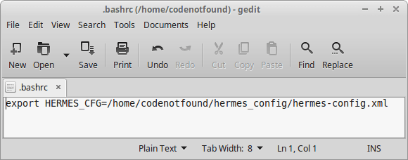

Save the file and perform a user log off in order for the variable to get loaded when logging on again. Start HermesJMS and this time you should see in the title of the application window that the custom configuration file was loaded instead of the default one.

This concludes the installation and setup of the Hermes JMS. If you found this post helpful or have any questions or remarks, please leave a comment.
