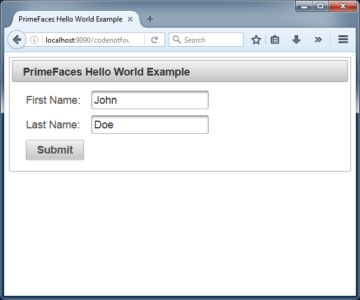
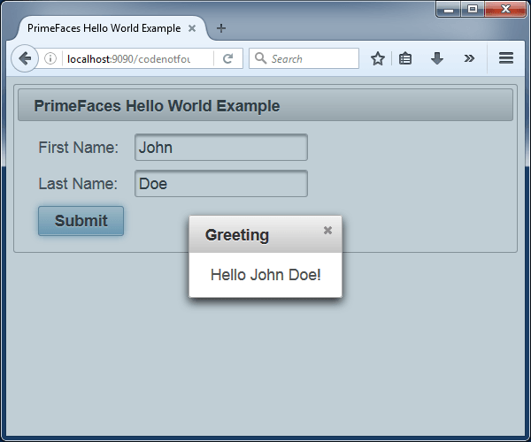

[PrimeFaces](http://primefaces.org/) is an open source component library for JavaServer Faces (JSF). It provides a collection of mostly visual components (widgets) that can be used by JSF programmers to build the UI for a web application. An overview of these widgets can be found at the [PrimeFaces showcase](http://www.primefaces.org/showcase/).

[Apache Tomcat](http://tomcat.apache.org/), is an open-source web server developed by the Apache Software Foundation. It implements several Java EE specifications and provides a "pure Java" HTTP web server environment for Java code to run in. Tomcat is released under Apache License 2.0 and is open-source software.

The following post illustrates a basic example in which we will configure, build and run a Hello World PrimeFaces example using Tomcat and Maven.

Tools used:

* JSF 2.2
* PrimeFaces 6.1
* Tomcat 7
* Maven 3.5

The code is built and run using [Maven](https://maven.apache.org/). Specified below is the Maven POM file which contains the needed dependencies for JSF and PrimeFaces.

In order to run the Hello World PrimeFaces application, a servlet container is needed and in this example, the Apache Tomcat implementation will be used. The deployment of the code and application server will be fully automated using the [tomcat7-maven-plugin](http://tomcat.apache.org/maven-plugin-2.2/).

The Tomcat plugin takes as input two configuration parameters so that the HTTP listener port is set to `9090` and the context path is set to `codenotfound`.

``` xml
<?xml version="1.0" encoding="UTF-8"?>
<project xmlns="http://maven.apache.org/POM/4.0.0" xmlns:xsi="http://www.w3.org/2001/XMLSchema-instance" xsi:schemaLocation="http://maven.apache.org/POM/4.0.0 http://maven.apache.org/xsd/maven-4.0.0.xsd">
  <modelVersion>4.0.0</modelVersion>

  <groupId>com.codenotfound</groupId>
  <artifactId>jsf-primefaces-apache-tomcat</artifactId>
  <version>0.0.1-SNAPSHOT</version>
  <packaging>war</packaging>

  <name>JSF - PrimeFaces Hello World Example using Apache Tomcat and Maven</name>
  <url>https://www.codenotfound.com/jsf-primefaces-hello-world-example-apache-tomcat.html</url>

  <properties>
    <project.build.sourceEncoding>UTF-8</project.build.sourceEncoding>
    <java.version>1.8</java.version>

    <servlet.version>3.1.0</servlet.version>
    <jsf.version>2.2.15</jsf.version>
    <primefaces.version>6.1</primefaces.version>

    <maven-compiler-plugin.version>3.7.0</maven-compiler-plugin.version>
    <tomcat7-maven-plugin.version>2.2</tomcat7-maven-plugin.version>
  </properties>

  <dependencies>
    <!-- Servlet -->
    <dependency>
      <groupId>javax.servlet</groupId>
      <artifactId>javax.servlet-api</artifactId>
      <version>${servlet.version}</version>
      <scope>provided</scope>
    </dependency>
    <!-- JSF -->
    <dependency>
      <groupId>com.sun.faces</groupId>
      <artifactId>jsf-api</artifactId>
      <version>${jsf.version}</version>
      <scope>compile</scope>
    </dependency>
    <dependency>
      <groupId>com.sun.faces</groupId>
      <artifactId>jsf-impl</artifactId>
      <version>${jsf.version}</version>
      <scope>compile</scope>
    </dependency>
    <!-- PrimeFaces -->
    <dependency>
      <groupId>org.primefaces</groupId>
      <artifactId>primefaces</artifactId>
      <version>${primefaces.version}</version>
    </dependency>
  </dependencies>

  <build>
    <plugins>
      <plugin>
        <groupId>org.apache.maven.plugins</groupId>
        <artifactId>maven-compiler-plugin</artifactId>
        <version>${maven-compiler-plugin.version}</version>
        <configuration>
          <source>${java.version}</source>
          <target>${java.version}</target>
        </configuration>
      </plugin>
      <!-- tomcat7-maven-plugin -->
      <plugin>
        <groupId>org.apache.tomcat.maven</groupId>
        <artifactId>tomcat7-maven-plugin</artifactId>
        <version>${tomcat7-maven-plugin.version}</version>
        <configuration>
          <port>9090</port>
          <path>/codenotfound</path>
        </configuration>
      </plugin>
    </plugins>
  </build>
</project>
```

The remaining code of the example is identical to a previous [PrimeFaces Hello World example running on Jetty](/jsf-primefaces-hello-world-example-jetty-maven.html). Feel free to check it out if you would like to know more details.

In order to run the above example open a command prompt and execute following Maven command:

``` bash
mvn tomcat7:run
```

Maven will download the needed dependencies, compile the code and start a Tomcat instance on which the web application will be deployed. The result should be the following startup trace ending with: `Starting ProtocolHandler`.

``` bash
[INFO] Running war on http://localhost:9090/codenotfound
[INFO] Using existing Tomcat server configuration at c:\code\jsf-primefaces\jsf-primefaces-apache-tomcat\target\tomcat
[INFO] create webapp with contextPath: /codenotfound
dec 30, 2017 7:08:49 AM org.apache.coyote.AbstractProtocol init
INFO: Initializing ProtocolHandler ["http-bio-9090"]
dec 30, 2017 7:08:49 AM org.apache.catalina.core.StandardService startInternal
INFO: Starting service Tomcat
dec 30, 2017 7:08:49 AM org.apache.catalina.core.StandardEngine startInternal
INFO: Starting Servlet Engine: Apache Tomcat/7.0.47
dec 30, 2017 7:08:51 AM com.sun.faces.config.ConfigureListener contextInitialized
INFO: Initializing Mojarra 2.2.15 ( 20171010-0603 637515cda4a29e3ba435e847fa14d55f2fff71a7) for context '/codenotfound'
dec 30, 2017 7:08:51 AM com.sun.faces.spi.InjectionProviderFactory createInstance
INFO: JSF1048: PostConstruct/PreDestroy annotations present.  ManagedBeans methods marked with these annotations will have said annotations processed.
dec 30, 2017 7:08:52 AM org.primefaces.webapp.PostConstructApplicationEventListener processEvent
INFO: Running on PrimeFaces 6.1
dec 30, 2017 7:08:52 AM org.apache.coyote.AbstractProtocol start
INFO: Starting ProtocolHandler ["http-bio-9090"]
```

Open a web browser and enter following URL: [http://localhost:9090/codenotfound/](http://localhost:9090/codenotfound/). The below page should be displayed:



Enter a first and last name and press the `Submit` button. A pop-up dialog will be shown with a greeting message.




If you would like to run the above code sample you can get the [full source code on GitHub](https://github.com/code-not-found/jsf-primefaces/tree/master/jsf-primefaces-apache-tomcat).


This concludes the PrimeFaces on Apache Tomcat example. If you found this post helpful or have any questions or remarks, please leave a comment.
