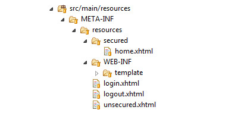
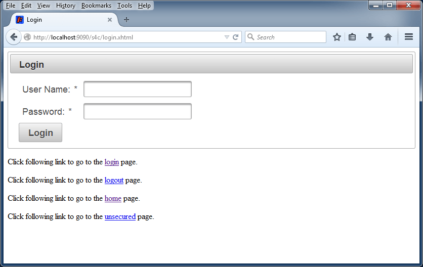
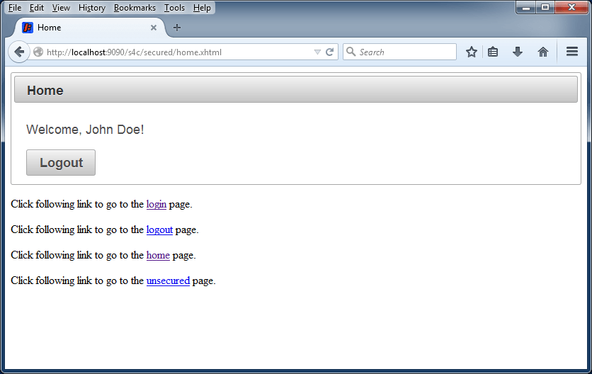
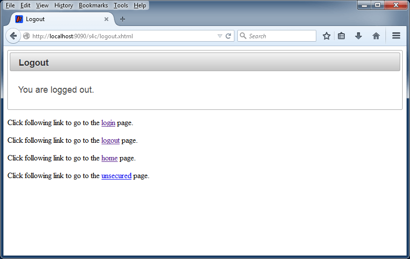

When creating a Java Server Faces application that needs to ensure only authenticated users can access certain pages, a `Servlet Filter` in combination with a session managed bean could be used to achieve this.

The following post illustrates how to implement a basic JSF login page example using PrimeFaces, Spring Boot, and Maven. It is largely based on this excellent [post by BalusC at the Stack Overflow forum](https://stackoverflow.com/questions/3841361/jsf-http-session-login/3842060#3842060).

Tools used:

* PrimeFaces 6.1
* JoinFaces 2.4
* Selenium 3.8
* Spring Boot 1.5
* Maven 3.5

The code is built and run using [Maven](https://maven.apache.org/). Specified below is the Maven POM file which contains the needed dependencies for PrimeFaces, JoinFaces, Selenium, and Spring Boot.

Testing is based on a previous [JSF Page Object pattern example]() in which we detailed how to use a Selenium `WebDriver` to automate tests against a [PrimeFaces](https://www.primefaces.org/) web page.

``` xml
<?xml version="1.0" encoding="UTF-8"?>
<project xmlns="http://maven.apache.org/POM/4.0.0" xmlns:xsi="http://www.w3.org/2001/XMLSchema-instance"
  xsi:schemaLocation="http://maven.apache.org/POM/4.0.0 http://maven.apache.org/xsd/maven-4.0.0.xsd">
  <modelVersion>4.0.0</modelVersion>

  <groupId>com.codenotfound</groupId>
  <artifactId>jsf-primefaces-login-servlet-filter</artifactId>
  <version>0.0.1-SNAPSHOT</version>
  <packaging>jar</packaging>

  <name>jsf-primefaces-login-servlet-filter</name>
  <description>JSF - PrimeFaces Login Servlet Filter Example</description>
  <url>https://www.codenotfound.com/jsf-primefaces-login-servlet-filter-example.html</url>

  <parent>
    <groupId>org.joinfaces</groupId>
    <artifactId>jsf-spring-boot-parent</artifactId>
    <version>2.4.1</version>
    <relativePath /> <!-- lookup parent from repository -->
  </parent>

  <properties>
    <java.version>1.8</java.version>

    <selenium-java.version>3.8.1</selenium-java.version>
    <selenium-htmlunit-driver.version>2.52.0</selenium-htmlunit-driver.version>
  </properties>

  <dependencies>
    <!-- spring-boot -->
    <dependency>
      <groupId>org.springframework.boot</groupId>
      <artifactId>spring-boot-starter</artifactId>
    </dependency>
    <dependency>
      <groupId>org.springframework.boot</groupId>
      <artifactId>spring-boot-starter-test</artifactId>
      <scope>test</scope>
    </dependency>
    <!-- joinfaces -->
    <dependency>
      <groupId>org.joinfaces</groupId>
      <artifactId>jsf-spring-boot-starter</artifactId>
    </dependency>
    <!-- selenium -->
    <dependency>
      <groupId>org.seleniumhq.selenium</groupId>
      <artifactId>selenium-java</artifactId>
      <version>${selenium-java.version}</version>
      <scope>test</scope>
    </dependency>
    <dependency>
      <groupId>org.seleniumhq.selenium</groupId>
      <artifactId>selenium-htmlunit-driver</artifactId>
      <version>${selenium-htmlunit-driver.version}</version>
      <scope>test</scope>
    </dependency>
  </dependencies>

  <build>
    <plugins>
      <!-- spring-boot-maven-plugin -->
      <plugin>
        <groupId>org.springframework.boot</groupId>
        <artifactId>spring-boot-maven-plugin</artifactId>
      </plugin>
    </plugins>
  </build>
</project>
```

## Model

First, a `User` class is defined which models some basic information on a user.

``` java
package com.codenotfound.primefaces.model;

import java.io.Serializable;

public class User implements Serializable {

  private static final long serialVersionUID = -1389546558353914770L;

  private String userId;
  private String firstName;
  private String lastName;

  public User(String userId, String firstName, String lastName) {
    this.userId = userId;
    this.firstName = firstName;
    this.lastName = lastName;
  }

  public String getUserId() {
    return userId;
  }

  public void setUserId(String userId) {
    this.userId = userId;
  }

  public String getFirstName() {
    return firstName;
  }

  public void setFirstName(String firstName) {
    this.firstName = firstName;
  }

  public String getLastName() {
    return lastName;
  }

  public void setLastName(String lastName) {
    this.lastName = lastName;
  }

  public String getName() {
    return firstName + " " + lastName;
  }
}
```

## Controller

Next, we have the `UserManager`, which is a session scoped managed bean that will handle all login related activities. It contains a `login()` method that will try to look-up a user based on a `userName` and `userPassword` combination entered on the login page.

When the user is found it is assigned to the `currentUser` variable and a redirect to the home page is returned. If the user is not found, a redirect to the login page is returned.

A `logout()` method will invalidate the session and the redirect to the logout page will make sure that the [previous data is longer available](http://stackoverflow.com/a/5620582/4201470).

The `isLoggedIn()` method will be used by the `LoginFilter` to check if a user is logged in. It checks the value of the `currentUser` which is only set after a successful login. The `isLoggedInForwardHome()` method will return a redirect to the home page in case a user is already logged in.

> Do not provide a setter for the `currentUser` variable, as this potentially allows a way to circumvent the `login()` method!

``` java
package com.codenotfound.primefaces.controller;

import java.io.Serializable;

import javax.faces.application.FacesMessage;
import javax.faces.bean.ManagedBean;
import javax.faces.bean.SessionScoped;
import javax.faces.context.FacesContext;

import org.slf4j.Logger;
import org.slf4j.LoggerFactory;

import com.codenotfound.primefaces.model.User;

@ManagedBean
@SessionScoped
public class UserManager implements Serializable {

  private static final long serialVersionUID = -9107952969237527819L;

  private static final Logger LOGGER =
      LoggerFactory.getLogger(UserManager.class);

  public static final String HOME_PAGE_REDIRECT =
      "/secured/home.xhtml?faces-redirect=true";
  public static final String LOGOUT_PAGE_REDIRECT =
      "/logout.xhtml?faces-redirect=true";

  private String userId;
  private String userPassword;

  private User currentUser;

  public String login() {
    // lookup the user based on user name and user password
    currentUser = find(userId, userPassword);

    if (currentUser != null) {
      LOGGER.info("login successful for '{}'", userId);

      return HOME_PAGE_REDIRECT;
    } else {
      LOGGER.info("login failed for '{}'", userId);
      FacesContext.getCurrentInstance().addMessage(null,
          new FacesMessage(FacesMessage.SEVERITY_WARN, "Login failed",
              "Invalid or unknown credentials."));

      return null;
    }
  }

  public String logout() {
    String identifier = userId;

    // invalidate the session
    LOGGER.debug("invalidating session for '{}'", identifier);
    FacesContext.getCurrentInstance().getExternalContext()
        .invalidateSession();

    LOGGER.info("logout successful for '{}'", identifier);
    return LOGOUT_PAGE_REDIRECT;
  }

  public boolean isLoggedIn() {
    return currentUser != null;
  }

  public String isLoggedInForwardHome() {
    if (isLoggedIn()) {
      return HOME_PAGE_REDIRECT;
    }

    return null;
  }

  private User find(String userId, String password) {
    User result = null;

    // TODO to be replaced with actual retrieval of user
    if ("john.doe".equalsIgnoreCase(userId)
        && "1234".equals(password)) {
      result = new User(userId, "John", "Doe");
    }

    return result;
  }

  public String getUserId() {
    return userId;
  }

  public void setUserId(String userId) {
    this.userId = userId;
  }

  public String getUserPassword() {
    return userPassword;
  }

  public void setUserPassword(String userPassword) {
    this.userPassword = userPassword;
  }

  public User getCurrentUser() {
    return currentUser;
  }

  // do not provide a setter for currentUser!
}
```

## View

In the example, a number of web pages will be used which realize the view part of the JSF web application. The following picture show how the different pages are structured under the `src/main/resources/META-INF/resources` folder.



The `login.xhtml` page is shown below. The header section contains a `<f:viewAction>` component which will redirect to the home page in case the user is already logged in.

The body contains a`&lt;p:inputText&gt;` and `&lt;p:password&gt;` input component which allow a user to enter the user name and password. Both fields apply some basic validation in that they are both required and need a minimum length of 3 characters.

The `Login` button will pass the entered values and call the `login()` method on the `UserManger` bean. Validation errors detected when submitting the credentials will be displayed using the `&lt;p:messages&gt;` component at the top of the page.

> At the bottom of the page, a number of links are included that make navigating the example easier.

``` html
<?xml version="1.0" encoding="UTF-8"?>
<!DOCTYPE html PUBLIC "-//W3C//DTD XHTML 1.0 Transitional//EN" "http://www.w3.org/TR/xhtml1/DTD/xhtml1-transitional.dtd">
<html xmlns="http://www.w3.org/1999/xhtml"
  xmlns:f="http://java.sun.com/jsf/core"
  xmlns:h="http://java.sun.com/jsf/html"
  xmlns:ui="http://java.sun.com/jsf/facelets"
  xmlns:p="http://primefaces.org/ui">

<h:head>
  <title>Login</title>
  <f:metadata>
    <f:viewAction action="#{userManager.isLoggedInForwardHome()}" />
  </f:metadata>
</h:head>

<h:body>

  <h:form id="login-form">
    <p:messages id="messages" showDetail="false" />

    <p:panel id="panel" header="Login">
      <h:panelGrid columns="3" cellpadding="5">
        <p:outputLabel for="user-name" value="User Name:" />
        <p:inputText id="user-name" value="#{userManager.userId}"
          required="true" label="User name">
          <f:validateLength minimum="3" />
        </p:inputText>
        <p:message for="user-name" display="icon" />

        <p:outputLabel for="password" value="Password:" />
        <p:password id="password" value="#{userManager.userPassword}"
          required="true" label="Password">
          <f:validateLength minimum="3" />
        </p:password>
        <p:message for="password" display="icon" />
      </h:panelGrid>

      <p:commandButton id="login" value="Login"
        update="panel messages" action="#{userManager.login()}" />
    </p:panel>
  </h:form>

  <ui:include src="/WEB-INF/template/links.xhtml" />

</h:body>
</html>
```

The `logout.xhtml` page contains two `&lt;p:panel&gt;` components which are rendered based on whether a user is logged in or not.

The first panel is shown in case a user is not logged in and contains a confirmation of the fact that the user is logged out. The second panel is shown in case the user is still logged in and provides a `Logout` button together with a reminder that the user is still logged in.

``` html
<?xml version="1.0" encoding="UTF-8"?>
<!DOCTYPE html PUBLIC "-//W3C//DTD XHTML 1.0 Transitional//EN" "http://www.w3.org/TR/xhtml1/DTD/xhtml1-transitional.dtd">
<html xmlns="http://www.w3.org/1999/xhtml"
  xmlns:h="http://java.sun.com/jsf/html"
  xmlns:ui="http://java.sun.com/jsf/facelets"
  xmlns:p="http://primefaces.org/ui">

<h:head>
  <title>Logout</title>
</h:head>

<h:body>

  <h:form>
    <p:panel header="Logout" rendered="#{!userManager.isLoggedIn()}">
      <p>You are logged out.</p>
    </p:panel>

    <p:panel header="Logout" rendered="#{userManager.isLoggedIn()}">
      <p>You are still logged in, click below button to log out!</p>
      <p:commandButton value="Logout" action="#{userManager.logout()}" />
    </p:panel>
  </h:form>

  <ui:include src="/WEB-INF/template/links.xhtml" />

</h:body>
</html>
```

The `home.xhtml` page is located in a `/secured` folder, to which access will be protected by the `LoginFilter`. The page contains a basic welcome message returning the full name of the user using the `getName()` method.

In addition, a Logout button is available which allows a user to invalidate the session.

``` html
<?xml version="1.0" encoding="UTF-8"?>
<!DOCTYPE html PUBLIC "-//W3C//DTD XHTML 1.0 Transitional//EN" "http://www.w3.org/TR/xhtml1/DTD/xhtml1-transitional.dtd">
<html xmlns="http://www.w3.org/1999/xhtml"
  xmlns:h="http://java.sun.com/jsf/html"
  xmlns:ui="http://java.sun.com/jsf/facelets"
  xmlns:p="http://primefaces.org/ui">

<h:head>
  <title>Home</title>
</h:head>

<h:body>

  <h:form id="home-form">
    <p:panel header="Home">
      <p>
        <h:outputText id="welcome-message"
          value="Welcome, #{userManager.currentUser.getName()}!" />
      </p>

      <p:commandButton value="Logout" action="#{userManager.logout()}" />
    </p:panel>
  </h:form>

  <ui:include src="/WEB-INF/template/links.xhtml" />

</h:body>
</html>
```

The `unsecured.xhtml` page is an example of a page that can be accessed without needing to log in.

The `WEB-INF/template/links.xhtml` is a `ui:composition` component that is referenced from all the above page. It contains links to make navigating the example easier.

## Security

The `LoginFilter` class is a `Servlet Filter` that will be used to restrict access to the home page. When called, it will try to retrieve the `UserManager` from the `ServletRequest`.  If the `isLoggedIn()` returns true then the call is allowed through. In all other cases, a redirect is done to the login page.

> Note that the session attribute name used to retrieve the `UserManager` is the name of the managed bean.

``` java
package com.codenotfound.primefaces.filter;

import java.io.IOException;

import javax.servlet.Filter;
import javax.servlet.FilterChain;
import javax.servlet.FilterConfig;
import javax.servlet.ServletException;
import javax.servlet.ServletRequest;
import javax.servlet.ServletResponse;
import javax.servlet.http.HttpServletRequest;
import javax.servlet.http.HttpServletResponse;

import org.slf4j.Logger;
import org.slf4j.LoggerFactory;

import com.codenotfound.primefaces.controller.UserManager;

public class LoginFilter implements Filter {

  private static final Logger LOGGER =
      LoggerFactory.getLogger(LoginFilter.class);

  public static final String LOGIN_PAGE = "/login.xhtml";

  @Override
  public void doFilter(ServletRequest servletRequest,
      ServletResponse servletResponse, FilterChain filterChain)
      throws IOException, ServletException {

    HttpServletRequest httpServletRequest =
        (HttpServletRequest) servletRequest;
    HttpServletResponse httpServletResponse =
        (HttpServletResponse) servletResponse;

    // managed bean name is exactly the session attribute name
    UserManager userManager = (UserManager) httpServletRequest
        .getSession().getAttribute("userManager");

    if (userManager != null) {
      if (userManager.isLoggedIn()) {
        LOGGER.debug("user is logged in");
        // user is logged in, continue request
        filterChain.doFilter(servletRequest, servletResponse);
      } else {
        LOGGER.debug("user is not logged in");
        // user is not logged in, redirect to login page
        httpServletResponse.sendRedirect(
            httpServletRequest.getContextPath() + LOGIN_PAGE);
      }
    } else {
      LOGGER.debug("userManager not found");
      // user is not logged in, redirect to login page
      httpServletResponse.sendRedirect(
          httpServletRequest.getContextPath() + LOGIN_PAGE);
    }
  }

  @Override
  public void init(FilterConfig arg0) throws ServletException {
    LOGGER.debug("loginFilter initialized");
  }

  @Override
  public void destroy() {
    // close resources
  }
}
```

The configuration of the `LoginFilter` is done in the `FilterConfig` class. The class is annotated with `@Configuration` which [indicates](https://docs.spring.io/spring/docs/4.3.13.RELEASE/spring-framework-reference/html/beans.html#beans-java-basic-concepts) that the class can be used by the Spring IoC container as a source of bean definitions.

A `FilterRegistrationBean` is created which registers filters in a Servlet 3.0+ container. In this example the `LoginFilter` will be applied to all pages inside the `/secured` directory.

``` java
package com.codenotfound.primefaces.config;

import org.springframework.boot.web.servlet.FilterRegistrationBean;
import org.springframework.context.annotation.Bean;
import org.springframework.context.annotation.Configuration;

import com.codenotfound.primefaces.filter.LoginFilter;

@Configuration
public class FilterConfig {

  @Bean
  public FilterRegistrationBean loginFilter() {
    FilterRegistrationBean registration =
        new FilterRegistrationBean();
    registration.setFilter(new LoginFilter());
    registration.addUrlPatterns("/secured/*");
    return registration;
  }
}
```

## Running the JSF Login Page Example

In order to run the above example open a command prompt and execute following Maven command:

``` bash
mvn spring-boot:run
```

Maven will download the needed dependencies, compile the code and start an Apache Tomcat instance on which the web application will be deployed.

Open a web browser and enter the following URL: [http://localhost:9090/codenotfound/login.xhtml](http://localhost:9090/codenotfound/login.xhtml). The result should be that below page is displayed:



Enter following credentials: User name=`john.doe` and Password=`1234` and a welcome page will be displayed as shown below.



Click the `Logout` button and a redirect to the logout page should happen as shown below.




If you would like to run the above code sample you can get the [full source code on GitHub](https://github.com/code-not-found/jsf-primefaces/tree/master/jsf-login-servlet-filter).


This concludes the JSF login page example using PrimeFaces and Spring Boot. If you found this post helpful or have any questions or remarks, please leave a comment below.
