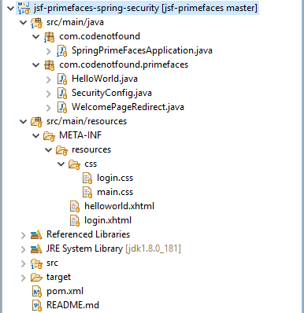
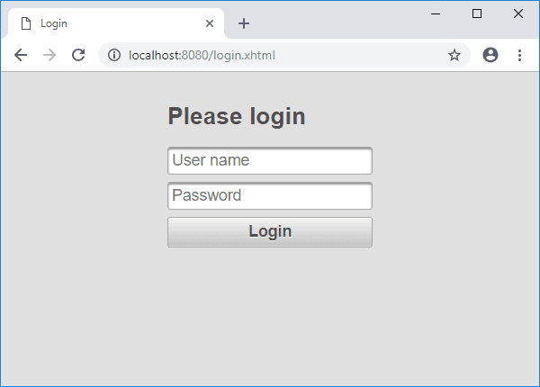
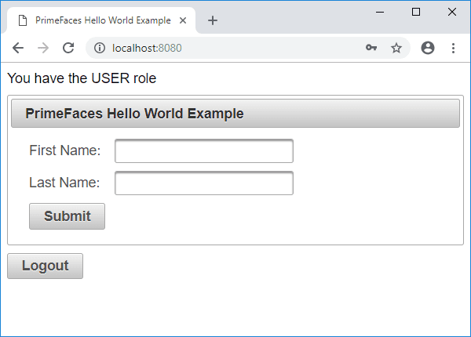
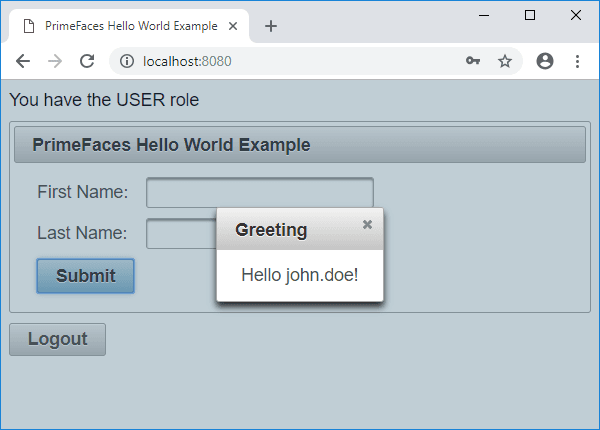
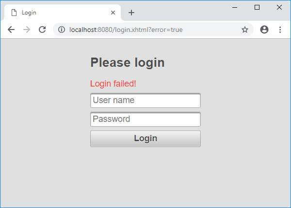

This is a complete guide to setup a PimeFaces login using [Spring Security](https://spring.io/projects/spring-security).

So if you want to secure your site, you'll love the step-by-step approach in this guide.

We've got a lot to cover, so let's get started.


If you want to learn more about PrimeFaces for JSF - head on over to the [JSF PrimeFaces tutorials]() page.


## What is Spring Security?

[Spring Security](https://en.wikipedia.org/wiki/Spring_Security) is a framework that focuses on providing both [authentication](https://en.wikipedia.org/wiki/Authentication) and [authorization](https://en.wikipedia.org/wiki/Authorization) to Java applications.

The project was started in late 2003 as 'Acegi Security'. Subsequently, it was incorporated into the Spring portfolio as Spring Security, an official Spring sub-project.

The following example shows how to set up a PrimeFaces login page in combination with Spring Security, Spring Boot, and Maven.

## General Project Overview

We will use the following tools/frameworks:

* PrimeFaces 6.2
* JoinFaces 3.3
* Spring Boot 2.1
* Spring Security 5.1
* Maven 3.5

Our project has the following directory structure:



## Maven Setup

The example is based on a previous [Hello World Primefaces Tutorial]() in which we created a greeting dialog based on a first and last name input form.

We also include the setup of a welcome page using the [PrimeFaces redirect example]().

To use Spring Security we add `spring-boot-starter-security` to the existing [Maven](https://maven.apache.org/) POM file. This will include the core security dependencies that are needed for securing our JSF application.

``` xml
<?xml version="1.0" encoding="UTF-8"?>
<project xmlns="http://maven.apache.org/POM/4.0.0" xmlns:xsi="http://www.w3.org/2001/XMLSchema-instance"
  xsi:schemaLocation="http://maven.apache.org/POM/4.0.0 http://maven.apache.org/xsd/maven-4.0.0.xsd">
  <modelVersion>4.0.0</modelVersion>

  <groupId>com.codenotfound</groupId>
  <artifactId>jsf-primefaces-spring-security</artifactId>
  <version>0.0.1-SNAPSHOT</version>
  <packaging>jar</packaging>

  <name>jsf-primefaces-spring-security</name>
  <description>JSF PrimeFaces Spring Security Example</description>
  <url>https://codenotfound.com/jsf-primefaces-spring-security-example.html</url>

  <parent>
    <groupId>org.springframework.boot</groupId>
    <artifactId>spring-boot-starter-parent</artifactId>
    <version>2.1.0.RELEASE</version>
    <relativePath /> <!-- lookup parent from repository -->
  </parent>

  <properties>
    <project.build.sourceEncoding>UTF-8</project.build.sourceEncoding>
    <project.reporting.outputEncoding>UTF-8</project.reporting.outputEncoding>
    <java.version>1.8</java.version>
    <joinfaces.version>3.3.0-rc2</joinfaces.version>
  </properties>

  <dependencyManagement>
    <dependencies>
      <dependency>
        <groupId>org.joinfaces</groupId>
        <artifactId>joinfaces-dependencies</artifactId>
        <version>${joinfaces.version}</version>
        <type>pom</type>
        <scope>import</scope>
      </dependency>
    </dependencies>
  </dependencyManagement>

  <dependencies>
    <dependency>
      <groupId>org.joinfaces</groupId>
      <artifactId>primefaces-spring-boot-starter</artifactId>
    </dependency>
    <dependency>
      <groupId>javax.enterprise</groupId>
      <artifactId>cdi-api</artifactId>
    </dependency>
    <dependency>
      <groupId>org.springframework.boot</groupId>
      <artifactId>spring-boot-starter-web</artifactId>
    </dependency>
    <dependency>
      <groupId>org.springframework.boot</groupId>
      <artifactId>spring-boot-starter-security</artifactId>
    </dependency>
  </dependencies>

  <build>
    <plugins>
      <plugin>
        <groupId>org.springframework.boot</groupId>
        <artifactId>spring-boot-maven-plugin</artifactId>
      </plugin>
    </plugins>
  </build>
</project>
```

## JSF Security Authorization and Authentication

Spring Security ships with a [default login page generator](https://github.com/spring-projects/spring-security/blob/master/web/src/main/java/org/springframework/security/web/authentication/ui/DefaultLoginPageGeneratingFilter.java) but in this example we will configure a custom login page using [PrimeFaces](https://www.primefaces.org/) components.

The `login.xhtml` page is located under `src/main/resources/META-INF/resources` and consists out of an `&lt;p:inputText&gt;` for the user name and a `&lt;p:password&gt;` for the password.

A `&lt;p:commandButton&gt;` is used to submit the form.

> Note that the IDs of the input fields need to be `username` and `password` respectively as by default Spring Security will look for parameters with these names.

We also specify `prependId="false"` on the form as otherwise the JSF framework will prefix the parameters with the ID of the form. Another option would be to override the default field names using the `usernameParameter()` and `passwordParameter()` methods on [formLogin()](https://docs.spring.io/spring-security/site/docs/5.1.1.RELEASE/reference/html/jc.html#jc-form) which we use further below.

``` html
<?xml version="1.0" encoding="UTF-8"?>
<!DOCTYPE html PUBLIC "-//W3C//DTD XHTML 1.0 Transitional//EN" "http://www.w3.org/TR/xhtml1/DTD/xhtml1-transitional.dtd">
<html xmlns="http://www.w3.org/1999/xhtml"
  xmlns:h="http://java.sun.com/jsf/html"
  xmlns:f="http://xmlns.jcp.org/jsf/core"
  xmlns:p="http://primefaces.org/ui"
  xmlns:pe="http://primefaces.org/ui/extensions">

<h:head>
  <title>Login</title>
  <h:outputStylesheet name="/css/login.css" />
</h:head>

<h:body>
  <h:form prependId="false">

    <p:panelGrid columns="1" styleClass="ui-fluid center ui-noborder">
      <h2>Please login</h2>

      <p:outputLabel value="Login failed!" styleClass="red"
        rendered="${!empty param['error']}" />

      <p:inputText id="username" placeholder="User name" />
      <p:password id="password" placeholder="Password" />

      <p:commandButton value="Login" ajax="false" />
    </p:panelGrid>

  </h:form>
</h:body>
</html>
```

If Spring Security is on the classpath Spring Boot automatically [configures a number of basic security features](https://docs.spring.io/spring-boot/docs/2.1.0.RELEASE/reference/htmlsingle/#boot-features-security) for a web application.

We will customize the web application security configuration by creating a `SecurityConfig` class that extends `WebSecurityConfigurerAdapter` which is a convenient base class that provides a default security configuration. The class is annotated with `@EnableWebSecurity` to enable Spring Security's web security support.

Override the `configure(HttpSecurity http)` method in order to define when and how users need to be authenticated.

Specifying `authorizeRequests().anyRequest().authenticated()` ensures that any request to our application requires the user to be authenticated.

The static resources (CSS, JavaScript, ...) need to be accessible to anyone otherwise the look and feel of the login page won't be the same as the rest of the application. Adding `antMatchers("/javax.faces.resource/**").permitAll()` allows anyone to access a URL that begins with `/javax.faces.resource/` (which is where the static resources in a JSF application are served).

As we have defined a custom PrimeFaces login page we need to specify its location using `formLogin().loginPage("/login.xhtml")` so that when authentication is required, the browser is redirected to `/login.xhtml`. We also need `permitAll()` on the login page so that anyone has access otherwise we end up in a [redirect loop](https://docs.spring.io/spring-security/site/docs/5.1.1.RELEASE/guides/html5/form-javaconfig.html#granting-access-to-unauthenticated-users).

If the login fails we redirect to the same login page with a `error=true` HTTP parameter in the URL using `failureUrl("/login.xhtml?error=true")`. This allows us to display and error message to the user.

Using `WebSecurityConfigurerAdapter`, logout capabilities are automatically applied. The default is that accessing the URL `/logout` will [log the user out](https://docs.spring.io/spring-security/site/docs/5.1.1.RELEASE/reference/html/jc.html#jc-logout). By specifying `logout().logoutSuccessUrl("/login.xhtml")` we redirect the user to the login page once he/she is successfully logged out.

Spring Security applies measures to prevents [CSRF attacks](https://en.wikipedia.org/wiki/Cross-site_request_forgery) by requiring a [randomly generated token](https://docs.spring.io/spring-security/site/docs/5.1.1.RELEASE/reference/html/web-app-security.html#synchronizer-token-pattern) as an HTTP parameter. However as JSF 2.2 already contains an [explicit protection against CSRF attacks](http://arjan-tijms.omnifaces.org/p/jsf-22.html#869) we disable the Spring Security protection by specifying `http.csrf().disable()`.

We will override the default single user `AuthenticationManager` that Spring Boot sets by auto-wiring an `AuthenticationManagerBuilder` into the `configureGlobal()` of our `SecurityConfig` `@Configuration` class.

For this example we use in-memory authentication in which two users (`john.doe` and `jane.doe`) with different roles (`USER` and `ADMIN`) are defined.

Password storage with Spring Security has undergone a [major overhaul since version 5](https://spring.io/blog/2017/11/01/spring-security-5-0-0-rc1-released#password-storage-updated). Because of these changes we prefix `{noop}` to the passwords in order for the `DelegatingPasswordEncoder` to use the `NoOpPasswordEncoder` [to validate them](https://stackoverflow.com/a/47150363/4201470).

``` java
package com.codenotfound.primefaces;

import org.springframework.beans.factory.annotation.Autowired;
import org.springframework.security.config.annotation.authentication.builders.AuthenticationManagerBuilder;
import org.springframework.security.config.annotation.web.builders.HttpSecurity;
import org.springframework.security.config.annotation.web.configuration.EnableWebSecurity;
import org.springframework.security.config.annotation.web.configuration.WebSecurityConfigurerAdapter;

@EnableWebSecurity
public class SecurityConfig extends WebSecurityConfigurerAdapter {

  @Override
  protected void configure(HttpSecurity http) throws Exception {
    // require all requests to be authenticated except for the resources
    http.authorizeRequests().antMatchers("/javax.faces.resource/**")
        .permitAll().anyRequest().authenticated();
    // login
    http.formLogin().loginPage("/login.xhtml").permitAll()
        .failureUrl("/login.xhtml?error=true");
    // logout
    http.logout().logoutSuccessUrl("/login.xhtml");
    // not needed as JSF 2.2 is implicitly protected against CSRF
    http.csrf().disable();
  }

  @Autowired
  public void configureGlobal(AuthenticationManagerBuilder auth)
      throws Exception {
    auth.inMemoryAuthentication().withUser("john.doe")
        .password("{noop}1234").roles("USER").and()
        .withUser("jane.doe").password("{noop}5678").roles("ADMIN");
  }
}
```

> When debugging Spring Security it is sometimes useful to enable the `DEBUG` level on the `org.springframework.security` logger. We have added this logger to the `logback.xml` logging configuration file located under `src/main/resources`.

## Role Based Access Control

Now that access to our application is secured we will adapt the Hello World example to illustrate role-based access control.

Spring Security has its own [taglib](https://docs.spring.io/spring-security/site/docs/5.1.1.RELEASE/reference/html/servlet-webclient.html#taglibs) which provides basic support for accessing security information and applying security constraints in JSPs.

On the `helloworld.xhtml` page we add a `&lt;div&gt;` element in which we use the authorize tag in order to display a message in case the user has the `USER` or `ADMIN` role.

We also add a logout `&lt;p:commandButton&gt;` at the bottom of the page. Note that we do not use `&lt;h:form&gt;` as [JSF sets the form action automatically to the current page](https://stackoverflow.com/a/19200679/4201470) and what we want to do is to navigate to the default logout URL offered by Spring Security.

``` html
<?xml version="1.0" encoding="UTF-8"?>
<!DOCTYPE html PUBLIC "-//W3C//DTD XHTML 1.0 Transitional//EN" "http://www.w3.org/TR/xhtml1/DTD/xhtml1-transitional.dtd">
<html xmlns="http://www.w3.org/1999/xhtml"
  xmlns:h="http://java.sun.com/jsf/html"
  xmlns:p="http://primefaces.org/ui"
  xmlns:sec="http://www.springframework.org/security/tags">

<h:head>
  <title>PrimeFaces Hello World Example</title>
  <h:outputStylesheet name="/css/main.css" />
</h:head>

<h:body>

  <div class="authorization-div">
    <sec:authorize access="hasRole('ROLE_USER')">
      <p:outputLabel value="You have the USER role" />
    </sec:authorize>
    <sec:authorize access="hasRole('ROLE_ADMIN')">
      <p:outputLabel value="You have the ADMIN role" />
    </sec:authorize>
  </div>

  <h:form>
    <p:panel header="PrimeFaces Hello World Example">
      <h:panelGrid columns="2" cellpadding="4">

        <h:outputText value="First Name: " />
        <p:inputText value="#{helloWorld.firstName}" />

        <h:outputText value="Last Name: " />
        <p:inputText value="#{helloWorld.lastName}" />

        <p:commandButton value="Submit" update="greeting"
          oncomplete="PF('greetingDialog').show()" />
      </h:panelGrid>
    </p:panel>

    <p:dialog header="Greeting" widgetVar="greetingDialog"
      modal="true" resizable="false">
      <h:panelGrid id="greeting" columns="1" cellpadding="4">
        <h:outputText value="#{helloWorld.showGreeting()}" />
      </h:panelGrid>
    </p:dialog>
  </h:form>

  <h:form onsubmit="this.action='#{request.contextPath}/logout';"
    class="logout-form">
    <p:commandButton value="Logout" ajax="false" />
  </h:form>

</h:body>
</html>
```

To wrap up we illustrate how you can access the current `Authentication` object stored in the security context.

We change the `showGreeting()` method to display the name of the authenticated user by calling `SecurityContextHolder.getContext().getAuthentication()` as shown below.

``` java
package com.codenotfound.primefaces;

import javax.inject.Named;
import org.springframework.security.core.Authentication;
import org.springframework.security.core.context.SecurityContextHolder;

@Named
public class HelloWorld {

  private String firstName = "";
  private String lastName = "";

  public String getFirstName() {
    return firstName;
  }

  public void setFirstName(String firstName) {
    this.firstName = firstName;
  }

  public String getLastName() {
    return lastName;
  }

  public void setLastName(String lastName) {
    this.lastName = lastName;
  }

  public String showGreeting() {
    Authentication authentication =
        SecurityContextHolder.getContext().getAuthentication();

    return "Hello " + authentication.getName() + "!";
  }
}
```

## Testing the JSF Security Roles

Let's test our secured PrimeFace login example by running following Maven command:

``` bash
mvn spring-boot:run
```

Once Spring Boot has started, open a web browser and enter the following URL: [http://localhost:8080/helloworld.xhtml](http://localhost:8080/helloworld.xhtml).

As we are not authenticated, Spring Security will redirect us to the login page.



Go ahead and enter the following user name=`john.doe` and password=`1234` and click the `Login` button.

We now see the Hello World page and the role of the user is displayed up top as shown below.



If we click on `Submit` then the username that was used to log in will be displayed.



Press the `Logout` button in order to be redirected to the login page.

If we now enter the same user but with an incorrect password an error message will be displayed.




If you would like to run the above code sample you can get the [full source code on GitHub](https://github.com/code-not-found/jsf-primefaces/tree/master/jsf-primefaces-spring-security).


The Spring Security framework is packed with out-of-the-box features that allow you to secure your JSF web application. All that is needed is a bit of configuration in order to set up authentication and authorization of users accessing our PrimeFaces example.

Let me know if you found the tutorial helpful.

Or in case you have some questions or remarks.

Thanks!
