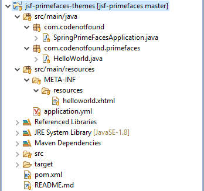
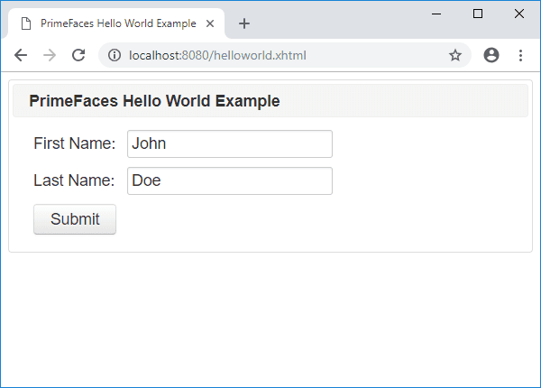

Today you're going to learn how to setup a [PrimeFaces](https://www.primefaces.org/) Theme.

More specifically we'll configure the free [Bootstrap](https://www.primefaces.org/twitter-bootstrap-theme/) community theme.

(FAST)

Let's jump right in…


If you want to learn more about PrimeFaces for JSF - head on over to the [JSF PrimeFaces tutorials](/jsf-primefaces-tutorials) page.


## What are PrimeFaces Themes?

PrimeFaces is integrated with the **ThemeRoller CSS Framework** in order to support different themes. There are three types of themes you can configure:

1. You can [purchase premium themes](https://www.primefaces.org/themes/).
2. You can choose from the [free community themes](https://www.primefaces.org/themes/) (click the Community tab).
3. You can create your own theme using the online theme generator tool of [ThemeRoller](http://jqueryui.com/themeroller/).

The following example shows how to set up the Bootstrap PrimeFaces theme using Spring Boot and Maven.

## General Project Overview

We will use the following tools/frameworks:

* PrimeFaces 6.2
* JoinFaces 3.3
* Spring Boot 2.1
* Maven 3.5

Our project has the following directory structure:



## Maven Setup

We start from a previous [JSF Spring Boot Example](/jsf-primefaces-example.html) in which we created a greeting dialog based on a first and last name input field.

As the PrimeFaces community themes are not available in the Maven central repository we need to specify the [PrimeFaces Maven Repository](http://repository.primefaces.org) in our Maven POM file as shown below.

Once this is done we need to include the [dependency to the specific PrimeFaces theme](https://repository.primefaces.org/org/primefaces/themes/) we want to use.

Alternatively, we can include all available themes by specifying the `all-themes` dependency. We will do the later in this example.

``` xml
<?xml version="1.0" encoding="UTF-8"?>
<project xmlns="http://maven.apache.org/POM/4.0.0" xmlns:xsi="http://www.w3.org/2001/XMLSchema-instance"
  xsi:schemaLocation="http://maven.apache.org/POM/4.0.0 http://maven.apache.org/xsd/maven-4.0.0.xsd">
  <modelVersion>4.0.0</modelVersion>

  <groupId>com.codenotfound</groupId>
  <artifactId>jsf-primefaces-themes</artifactId>
  <version>0.0.1-SNAPSHOT</version>
  <packaging>jar</packaging>

  <name>jsf-primefaces-themes</name>
  <description>JSF Primefaces Themes Example</description>
  <url>https://codenotfound.com/jsf-primefaces-themes-example.html</url>

  <parent>
    <groupId>org.springframework.boot</groupId>
    <artifactId>spring-boot-starter-parent</artifactId>
    <version>2.1.0.RELEASE</version>
    <relativePath /> <!-- lookup parent from repository -->
  </parent>

  <properties>
    <project.build.sourceEncoding>UTF-8</project.build.sourceEncoding>
    <project.reporting.outputEncoding>UTF-8</project.reporting.outputEncoding>
    <java.version>1.8</java.version>
    <joinfaces.version>3.3.0-rc2</joinfaces.version>
  </properties>

  <dependencyManagement>
    <dependencies>
      <dependency>
        <groupId>org.joinfaces</groupId>
        <artifactId>joinfaces-dependencies</artifactId>
        <version>${joinfaces.version}</version>
        <type>pom</type>
        <scope>import</scope>
      </dependency>
    </dependencies>
  </dependencyManagement>

  <dependencies>
    <dependency>
      <groupId>org.joinfaces</groupId>
      <artifactId>primefaces-spring-boot-starter</artifactId>
    </dependency>
    <dependency>
      <groupId>javax.enterprise</groupId>
      <artifactId>cdi-api</artifactId>
    </dependency>
    <dependency>
      <groupId>org.primefaces.themes</groupId>
      <artifactId>all-themes</artifactId>
      <version>1.0.10</version>
    </dependency>
  </dependencies>

  <repositories>
    <repository>
      <id>primefaces-maven-repository</id>
      <name>PrimeFaces Maven Repository</name>
      <url>http://repository.primefaces.org</url>
    </repository>
  </repositories>

  <build>
    <plugins>
      <plugin>
        <groupId>org.springframework.boot</groupId>
        <artifactId>spring-boot-maven-plugin</artifactId>
      </plugin>
    </plugins>
  </build>
</project>
```

## PrimeFaces Bootstrap Theme Setup

As we are using [JoinFaces](https://github.com/joinfaces/joinfaces#joinfaces) to setup Spring Boot we can use an [application property](https://github.com/joinfaces/joinfaces#jsf-properties-configuration-via-applicationproperties-or-applicationyml) in order to configure a PrimeFaces theme.

We set the `Bootstrap` theme by specifying the `jsf:primefaces:theme` property in `src/main/resources/application.yml` as shown below.

``` yml
jsf:
  primefaces:
    theme: bootstrap
```

Let's check the new look of our web application. Execute following Maven command:

``` bash
mvn spring-boot:run
```

Once Spring Boot has started, open a web browser and enter the following URL: [http://localhost:8080/helloworld.xhtml](http://localhost:8080/helloworld.xhtml).

The web page should now be displayed in the newly configured theme.




If you would like to run the above code sample you can get the [full source code on GitHub](https://github.com/code-not-found/jsf-primefaces/tree/master/jsf-primefaces-themes).


In this post, we illustrated how to configure the PrimeFaces Bootstrap theme using Spring Boot and Maven.

Drop a line below if you enjoyed reading this post.
