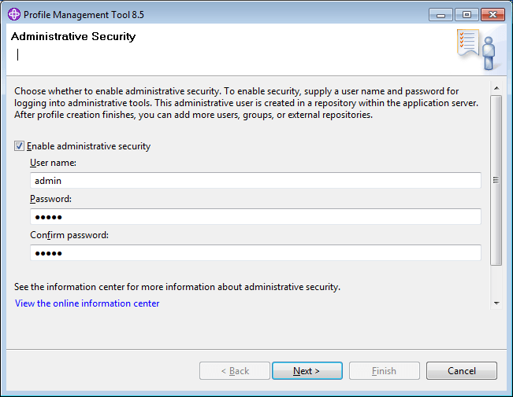
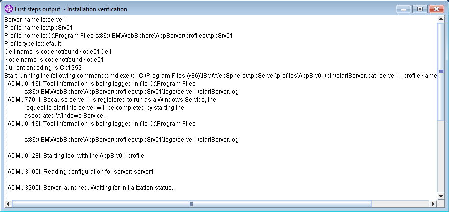
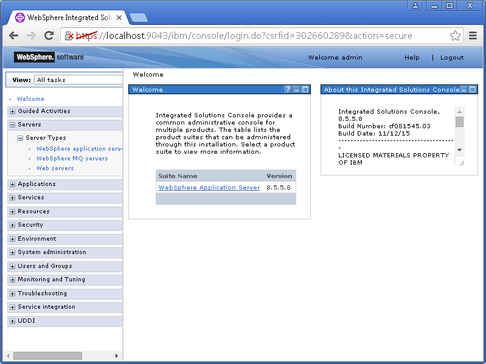
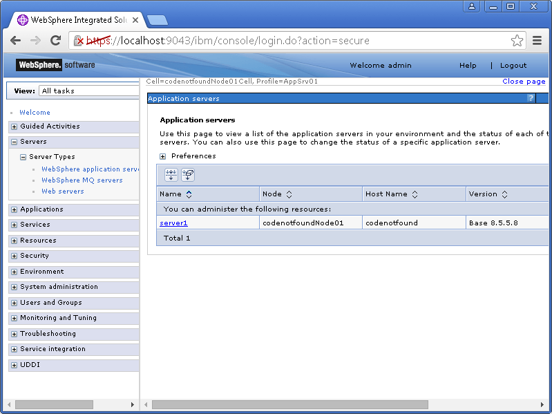
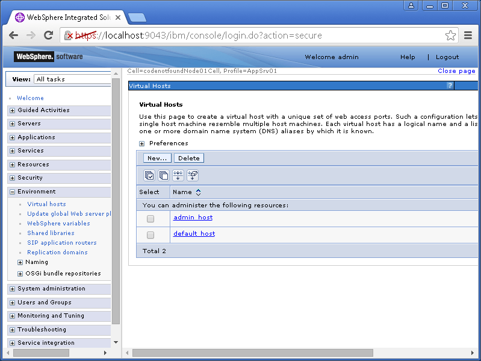
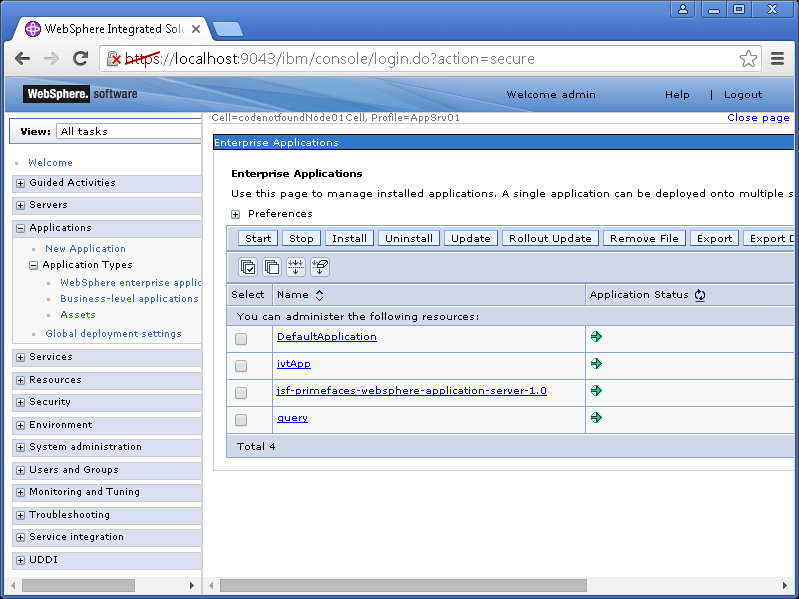
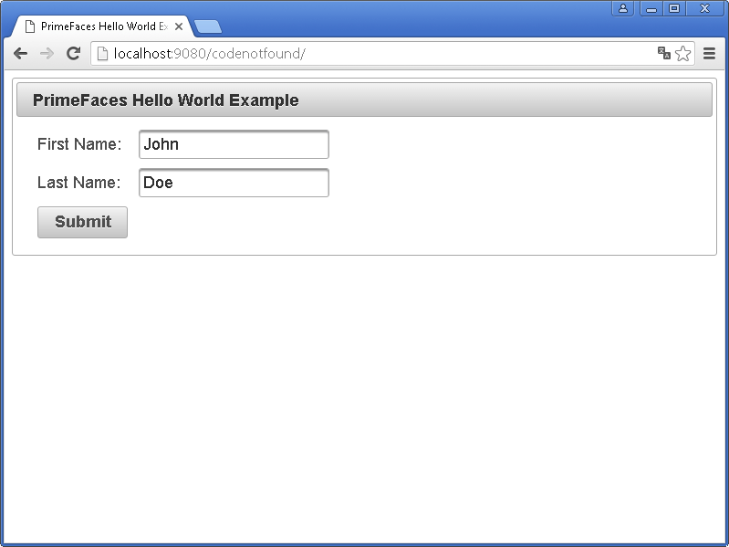
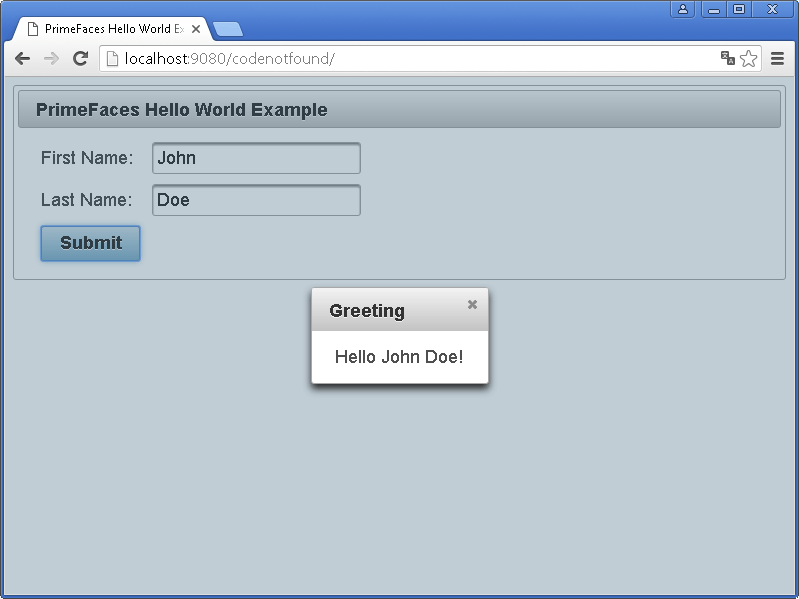

[IBM WebSphere Application Server](http://www-03.ibm.com/software/products/en/appserv-was) (WAS) is a software framework and middleware developed by International Business Machines Corporation. It hosts Java-based web applications and is built using Open standards such as Java EE, XML, and Web Services. WebSphere Application Server is released under a commercial license.

The following post illustrates a basic example in which we will configure, build and run a Hello World PrimeFaces example using WebSphere Application Server and Maven.

Tools used:

* JSF 2.2
* PrimeFaces 6.1
* WebSphere Application Server 8.5
* Maven 3.5

## WebSphere Application Server Setup

The example assumes you have an instance of WAS installed on the machine from which you will be executing Maven. If this is the case you can go ahead and [jump directly to the configuration of the was-maven-plugin](/jsf-primefaces-hello-world-example-websphere-application-server-maven.html#was-maven-plugin-configuration).

If you don't have an instance of WebSphere Application Server installed on your machine, you can [download the developers edition](https://www.ibm.com/developerworks/downloads/ws/wasdevelopers/index.html) that can be used for development and testing purposes at no charge. Click on the `Download` button and login with your IBM ID (register one if needed).

Download and extract the Installation Manager for your operating system. Launch the IBM Installation Manager and click through the different setup steps and start the installation. When the installation is complete select the option to launch the `Profile Management Tool to create an application server profile for a development environment`.

Once the Profile Management Tool is launched, enable administrative security as shown below. In this example we will use following values: User name=`admin` and Password=`admin`.



On the last step leave the `Launch the First steps console` selected and finish. A new window will pop-up from which you can select the `Installation verification` link which will launch a first steps output console that prints a number of details on your newly created development server profile.



Once `Server launched` is printed, open a web browser and enter following URL: [http://localhost:9060/ibm/console](http://localhost:9060/ibm/console). After entering the credentials that were defined during the profile setup (in this example User ID=`admin` and Password=`admin`), the WebSphere Application Server admin console should open as shown below.



## WAS Maven Plugin Configuration

The example code is built and run using [Maven](https://maven.apache.org/). Specified below is the Maven POM file which contains the needed dependencies for JSF and PrimeFaces.

In order to run the Hello World PrimeFaces application, a servlet container is needed and in this example, the IBM WebSphere Application Server implementation will be used. The deployment of the code will be fully automated using following [was-maven-plugin](https://github.com/orctom/was-maven-plugin). The detailed configuration of the plugin will be explained in the below steps.

``` xml
<?xml version="1.0" encoding="UTF-8"?>
<project xmlns="http://maven.apache.org/POM/4.0.0" xmlns:xsi="http://www.w3.org/2001/XMLSchema-instance" xsi:schemaLocation="http://maven.apache.org/POM/4.0.0 http://maven.apache.org/xsd/maven-4.0.0.xsd">
  <modelVersion>4.0.0</modelVersion>

  <groupId>com.codenotfound</groupId>
  <artifactId>jsf-primefaces-websphere-application-server</artifactId>
  <version>0.0.1-SNAPSHOT</version>
  <packaging>war</packaging>

  <name>JSF - PrimeFaces Hello World Example using WebSphere Application Server and Maven</name>
  <url>http://www.codenotfound.com/jsf-primefaces-hello-world-example-websphere-application-server-maven.html</url>

  <properties>
    <project.build.sourceEncoding>UTF-8</project.build.sourceEncoding>
    <java.version>1.6</java.version>

    <servlet.version>3.1.0</servlet.version>
    <jsf.version>2.2.15</jsf.version>
    <primefaces.version>6.1</primefaces.version>

    <was.home>C:\Program Files (x86)\IBM\WebSphere\AppServer</was.home>

    <maven-compiler-plugin.version>3.7.0</maven-compiler-plugin.version>
    <was-maven-plugin.version>1.1.2</was-maven-plugin.version>
  </properties>

  <dependencies>
    <!-- Servlet -->
    <dependency>
      <groupId>javax.servlet</groupId>
      <artifactId>javax.servlet-api</artifactId>
      <version>${servlet.version}</version>
      <scope>provided</scope>
    </dependency>
    <!-- JSF -->
    <dependency>
      <groupId>com.sun.faces</groupId>
      <artifactId>jsf-api</artifactId>
      <version>${jsf.version}</version>
      <scope>provided</scope>
    </dependency>
    <dependency>
      <groupId>com.sun.faces</groupId>
      <artifactId>jsf-impl</artifactId>
      <version>${jsf.version}</version>
      <scope>provided</scope>
    </dependency>
    <!-- PrimeFaces -->
    <dependency>
      <groupId>org.primefaces</groupId>
      <artifactId>primefaces</artifactId>
      <version>${primefaces.version}</version>
    </dependency>
  </dependencies>

  <build>
    <plugins>
      <plugin>
        <groupId>org.apache.maven.plugins</groupId>
        <artifactId>maven-compiler-plugin</artifactId>
        <version>${maven-compiler-plugin.version}</version>
        <configuration>
          <source>${java.version}</source>
          <target>${java.version}</target>
        </configuration>
      </plugin>
      <!-- was-maven-plugin -->
      <plugin>
        <groupId>com.orctom.mojo</groupId>
        <artifactId>was-maven-plugin</artifactId>
        <version>${was-maven-plugin.version}</version>
        <executions>
          <execution>
            <id>deploy</id>
            <phase>install</phase>
            <goals>
              <goal>deploy</goal>
            </goals>
            <configuration>
              <wasHome>${was.home}</wasHome>
              <user>admin</user>
              <password>admin</password>
              <host>localhost</host>
              <server>server1</server>
              <node>codenotfoundNode01</node>
              <virtualHost>default_host</virtualHost>
              <applicationName>${project.build.finalName}</applicationName>
              <contextRoot>codenotfound</contextRoot>
              <parentLast>true</parentLast>
            </configuration>
          </execution>
        </executions>
      </plugin>
    </plugins>
  </build>
</project>
```

In order to be able to run the `was-maven-plugin` needs a WebSphere Application Server installation. So the first thing we need to set is the `&lt;was.home&gt;` variable with the full path to the WebSphere `AppServer` directory. In the above example we installed WAS on Windows at the following location: `C:\Program Files (x86)\IBM\WebSphere\AppServer`.

Under the plugin configuration section the `&lt;user&gt;` and `&lt;password&gt;` parameters need to be set with the values assigned during the profile creation when enabling administrative security. These parameters are not needed in case administrative security is not enabled.

The `&lt;host&gt;` parameter specifies the IP/domain URL of the WAS instance on which we will deploy the Hello World application. In this example we will run the Maven command on the same machine as WAS is installed and so we use `localhost` as value.

The `&lt;server&gt;` and `&lt;node&gt;` values can be found by opening the admin console and selecting the `Servers &gt; Server Types &gt; WebSphere application servers` menu on the left hand side. This opens an overview of all application servers. The `name` and `node` columns will contain the server name and node name respectively.



In WebSphere, a virtual host is simply a set of host aliases, where each alias specifies a host name (or a * wildcard to match any host name) and a port number. The names of the available virtual hosts can be found under `Environment &gt; Virtual hosts` menu, as shown below. In this example we will use `default_host` as it contains a host alias for port `9080`, which is the default port WAS uses to listen for HTTP traffic.



The name of the deployed application will be set to `${project.build.finalName}` which defaults to `${artifactId}-${version}`. In this example this would be: `jsf-primefaces-websphere-application-server-1.0`. In addition the context path is set to `codenotfound`.

As WebSphere Application Server ships with its own implementation of the Servlet API and JaveServer Faces we need to set the respective Maven dependencies (javax.servlet-api, jsf-api, jsf-impl) to scope=`provided`. In addition the was-maven-plugin needs to be configured to set the webmodule class loader policy to parent last. This can be achieved by setting `&lt;parentLast&gt;` to `true`.

> Note that WebSphere Application server 8.5 by default runs on JDK 1.6. This is why the maven-compiler-plugin has been configured to compile to "1.6". Specifying a higher Java version will result following error message when trying to start the application:
`java.lang.UnsupportedClassVersionError: JVMCFRE003 bad major version; class=com/codenotfound/primefaces/HelloWorld, offset=6`.

The remaining code of the example is identical to the [PrimeFaces Hello World example detailed in this post](/jsf-primefaces-hello-world-example-jetty-maven.html). Feel free to check it out if you would like to know more details.

## Running the Hello World Example

In order to run the above example open a command prompt and execute following Maven command:

``` bash
mvn install
```

> Depending on where WebSphere Application Server is installed, you might need to execute the above command with the correct privileges. For example when running on Windows 7 with the default installation location, not running as an administrator results in following error message:
`!MESSAGE Error reading configuration: C:\Program Files (x86)\IBM\WebSphere\AppServer\profiles\AppSrv01\configuration\org.eclipse.osgi\.manager\.fileTableLock (Access is denied.)`.

Maven will download the needed dependencies, compile the code and connect to the WAS server. In a first step, a check is done to see if the application is already installed. If so then an uninstall command is triggered to remove the previous version. In a next step, the application is installed and started. Finally, the application server is restarted resulting in a successful build and deploy as shown below.

``` bash
[INFO] --- was-maven-plugin:1.1.2:deploy (deploy) @ jsf-primefaces-websphere-application-server ---
[INFO] was-maven-plugin - deploy
[INFO] Single target: localhost
[INFO] ============================================================
[INFO] [DEPLOY] localhost jsf-primefaces-websphere-application-server-1.0
[INFO] ============================================================
[INFO] ====================    pre-steps    =======================
[INFO] Skipped, not configured.
[INFO] ======================    deploy    ========================
wsadmin location: C:\Program Files (x86)\IBM\WebSphere\AppServer\bin\wsadmin.bat
WASX7209I: Connected to process "server1" on node codenotfoundNode01 using SOAP connector;  The type of process is: UnManagedProcess
WASX7303I: The following options are passed to the scripting environment and are available as arguments that are stored in the argv variable: "[-o, deploy]"
---------------------------------------------------------------
 AdminApplication:       Check if application exists
 Application Name:       jsf-primefaces-websphere-application-server-1.0
 Usage: AdminApplication.checkIfAppExists("jsf-primefaces-websphere-application-server-1.0")
 Return: Checks whether the application exists. If the application exists, a true value is returned.
---------------------------------------------------------------


------------------------------------------------------------
[UNINSTALLING APPLICATION] localhost jsf-primefaces-websphere-application-server-1.0
2016-jan-06 14:29:37 CET
------------------------------------------------------------
ADMA5017I: Uninstallation of jsf-primefaces-websphere-application-server-1.0 started.
ADMA5104I: The server index entry for WebSphere:cell=codenotfoundNode01Cell,node=codenotfoundNode01 is updated successfully.
ADMA5102I: The configuration data for jsf-primefaces-websphere-application-server-1.0 from the configuration repository is deleted successfully.
ADMA5011I: The cleanup of the temp directory for application jsf-primefaces-websphere-application-server-1.0 is complete.
ADMA5106I: Application jsf-primefaces-websphere-application-server-1.0 uninstalled successfully.

------------------------------------------------------------
[INSTALLING APPLICATION] localhost jsf-primefaces-websphere-application-server-1.0
2016-jan-06 14:29:45 CET
------------------------------------------------------------

options:  ['-distributeApp', '-appname', 'jsf-primefaces-websphere-application-server-1.0', '-MapModulesToServers', [['.*', '.*', 'WebSphere:server=server1']],
'-contextroot', 'codenotfound', '-MapWebModToVH', [['.*', '.*', 'default_host']]]

INSTALLING
WASX7327I: Contents of was.policy file:
 //
// Template policy file for enterprise application.
// Extra permissions can be added if required by the enterprise application.
//
// NOTE: Syntax errors in the policy files will cause the enterprise application FAIL to start.
//       Extreme care should be taken when editing these policy files. It is advised to use
//       the policytool provided by the JDK for editing the policy files
//       (WAS_HOME/java/jre/bin/policytool).
//

grant codeBase "file:${application}" {
};

grant codeBase "file:${jars}" {
};

grant codeBase "file:${connectorComponent}" {
};

grant codeBase "file:${webComponent}" {
};

grant codeBase "file:${ejbComponent}" {
};


ADMA5016I: Installation of jsf-primefaces-websphere-application-server-1.0 started.
ADMA5058I: Application and module versions are validated with versions of deployment targets.
ADMA5005I: The application jsf-primefaces-websphere-application-server-1.0 is configured in the WebSphere Application Server repository.
ADMA5005I: The application jsf-primefaces-websphere-application-server-1.0 is configured in the WebSphere Application Server repository.
ADMA5081I: The bootstrap address for client module is configured in the WebSphere Application Server repository.
ADMA5053I: The library references for the installed optional package are created.
ADMA5005I: The application jsf-primefaces-websphere-application-server-1.0 is configured in the WebSphere Application Server repository.
ADMA5001I: The application binaries are saved in C:\Program Files (x86)\IBM\WebSphere\AppServer\profiles\AppSrv01\wstemp\Script1521720b9c0\workspace\cells\coden
otfoundNode01Cell\applications\jsf-primefaces-websphere-application-server-1.0.ear\jsf-primefaces-websphere-application-server-1.0.ear
ADMA5005I: The application jsf-primefaces-websphere-application-server-1.0 is configured in the WebSphere Application Server repository.
SECJ0400I: Successfully updated the application jsf-primefaces-websphere-application-server-1.0 with the appContextIDForSecurity information.
ADMA5005I: The application jsf-primefaces-websphere-application-server-1.0 is configured in the WebSphere Application Server repository.
ADMA5005I: The application jsf-primefaces-websphere-application-server-1.0 is configured in the WebSphere Application Server repository.
ADMA5113I: Activation plan created successfully.
ADMA5011I: The cleanup of the temp directory for application jsf-primefaces-websphere-application-server-1.0 is complete.
ADMA5013I: Application jsf-primefaces-websphere-application-server-1.0 installed successfully.

SAVING CONFIG
ADMA5071I: Distribution status check started for application jsf-primefaces-websphere-application-server-1.0.
WebSphere:cell=codenotfoundNode01Cell,node=codenotfoundNode01,distribution=true,expansion=notprocessing
ADMA5011I: The cleanup of the temp directory for application jsf-primefaces-websphere-application-server-1.0 is complete.
ADMA5072I: Distribution status check completed for application jsf-primefaces-websphere-application-server-1.0.
INSTALLED jsf-primefaces-websphere-application-server-1.0
------------------------------------------------------------
[RESTARTING SERVER] localhost
2016-jan-06 14:30:02 CET
------------------------------------------------------------

------------------------------------------------------------
[FINISHED] localhost jsf-primefaces-websphere-application-server-1.0
2016-jan-06 14:30:02 CET
------------------------------------------------------------
Return code: 0
[INFO] ====================    post-steps    ======================
[INFO] Skipped, not configured.
[INFO] ------------------------------------------------------------------------
[INFO] BUILD SUCCESS
[INFO] ------------------------------------------------------------------------
[INFO] Total time: 01:10 min
[INFO] Finished at: 2016-01-06T14:30:03+01:00
[INFO] Final Memory: 17M/128M
[INFO] ------------------------------------------------------------------------

C:\codenotfound\code\jsf-primefaces\jsf-primefaces-websphere-application-server>
```

Open the WAS admin console and navigate to `Applications > Application Types' > WebSphere enterprise applications`. The example application should now be shown in the list of installed application (jsf-primefaces-websphere-application-server-1.0) with a green arrow beside it which indicates it was successfully started.



Open a web browser and enter the following URL: [http://localhost:9090/codenotfound/](http://localhost:9090/codenotfound/). The below page should be displayed:



Enter a first and last name and press the `Submit` button. A pop-up dialog will be shown with a greeting message.




If you would like to run the above code sample you can get the [full source code on GitHub](https://github.com/code-not-found/jsf-primefaces/tree/master/jsf-primefaces-websphere-application-server).


This concludes the PrimeFaces Hello World example using WebSphere Application Server. If you found this post helpful or have any questions or remarks, please leave a comment.
