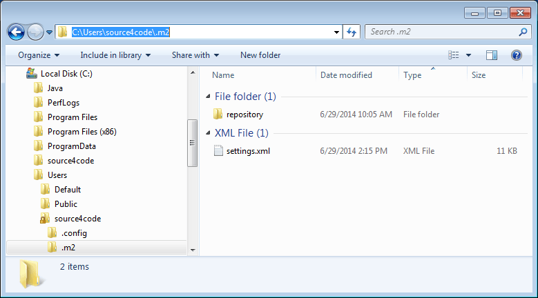
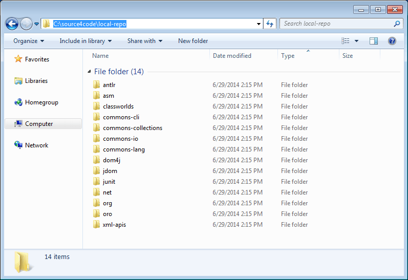

A repository in [Maven](https://maven.apache.org/) is used to hold build artifacts and dependencies of varying types. There are strictly only two types of repositories: local and remote.

The **local repository** refers to a copy on your own machine that is a cache of the remote downloads and also contains the temporary build artifacts that have not yet been released.

When [installing Maven](), the local repository is located under a default location. The following tutorial shows how you can change the location of this local repository on Windows.

## Maven Local Repository

Maven is configured based on a `settings.xml` file that can be specified at two levels:

1. **User Level**: provides configuration for a single user and is typically provided in `${user.home}/.m2/settings.xml`.
2. **Global level**: provides configuration for all Maven users on a machine (assuming they're all using the same Maven installation) and it's typically provided in `${maven.home}/conf/settings.xml`.

In this example we will change the local repository location by creating/editing a `settings.xml` file at user level.

Navigate to `[maven_install_dir]/conf` and if not already present copy the `setting.xml` file to the `.m2` directory located in the user home directory (in this example the user is `'source4code'`) as shown below.



Open the copied `settings.xml` file and add/update the `'&lt;localRepository&gt;'` element to point to the new location of the local repository. In this example the location is set to `C:\source4code\local-repo`.

``` xml
<settings xmlns="http://maven.apache.org/SETTINGS/1.0.0" 
          xmlns:xsi="http://www.w3.org/2001/XMLSchema-instance" 
          xsi:schemaLocation="http://maven.apache.org/SETTINGS/1.0.0 http://maven.apache.org/xsd/settings-1.0.0.xsd">
  <!-- localRepository
   | The path to the local repository maven will use to store artifacts.
   |
   | Default: ${user.home}/.m2/repository
  <localRepository>/path/to/local/repo</localRepository>
  -->
  <localRepository>C:\source4code\local-repo</localRepository>

  ...
  
</settings>
```

Next time Maven tries to resolve and download dependencies to the local repository, they will be stored in the newly defined location.

The below image shows the result after creating a quickstart Maven project. The artifacts are now downloaded to the `C:\source4code\local-repo` directory that was configured in the above `settings.xml`.



This concludes changing the location of the Maven local repository. If you found this post helpful or have any questions or remarks, please leave a comment below.
