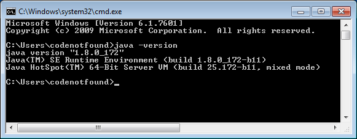
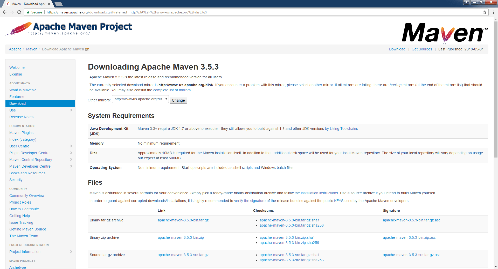
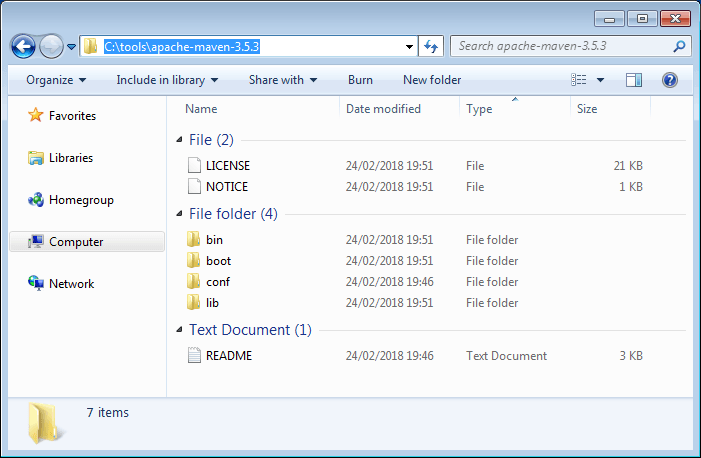
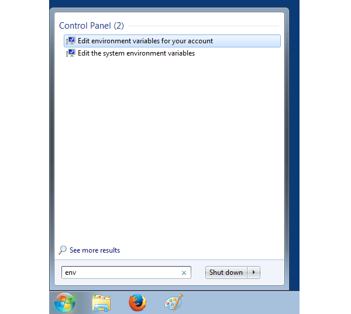
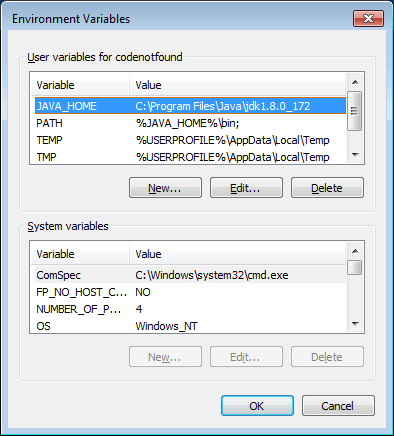
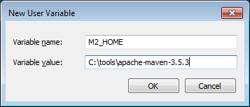
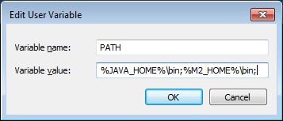
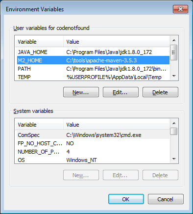
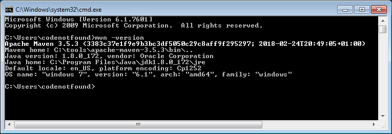
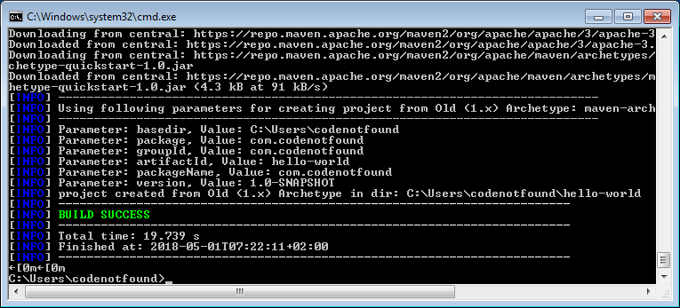

[Maven](https://maven.apache.org/) is a build automation tool used primarily for Java projects. Maven addresses two aspects of building software:

1. It describes **how software is built**.
2. It describes **its dependencies**.

The following tutorial shows how to download, install and configure Apache Maven 3.5.3 on Windows.

## Maven Prerequisites

As Maven needs [Java](https://java.com/en/download/) in order to work, make sure that [a Java runtime environment (JRE) is installed and configured on your system](/java-download-install-jdk-8-windows.html).

Maven 3.3+ requires JDK 1.7 or above to execute.

In order to check if Java is available on your system, open a command prompt and execute the following statement.

``` bash
java -version
```

If a Java Runtime Environment (JRE) is correctly installed and configured the version will be printed as shown below.



## Maven Download & Install

Head over to the [Maven download page](https://maven.apache.org/download.cgi) and locate `Files` section. Download the binary ZIP file, at the time of writing it was `apache-maven-3.5.3-bin.zip`.

> Here is the direct link to [download the apache-maven-3.5.3 binary ZIP file for Windows 32 or 64 bit](http://www-us.apache.org/dist/maven/maven-3/3.5.3/binaries/apache-maven-3.5.3-bin.zip).



Extract the binary archive downloaded in the previous step. The extracted root directory should contain a number of files and subdirectories as shown below.

In this example the install location is `'C:\tools\apache-maven-3.5.3'`. From now on we will refer to this directory as: `[maven_install_dir]`.



## Maven Configuration

Next we need to setup a `'M2_HOME'` environment variable that will point to the installed Maven runtime. In addition, if we want to run Maven from a command prompt, we need to configure the `'PATH'` environment variable to contain the Maven bin directory.

When using Windows the above parameters can be configured on the Environment Variables panel. Click on the `Windows Start` button and enter `env` without quotes as shown below.



Environment variables can be set at account level or at system level. For this example click on `Edit environment variables for your account` and following panel should appear.



Click on the `New` button and enter `M2_HOME` as variable name and the `[maven_install_dir]` as variable value. In this tutorial the installation directory is `'C:\tools\apache-maven-3.5.3'`. Click `OK` to to save.

> Note that "M2_HOME" is used for Maven 2 and later. "MAVEN_HOME" is for Maven 1.



Select the `'PATH'` entry and click on the `Edit` button. Add `;%M2_HOME%\bin;` at the end of the variable value and click `OK` to save.

> Note that in case a `'PATH'` variable does not exist you can create it and use `%M2_HOME%\bin;` as the variable value.



The result should be as shown below. Click `OK` to close the Environment Variables panel.



In order to test the above configuration, open a command prompt by clicking on the `Windows Start` button and typing `cmd` followed by pressing `ENTER`. A new command prompt should open in which the following command can be entered to verify the installed Maven version:

``` bash
mvn -version
```

The result should be that the Maven version is printed as shown below.



## Maven Usage

Let's finish the tutorial by creating a basic Maven HelloWorld project.

Open a command prompt and navigate to the directory in which you want to create the project. In the example below we will use `C:\Users\codenotfound`.

Next enter following Maven command and press `ENTER`.

``` bash
mvn archetype:generate -DgroupId=com.codenotfound -DartifactId=hello-world -DarchetypeArtifactId=maven-archetype-quickstart -DinteractiveMode=false
```

Maven will start looking for the needed dependencies in order to create the project which is based on the `'maven-archetype-quickstart'` archetype (= a Maven project templating toolkit). If needed, dependencies are downloaded to the local repository. Once all dependencies are resolved, the project is created and a `BUILD SUCCESS` statement is shown.

Feel free to browse the created `hello-world` directory. At the root you should be able to find the `pom.xml`, which is the XML representation of the Maven project.



This concludes the setting up and configuring Maven 3.5.

If you found this post helpful or have any questions or remarks, please leave a comment.
