[RabbitMQ](https://www.rabbitmq.com/) is an open source message broker software that implements the Advanced Message Queuing Protocol (AMQP). The RabbitMQ server is written in the [Erlang programming language](https://www.erlang.org/) and client libraries to interface with the broker are available for all major programming languages.

Following tutorial shows how to download and install RabbitMQ on Windows and perform a start/stop of the installed instance.

## Install Erlang

[Erlang](https://en.wikipedia.org/wiki/Erlang_(programming_language)) is a general-purpose concurrent, garbage-collected programming language and runtime system. It was designed by Ericsson to support distributed, fault-tolerant applications.

It was originally a proprietary language within Ericsson, but was released as open source in 1998. OTP (Open Telecom Platform) is the open source distribution of Erlang.

The first thing to do is to download the OTP binaries. Go the the [Erlang download page](http://www.erlang.org/download.html) and click on the Windows binary link for your system (32-bit or 64-bit). At the time of writing the latest stable release was `otp_win64_20.2.exe`.

> Note that there are also pre-built packages for platforms such as: [Raspbian, Ubuntu, Fedora, OS X, and more](https://www.erlang-solutions.com/resources/download.html).

Double click to run the downloaded `.exe` file and click `Next` keeping the default settings on the first installer step.

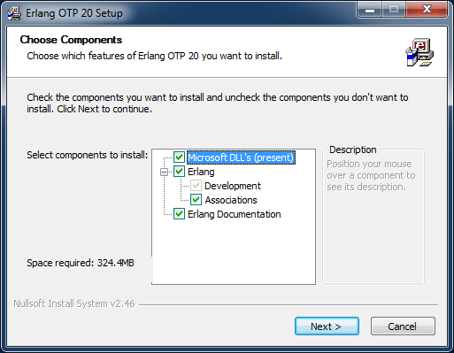

Optionally change the default destination folder and click `Next` and then `Install`. In the example below the install location was changed to `'C:\tools\erl9.2'`. From now on we will refer to this directory as: `[erlang_install_dir]`.

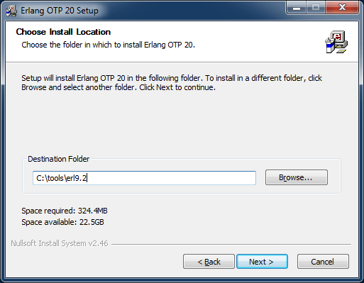

If Microsoft Visual C++ is not already setup on your system, a second installer window will pop-up. Click the `'I have read and accept the license terms'` check-box and click `Install`.

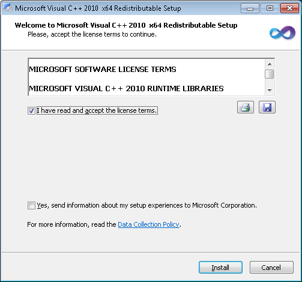

Click `Finish` when the Microsoft Visual C++ setup is complete and then click `Close` to finish the OTP installation.

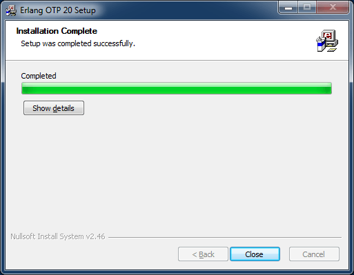

In order for Erlang applications to be able to run we need to setup an `'ERLANG_HOME'` environment variable that will point to the Erlang installation directory.

When using Windows the above parameter can be configured on the Environment Variables panel. Click on the `Windows Start` button and enter `env` without quotes as shown below.

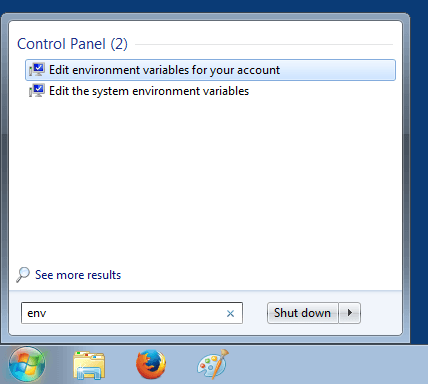

Environment variables can be set at account level or at system level. For this example click on `Edit environment variables for your account` and following panel should appear.

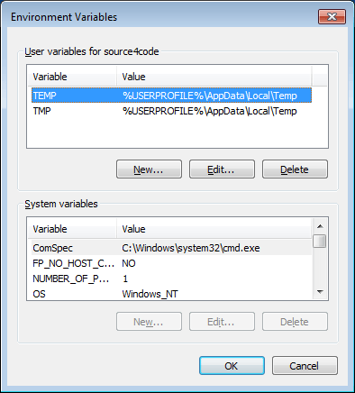

Click on the `New` button and enter `ERLANG_HOME` as variable name and the `[erlang_install_dir]` as variable value. In this tutorial the installation directory is `'C:\tools\erl9.2'`. Click OK to to save.

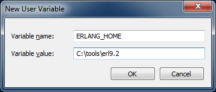

## Install RabbitMQ

RabbitMQ can be downloaded from the [RabbitMQ download page](https://www.rabbitmq.com/download.html). There are a number of different download packages available, for this tutorial we will be installing the [manual install package](https://www.rabbitmq.com/install-windows-manual.html) on Windows. At the time of writing the latest stable release was `rabbitmq-server-windows-3.7.2.zip`.

Extract the binaries archive downloaded in the previous step. The extracted root directory should contain a number of files and subdirectories as shown below. From now on we will refer to this directory as: `[rabbitmq_install_dir]`.

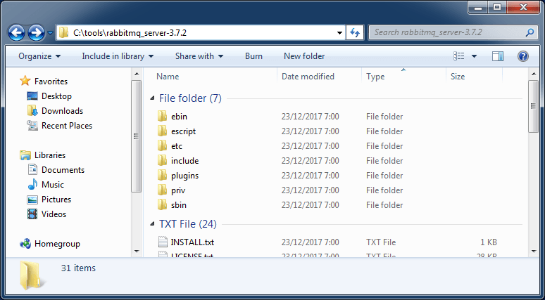

In order to start RabbitMQ, open a command prompt by clicking on the Windows Start button and typing `cmd` followed by pressing `ENTER`. A new command prompt window should open. Navigate to the `[rabbitmq_install_dir]/sbin` and enter following command:

``` bash
rabbitmq-server
```

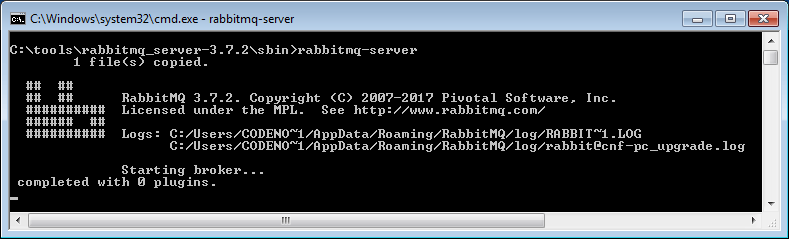

In order to stop RabbitMQ, open another command prompt at  `[rabbitmq_install_dir]/sbin` and enter following command:

``` bash
rabbitmqctl stop
```

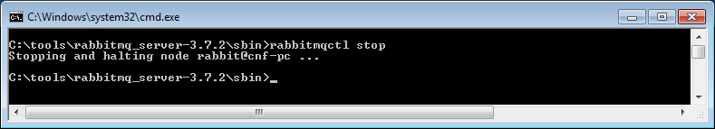

## Setup RabbitMQ

The `'rabbitmq-management'` plugin provides a browser-based UI for management and monitoring of the RabbitMQ server . In order to enable the UI, **make sure RabbitMQ is running** and open a new command prompt at `[rabbitmq_install_dir]/sbin` in which you enter following:

``` text
rabbitmq-plugins enable rabbitmq_management
```

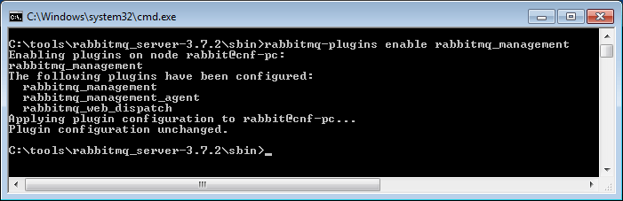

Open the RabbitMQ web console in a browser using: [http://localhost:15672](http://localhost:15672) and following page should be displayed:

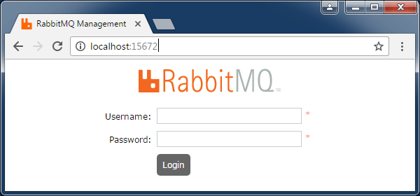

Enter following default credentials: Username=`guest` and Password=`guest` and click on `Login`. An overview page will be displayed that contains some basic information on the RabbitMQ server.

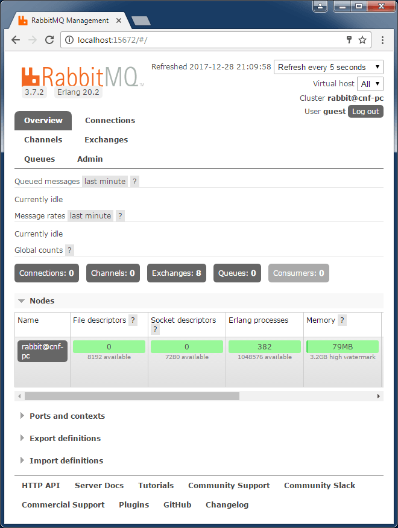

This concludes setting up and configuring RabbitMQ. If you found this post helpful or have any questions or remarks, please leave a comment.
