Looking for a [Spring Batch Admin UI](https://docs.spring.io/spring-batch-admin/trunk/) tutorial?

You might be surprised to learn it is no longer supported.

But don't worry as in this post **I'll show you the recommended replacement**.

And how to set it up.

Let's dive right in.


If you want to learn more about Spring Batch - head on over to the [Spring Batch tutorials page]().


## What is Spring Batch Admin?

Spring Batch Admin provides a web-based user interface (UI) that allows you to manage [Spring Batch](https://spring.io/projects/spring-batch) jobs. The project, however, is **end-of-life since December 31, 2017**.

[Spring Cloud Data Flow](https://spring.io/projects/spring-cloud-dataflow) is now the [recommended replacement](https://github.com/spring-projects/spring-batch-admin#note-this-project-is-being-moved-to-the-spring-attic-and-is-not-recommended-for-new-projects--spring-cloud-data-flow-is-the-recommended-replacement-for-managing-and-monitoring-spring-batch-jobs-going-forward--you-can-read-more-about-migrating-to-spring-cloud-data-flow-here) for managing and monitoring Spring Batch jobs.

Let's show how you can configure Spring Cloud Data Flow to run a batch job.

We use the following [Spring Batch capitalize names](https://github.com/code-not-found/spring-batch/tree/master/spring-batch-capitalize-names) project. It contains a batch job that converts person names from lower case into upper case.

We then start a Spring Cloud Data Flow server and configure the batch job. Using the web-based UI we launch the job and check the status.

## General Project Overview

We will use the following tools/frameworks:

* Spring Batch 4.1
* Spring Boot 2.1
* Maven 3.6

We will create two Maven projects.

One for the batch job:

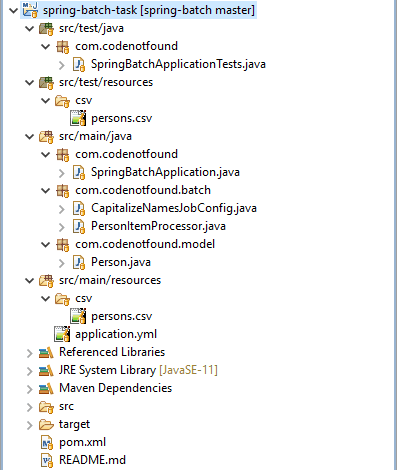

And one for Spring Cloud Data Flow:

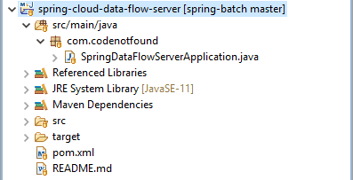

## Creating a Spring Batch Task

The basic Maven and Spring Boot setup of this project are identical to a previous [Spring Batch Hello World example](). As such we will not cover them in this post.

Spring Cloud Data Flow is **a toolkit for building data processing pipelines**. The pipelines consist of Spring Boot applications. This means we can run a Spring Boot batch job using a Data Flow server.

All we need to do is annotate our existing `SpringBatchApplication` with `@EnableTask` as shown below.

This class-level annotation tells [Spring Cloud Task](https://spring.io/projects/spring-cloud-task) to bootstrap its functionality. It enables a `TaskConfigurer` that registers the application in a `TaskRepository`.

Spring Cloud Task will also [associate the execution of a batch job with a task's execution](https://docs.spring.io/spring-cloud-task/docs/1.3.0.RELEASE/reference/htmlsingle/#batch-association) so that one can be traced back to the other. This association is by default in any context that has both a Spring Batch Job configured and the `spring-cloud-task-batch` JAR available within the classpath.

We can now define a Spring Cloud Task as we will see in the next section.

``` java
package com.codenotfound;

import org.springframework.boot.SpringApplication;
import org.springframework.boot.autoconfigure.SpringBootApplication;
import org.springframework.cloud.task.configuration.EnableTask;

@EnableTask
@SpringBootApplication
public class SpringBatchApplication {

  public static void main(String[] args) {
    SpringApplication.run(SpringBatchApplication.class, args);
  }
}
```

Spring Cloud Task uses a datasource for storing the results of task executions. When running on Spring Cloud Data Flow we need to make sure that [common datasource settings are shared among both](https://docs.spring.io/spring-cloud-dataflow/docs/2.1.0.RELEASE/reference/htmlsingle/#_task_database_configuration).

By default Spring Cloud Data Flow uses an in-memory instance of [H2](http://www.h2database.com/html/main.html) with the following URL: `jdbc:h2:tcp://localhost:19092/mem:dataflow`.

We set the same datasource on our Spring Batch Task using the `application.yml` properties file located in `src/main/resources`.

``` yml
spring:
  datasource:
    url: jdbc:h2:tcp://localhost:19092/mem:dataflow
    driverClassName: org.h2.Driver
```

To enable the above configuration changes we need to add extra dependencies in the Maven `pom.xml` file.

The `spring-cloud-starter-task` starter includes the dependencies for testing Spring Boot applications. It imports libraries that include [JUnit](http://junit.org/junit4/), [Hamcrest](http://hamcrest.org/JavaHamcrest/) and [Mockito](https://site.mockito.org/).

We also declare a dependency on `h2`. Spring Boot will take care of the [auto-configuration of the datasource](https://docs.spring.io/spring-boot/docs/2.1.5.RELEASE/reference/html/using-boot-auto-configuration.html) when it finds the H2 library on the classpath.

``` xml
<?xml version="1.0" encoding="UTF-8"?>
<project xmlns="http://maven.apache.org/POM/4.0.0"
  xmlns:xsi="http://www.w3.org/2001/XMLSchema-instance"
  xsi:schemaLocation="http://maven.apache.org/POM/4.0.0 http://maven.apache.org/xsd/maven-4.0.0.xsd">
  <modelVersion>4.0.0</modelVersion>

  <groupId>com.codenotfound</groupId>
  <artifactId>spring-batch-task</artifactId>
  <version>0.0.1-SNAPSHOT</version>
  <packaging>jar</packaging>

  <name>spring-batch-task</name>
  <description>Spring Batch Task Example</description>
  <url>https://codenotfound.com/spring-batch-admin-example.html</url>

  <parent>
    <groupId>org.springframework.boot</groupId>
    <artifactId>spring-boot-starter-parent</artifactId>
    <version>2.1.5.RELEASE</version>
    <relativePath /> <!-- lookup parent from repository -->
  </parent>

  <properties>
    <java.version>11</java.version>
    <spring-cloud-starter-task.version>2.1.0.RELEASE</spring-cloud-starter-task.version>
  </properties>

  <dependencies>
    <dependency>
      <groupId>org.springframework.boot</groupId>
      <artifactId>spring-boot-starter-batch</artifactId>
    </dependency>
    <dependency>
      <groupId>org.springframework.cloud</groupId>
      <artifactId>spring-cloud-starter-task</artifactId>
      <version>${spring-cloud-starter-task.version}</version>
    </dependency>
    <dependency>
      <groupId>com.h2database</groupId>
      <artifactId>h2</artifactId>
      <scope>runtime</scope>
    </dependency>
    <dependency>
      <groupId>org.springframework.boot</groupId>
      <artifactId>spring-boot-starter-test</artifactId>
      <scope>test</scope>
    </dependency>
    <dependency>
      <groupId>org.springframework.batch</groupId>
      <artifactId>spring-batch-test</artifactId>
      <scope>test</scope>
    </dependency>
  </dependencies>

  <build>
    <plugins>
      <plugin>
        <groupId>org.springframework.boot</groupId>
        <artifactId>spring-boot-maven-plugin</artifactId>
      </plugin>
    </plugins>
  </build>

</project>
```

The last thing left to do is to package our Spring Batch Task application as a Spring Boot JAR.

Open a command prompt and navigate to the `spring-batch-task` project. Execute following Maven command:

``` bash
mvn install
```

The result is a `spring-batch-task-0.0.1-SNAPSHOT.jar` JAR file in the `spring-batch-task/target` directory:

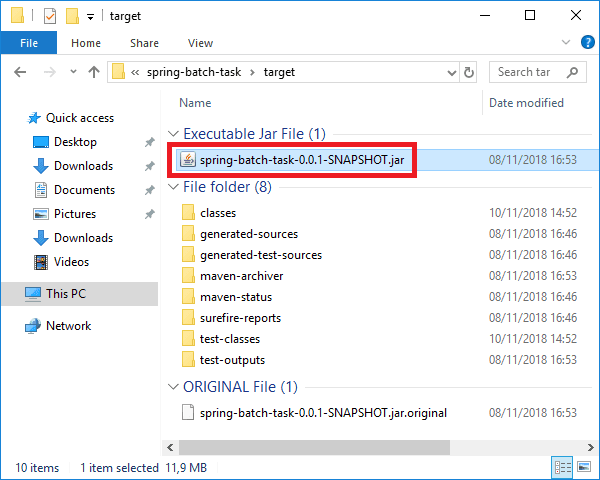

## Running a Spring Cloud Data Flow Server

In this example, we will run Spring Cloud Data Flow on a local server.

Create a new `spring-cloud-data-flow-server` Maven project.

The `spring-boot-starter` starter in the `pom.xml` will import the needed Spring Boot dependencies.

`spring-cloud-starter-dataflow-server` takes care of the Spring Cloud Data Flow dependencies.

> We also override the `h2.version` as otherwise [H2 will not auto-create the database](https://stackoverflow.com/a/55368174/4201470).

``` xml
<?xml version="1.0" encoding="UTF-8"?>
<project xmlns="http://maven.apache.org/POM/4.0.0"
  xmlns:xsi="http://www.w3.org/2001/XMLSchema-instance"
  xsi:schemaLocation="http://maven.apache.org/POM/4.0.0 http://maven.apache.org/xsd/maven-4.0.0.xsd">
  <modelVersion>4.0.0</modelVersion>

  <groupId>com.codenotfound</groupId>
  <artifactId>spring-cloud-data-flow-server</artifactId>
  <version>0.0.1-SNAPSHOT</version>
  <packaging>jar</packaging>

  <name>spring-cloud-data-flow-server</name>
  <description>Spring Cloud Data Server on Spring Boot</description>
  <url>https://codenotfound.com/spring-batch-admin-example.html</url>

  <parent>
    <groupId>org.springframework.boot</groupId>
    <artifactId>spring-boot-starter-parent</artifactId>
    <version>2.1.5.RELEASE</version>
    <relativePath /> <!-- lookup parent from repository -->
  </parent>

  <properties>
    <java.version>11</java.version>
    <spring-cloud-starter-dataflow-server.version>2.1.0.RELEASE</spring-cloud-starter-dataflow-server.version>
    <h2.version>1.4.193</h2.version>
  </properties>

  <dependencies>
    <dependency>
      <groupId>org.springframework.cloud</groupId>
      <artifactId>spring-cloud-starter-dataflow-server</artifactId>
      <version>${spring-cloud-starter-dataflow-server.version}</version>
    </dependency>
    <dependency>
      <groupId>com.h2database</groupId>
      <artifactId>h2</artifactId>
      <version>${h2.version}</version>
    </dependency>
  </dependencies>

  <build>
    <plugins>
      <plugin>
        <groupId>org.springframework.boot</groupId>
        <artifactId>spring-boot-maven-plugin</artifactId>
      </plugin>
    </plugins>
  </build>

</project>
```

Add the `@EnableDataFlowServer` annotation to the Spring Boot main class. This activates a Spring Cloud Data Flow Server implementation.

> We also disable the auto-configuration of the `CloudFoundryClient` by adding `exclude = {CloudFoundryDeployerAutoConfiguration.class}` to the `@SpringBootApplication` annotation.

``` java
package com.codenotfound;

import org.springframework.boot.SpringApplication;
import org.springframework.boot.autoconfigure.SpringBootApplication;
import org.springframework.cloud.dataflow.server.EnableDataFlowServer;
import org.springframework.cloud.deployer.spi.cloudfoundry.CloudFoundryDeployerAutoConfiguration;

@EnableDataFlowServer
@SpringBootApplication(
    exclude = {CloudFoundryDeployerAutoConfiguration.class})
public class SpringDataFlowServerApplication {

  public static void main(String[] args) {
    SpringApplication.run(SpringDataFlowServerApplication.class,
        args);
  }
}
```

That's it. We can now start our Local Data Flow Server.

Fire up a command prompt in the `spring-cloud-data-flow-server` project directory. Execute following Maven command:

``` bash
mvn spring-boot:run
```

The application will boot up.

``` bash
 ____                              ____ _                __
/ ___| _ __  _ __(_)_ __   __ _   / ___| | ___  _   _  __| |
\___ \| '_ \| '__| | '_ \ / _` | | |   | |/ _ \| | | |/ _` |
___) | |_) | |  | | | | | (_| | | |___| | (_) | |_| | (_| |
|____/| .__/|_|  |_|_| |_|\__, |  \____|_|\___/ \__,_|\__,_|
____ |_|    _          __|___/                 __________
|  _ \  __ _| |_ __ _  |  ___| | _____      __  \ \ \ \ \ \
| | | |/ _` | __/ _` | | |_  | |/ _ \ \ /\ / /   \ \ \ \ \ \
| |_| | (_| | || (_| | |  _| | | (_) \ V  V /    / / / / / /
|____/ \__,_|\__\__,_| |_|   |_|\___/ \_/\_/    /_/_/_/_/_/


2019-05-31 08:37:59.034  INFO 15308 --- [           main] c.c.c.ConfigServicePropertySourceLocator : Fetching config from server at : http://localhost:8888
2019-05-31 08:38:00.140  INFO 15308 --- [           main] c.c.c.ConfigServicePropertySourceLocator : Connect Timeout Exception on Url - http://localhost:8888. Will be trying the next url if available
2019-05-31 08:38:00.141  WARN 15308 --- [           main] c.c.c.ConfigServicePropertySourceLocator : Could not locate PropertySource: I/O error on GET request for "http://localhost:8888/spring-cloud-dataflow-server/local": Connection refused: connect; nested exception is java.net.ConnectException: Connection refused: connect
2019-05-31 08:38:00.148  WARN 15308 --- [           main] io.fabric8.kubernetes.client.Config      : Error reading service account token from: [/var/run/secrets/kubernetes.io/serviceaccount/token]. Ignoring.
2019-05-31 08:38:00.157  INFO 15308 --- [           main] c.c.SpringDataFlowServerApplication      : The following profiles are active: local
2019-05-31 08:38:01.293  INFO 15308 --- [           main] .s.d.r.c.RepositoryConfigurationDelegate : Multiple Spring Data modules found, entering strict repository configuration mode!
2019-05-31 08:38:01.296  INFO 15308 --- [           main] .s.d.r.c.RepositoryConfigurationDelegate : Bootstrapping Spring Data repositories in DEFAULT mode.
2019-05-31 08:38:01.322  INFO 15308 --- [           main] .s.d.r.c.RepositoryConfigurationDelegate : Finished Spring Data repository scanning in 14ms. Found 0 repository interfaces.
2019-05-31 08:38:01.357  INFO 15308 --- [           main] .s.d.r.c.RepositoryConfigurationDelegate : Multiple Spring Data modules found, entering strict repository configuration mode!
2019-05-31 08:38:01.358  INFO 15308 --- [           main] .s.d.r.c.RepositoryConfigurationDelegate : Bootstrapping Spring Data repositories in DEFAULT mode.
2019-05-31 08:38:01.515  INFO 15308 --- [           main] .s.d.r.c.RepositoryConfigurationDelegate : Finished Spring Data repository scanning in 153ms. Found 1 repository interfaces.
2019-05-31 08:38:01.674  INFO 15308 --- [           main] .s.d.r.c.RepositoryConfigurationDelegate : Multiple Spring Data modules found, entering strict repository configuration mode!
2019-05-31 08:38:01.674  INFO 15308 --- [           main] .s.d.r.c.RepositoryConfigurationDelegate : Bootstrapping Spring Data repositories in DEFAULT mode.
2019-05-31 08:38:01.730  INFO 15308 --- [           main] .s.d.r.c.RepositoryConfigurationDelegate : Finished Spring Data repository scanning in 55ms. Found 5 repository interfaces.
2019-05-31 08:38:02.144  INFO 15308 --- [           main] o.s.cloud.context.scope.GenericScope     : BeanFactory id=8f97e30e-e057-3d61-b376-39100bb816e7
2019-05-31 08:38:02.740  INFO 15308 --- [           main] o.s.b.w.embedded.tomcat.TomcatWebServer  : Tomcat initialized with port(s): 9393 (http)
2019-05-31 08:38:02.784  INFO 15308 --- [           main] o.apache.catalina.core.StandardService   : Starting service [Tomcat]
2019-05-31 08:38:02.785  INFO 15308 --- [           main] org.apache.catalina.core.StandardEngine  : Starting Servlet engine: [Apache Tomcat/9.0.19]
2019-05-31 08:38:02.930  INFO 15308 --- [           main] o.a.c.c.C.[Tomcat].[localhost].[/]       : Initializing Spring embedded WebApplicationContext
2019-05-31 08:38:03.630  INFO 15308 --- [           main] o.s.c.d.s.config.web.WebConfiguration    : Start Embedded H2
2019-05-31 08:38:03.630  INFO 15308 --- [           main] o.s.c.d.s.config.web.WebConfiguration    : Starting H2 Server with URL: jdbc:h2:tcp://localhost:19092/mem:dataflow
2019-05-31 08:38:03.947  INFO 15308 --- [           main] com.zaxxer.hikari.HikariDataSource       : HikariPool-1 - Starting...
2019-05-31 08:38:04.053  INFO 15308 --- [           main] com.zaxxer.hikari.HikariDataSource       : HikariPool-1 - Start completed.
2019-05-31 08:38:04.123  INFO 15308 --- [           main] o.f.c.internal.license.VersionPrinter    : Flyway Community Edition 5.2.4 by Boxfuse
2019-05-31 08:38:04.138  INFO 15308 --- [           main] o.f.c.internal.database.DatabaseFactory  : Database: jdbc:h2:tcp://localhost:19092/mem:dataflow (H2 1.4)
2019-05-31 08:38:04.227  INFO 15308 --- [           main] o.f.core.internal.command.DbValidate     : Successfully validated 1 migration (execution time 00:00.027s)
2019-05-31 08:38:04.236  INFO 15308 --- [           main] o.f.c.i.s.JdbcTableSchemaHistory         : Creating Schema History table: "PUBLIC"."flyway_schema_history_dataflow"
2019-05-31 08:38:04.257  INFO 15308 --- [           main] o.f.core.internal.command.DbMigrate      : Current version of schema "PUBLIC": << Empty Schema >>
2019-05-31 08:38:04.260  INFO 15308 --- [           main] o.f.core.internal.command.DbMigrate      : Migrating schema "PUBLIC" to version 1 - INITIAL SETUP
2019-05-31 08:38:04.309  INFO 15308 --- [           main] o.f.core.internal.command.DbMigrate      : Successfully applied 1 migration to schema "PUBLIC" (execution time 00:00.073s)
2019-05-31 08:38:04.494  INFO 15308 --- [           main] o.hibernate.jpa.internal.util.LogHelper  : HHH000204: Processing PersistenceUnitInfo [
      name: default
      ...]
2019-05-31 08:38:04.582  INFO 15308 --- [           main] org.hibernate.Version                    : HHH000412: Hibernate Core {5.3.10.Final}
2019-05-31 08:38:04.585  INFO 15308 --- [           main] org.hibernate.cfg.Environment            : HHH000206: hibernate.properties not found
2019-05-31 08:38:04.768  INFO 15308 --- [           main] o.hibernate.annotations.common.Version   : HCANN000001: Hibernate Commons Annotations {5.0.4.Final}
2019-05-31 08:38:04.956  INFO 15308 --- [           main] org.hibernate.dialect.Dialect            : HHH000400: Using dialect: org.hibernate.dialect.H2Dialect
2019-05-31 08:38:05.920  INFO 15308 --- [           main] j.LocalContainerEntityManagerFactoryBean : Initialized JPA EntityManagerFactory for persistence unit 'default'
2019-05-31 08:38:05.941  WARN 15308 --- [           main] io.fabric8.kubernetes.client.Config      : Error reading service account token from: [/var/run/secrets/kubernetes.io/serviceaccount/token]. Ignoring.
2019-05-31 08:38:05.943  WARN 15308 --- [           main] io.fabric8.kubernetes.client.Config      : Error reading service account token from: [/var/run/secrets/kubernetes.io/serviceaccount/token]. Ignoring.
2019-05-31 08:38:05.981  WARN 15308 --- [           main] io.fabric8.kubernetes.client.Config      : Error reading service account token from: [/var/run/secrets/kubernetes.io/serviceaccount/token]. Ignoring.
2019-05-31 08:38:05.983  WARN 15308 --- [           main] io.fabric8.kubernetes.client.Config      : Error reading service account token from: [/var/run/secrets/kubernetes.io/serviceaccount/token]. Ignoring.
2019-05-31 08:38:05.996  WARN 15308 --- [           main] io.fabric8.kubernetes.client.Config      : Error reading service account token from: [/var/run/secrets/kubernetes.io/serviceaccount/token]. Ignoring.
2019-05-31 08:38:05.997  WARN 15308 --- [           main] io.fabric8.kubernetes.client.Config      : Error reading service account token from: [/var/run/secrets/kubernetes.io/serviceaccount/token]. Ignoring.
2019-05-31 08:38:07.085  INFO 15308 --- [           main] o.s.s.concurrent.ThreadPoolTaskExecutor  : Initializing ExecutorService 'applicationTaskExecutor'
2019-05-31 08:38:07.166  WARN 15308 --- [           main] aWebConfiguration$JpaWebMvcConfiguration : spring.jpa.open-in-view is enabled by default. Therefore, database queries may be performed during view rendering. Explicitly configure spring.jpa.open-in-view to disable this warning
2019-05-31 08:38:07.754  INFO 15308 --- [           main] .s.s.UserDetailsServiceAutoConfiguration :

Using generated security password: 92f0b659-abe2-4aa1-86e5-b8ee0d132441

2019-05-31 08:38:08.323  INFO 15308 --- [           main] o.s.b.c.r.s.JobRepositoryFactoryBean     : No database type set, using meta data indicating: H2
2019-05-31 08:38:08.363  INFO 15308 --- [           main] o.s.c.d.s.b.SimpleJobServiceFactoryBean  : No database type set, using meta data indicating: H2
2019-05-31 08:38:08.801  INFO 15308 --- [           main] .s.c.DataFlowControllerAutoConfiguration : Skipper URI [http://localhost:7577/api]
2019-05-31 08:38:09.086  INFO 15308 --- [           main] o.s.b.w.embedded.tomcat.TomcatWebServer  : Tomcat started on port(s): 9393 (http) with context path ''
2019-05-31 08:38:09.091  INFO 15308 --- [           main] c.c.SpringDataFlowServerApplication      : Started SpringDataFlowServerApplication in 12.008 seconds (JVM running for 20.588)
2019-05-31 08:38:09.138  INFO 15308 --- [           main] .s.c.d.s.s.LauncherInitializationService : Added 'Local' platform account 'default' into Task Launcher repository.
```

Open a web browser and navigate to [http://localhost:9393/dashboard](http://localhost:9393/dashboard).

This will open the Spring Cloud Data Flow dashboard as shown below.

Now it's time to add our Spring Batch Task application. Click on the `Add Application(s)` button.

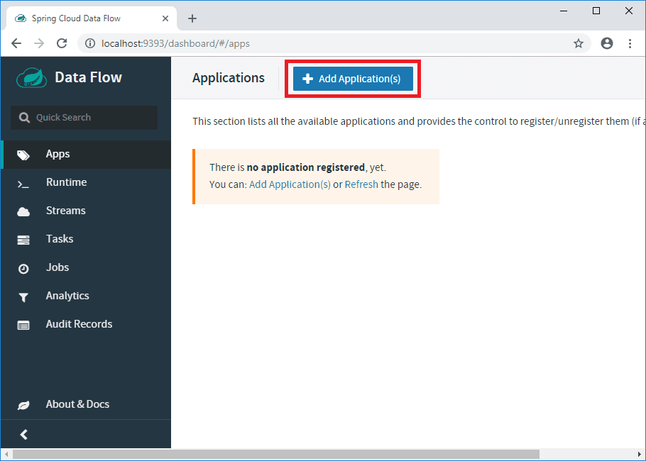

Click on `Register one or more applications`.

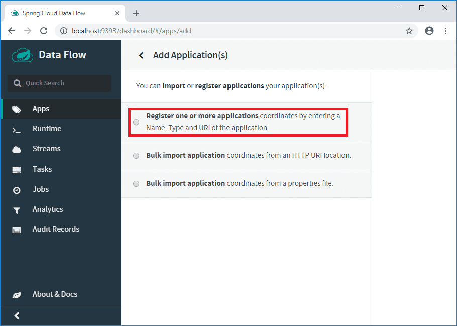

Enter `capitalize-names-app` as `name` of our application and select `Task` as `type`.

For the `URI` we enter the location of our Spring Boot Task JAR. In this example, the JAR file is located at: `file://C:/Users/Codenotfound/repos/spring-batch/spring-batch-admin/spring-batch-task/target/spring-batch-task-0.0.1-SNAPSHOT.jar`

Once done click on `Register the application(s)`.

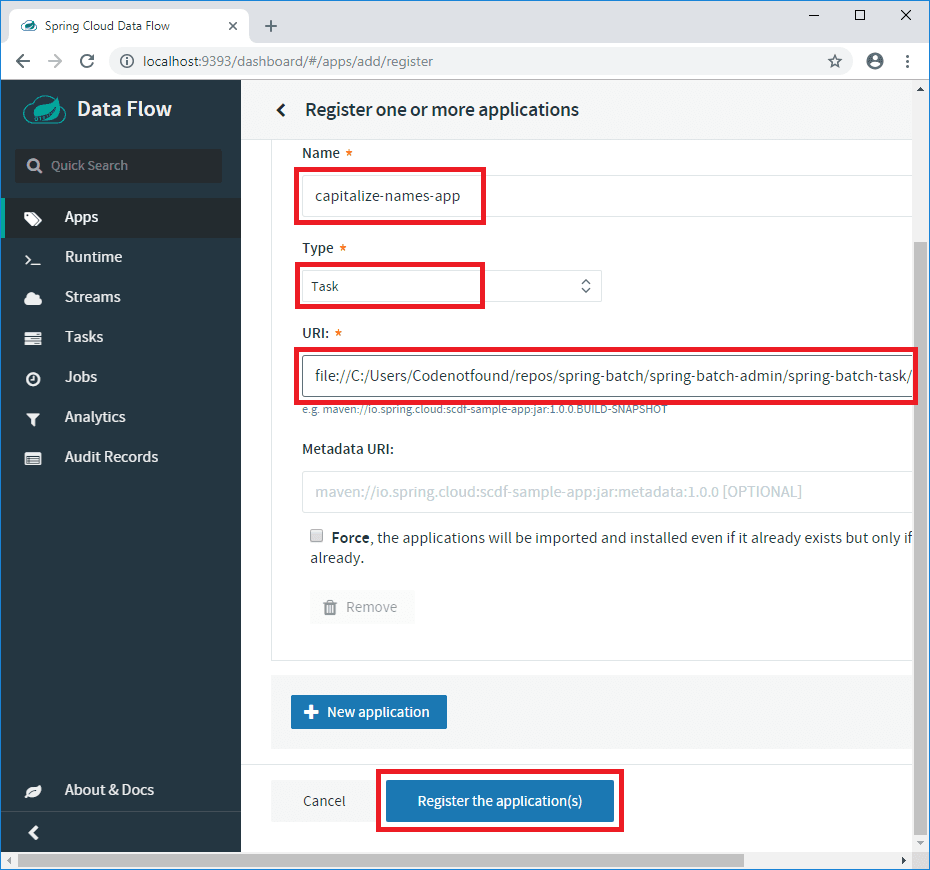

Our application is now registered.

Now click on the `Task` menu to create a new task that we can execute.

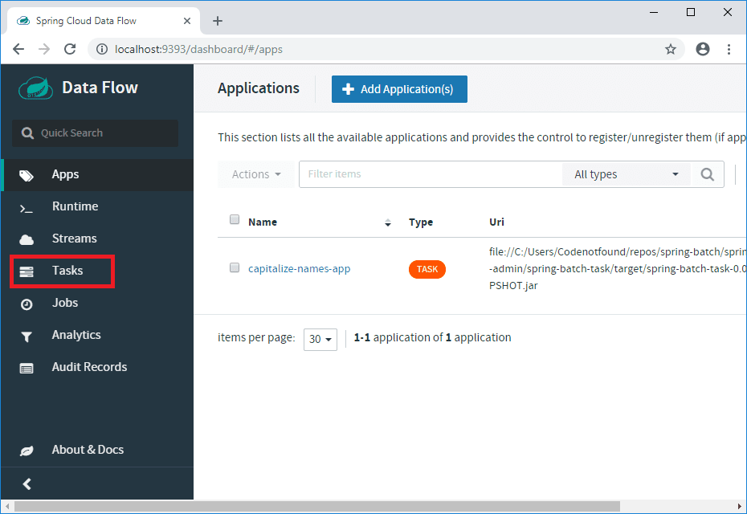

Click on the `Create task(s)` button.

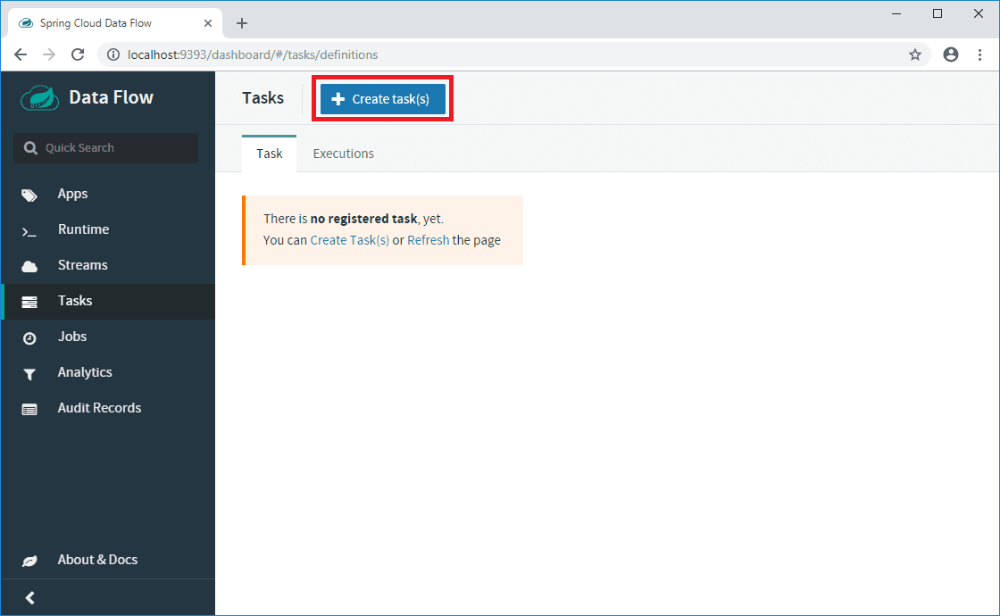

Drag the `Capitalize-Names-App` application on the canvas and connect the `START` and `END` nodes as shown below.

Click on `Create Task`.

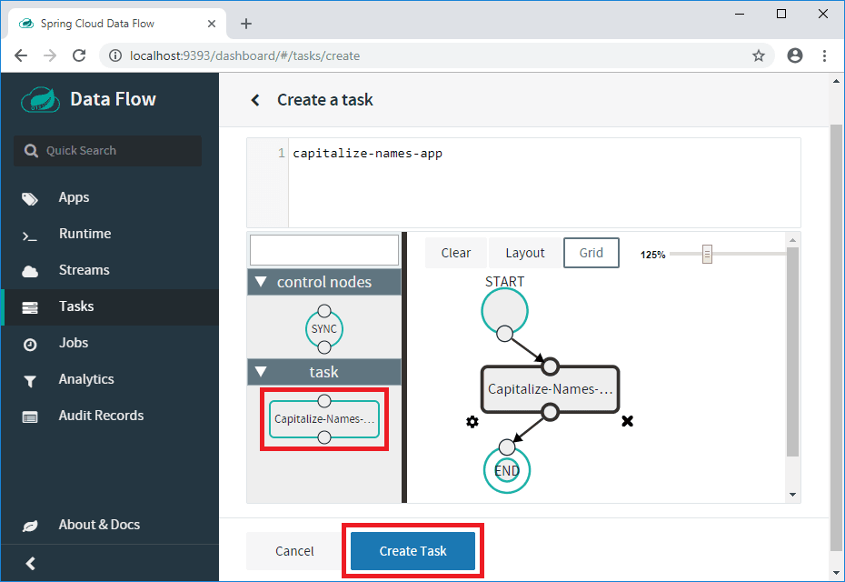

Enter `capitalize-names-task` as task name and click on `Create the task`.

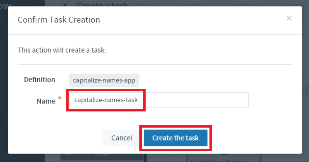

Our `capitalize-names-task` is now ready to be used. Click on the play icon to start an instance.

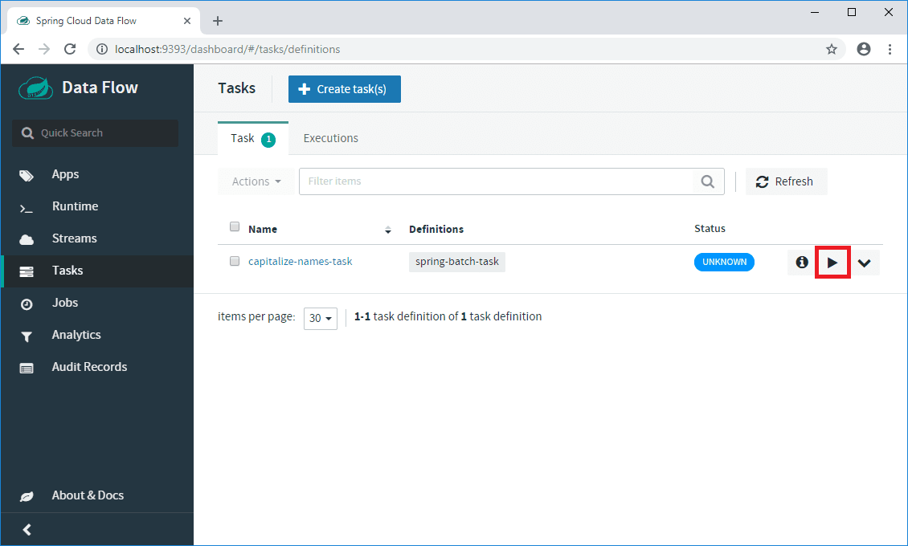

Click on the `Launch the task` button.

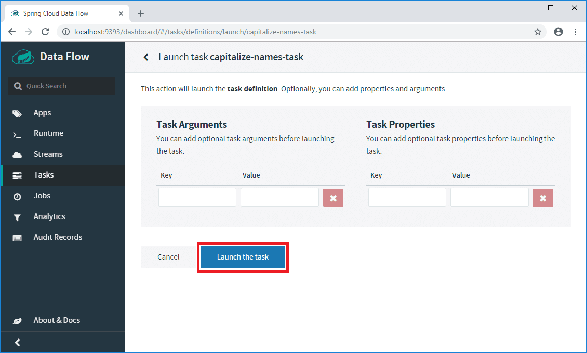

A new `Executions` tab now appears under the `Task` section. Click on it to consult the status of the task that we started.

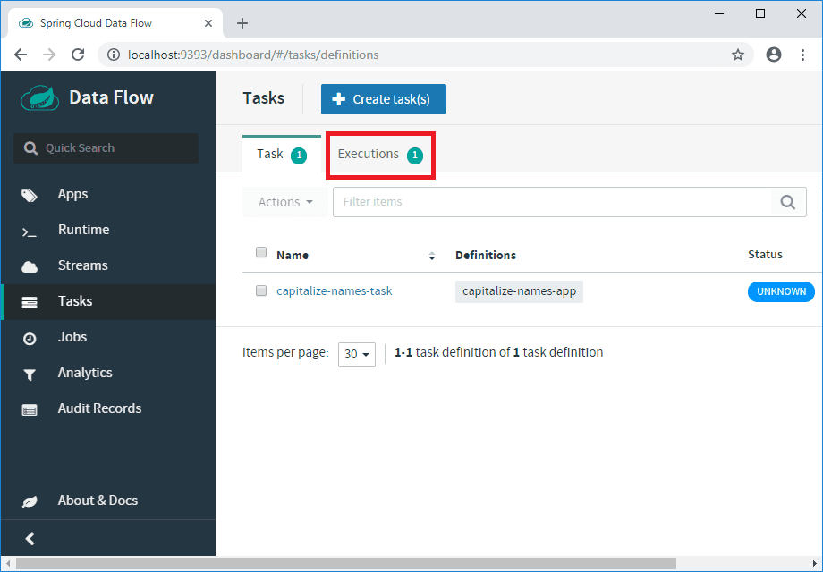

We can see that there is one execution instance for our `capitalize-names-task`. Click on the information icon to see the details.

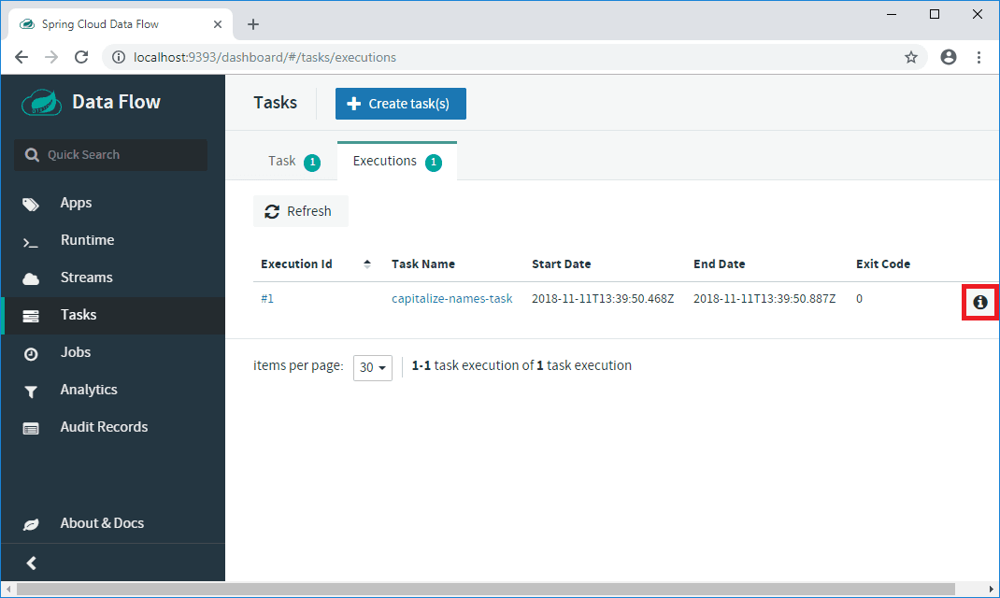

Click on the `Job Execution Ids` identifier to see detailed information on the batch job that was executed.

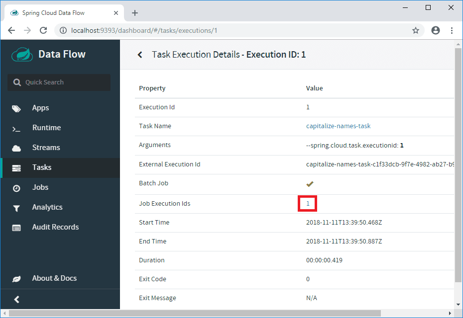

A new page opens that shows us the details on the Spring Batch `capitalizeNamesJob` job. We can even see the status and information on the step that was executed.

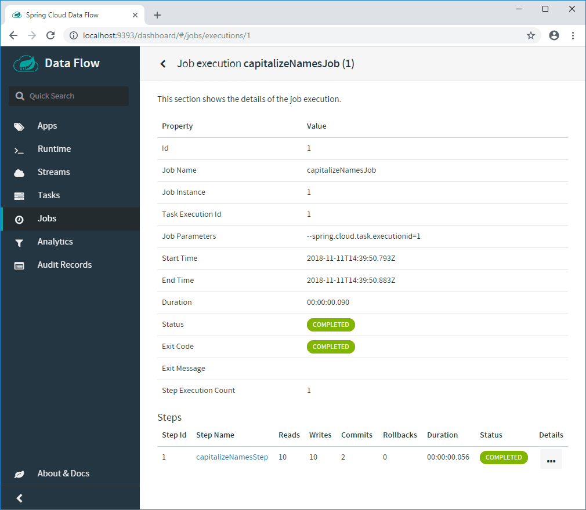

That's it, we successfully used a Spring Batch Admin UI to launch a Spring Batch job!

> Note that you can also consult the log files of the executed batch job. Check the console output of the Spring Cloud Server for the location of the log files.

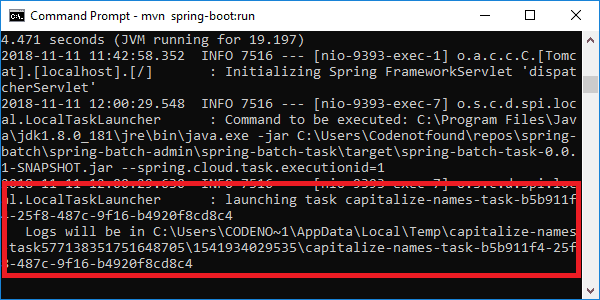


If you would like to run the above code sample you can get the [full source code on GitHub](https://github.com/code-not-found/spring-batch/tree/master/spring-batch-admin).


In this tutorial, we illustrated an end-to-end scenario in which the Spring Cloud Data Flow user interface was used to launch and monitor a Spring Batch job.

I hope you enjoyed this post.

Leave a comment if you did.

Thanks!
