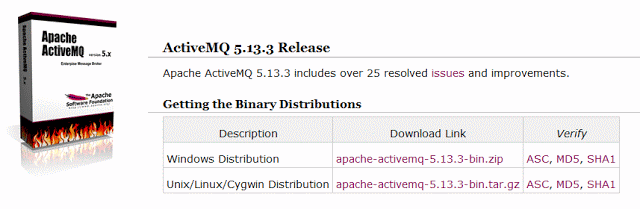
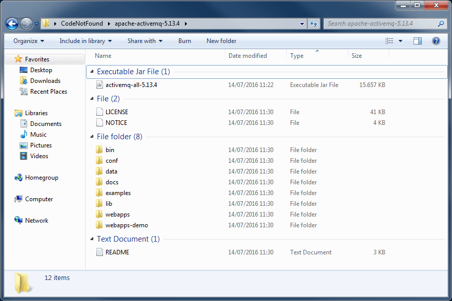
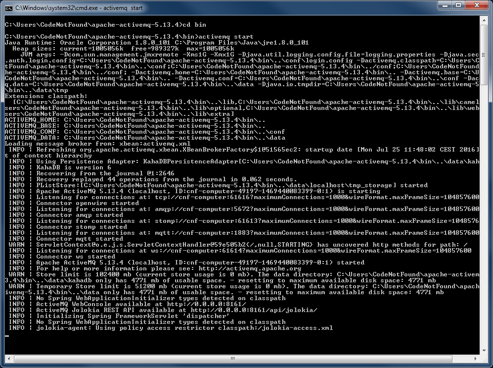
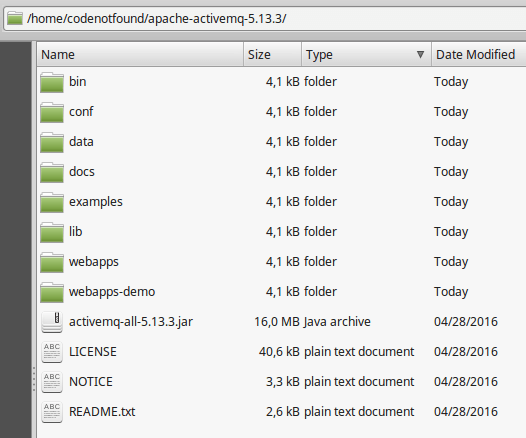
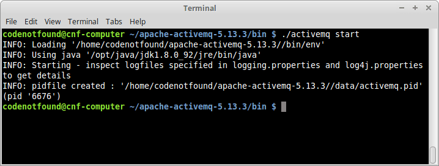
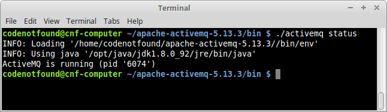
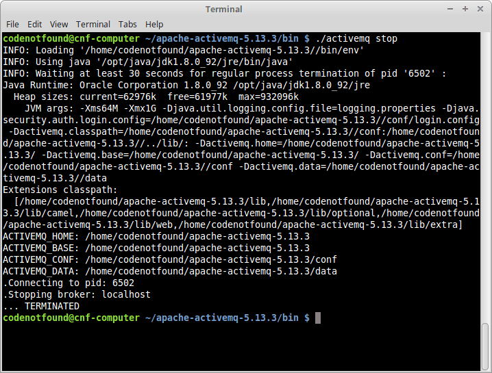
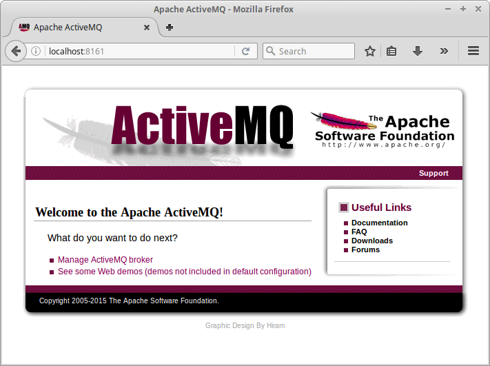
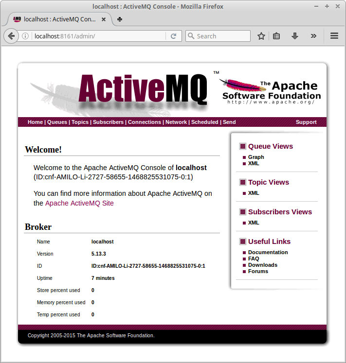
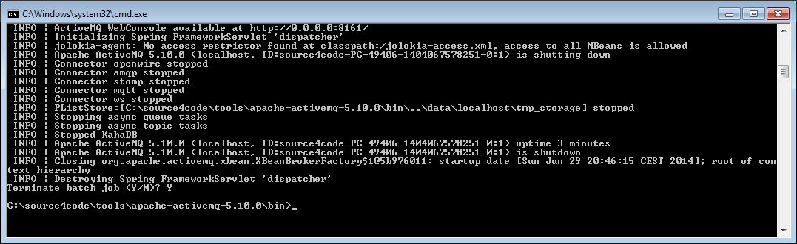

[Apache ActiveMQ](http://activemq.apache.org/) is an **open source message broker** written in Java that offers JMS, REST and WebSocket interfaces. It supports protocols like AMQP, MQTT, OpenWire, and STOMP that can be used by applications in different languages.

Following tutorial details how to install ActiveMQ on Windows or Unix and in addition shows how to perform a start/stop of the installed instance.

 First thing to do is to download the ActiveMQ binaries. Go the the [ActiveMQ download page](http://activemq.apache.org/download.html) and click on the latest stable release link in the `Latest Releases` section. Then in the `Getting the Binary Distributions` section click on the download link for your operating system. At the time of writing the latest stable release was `apache-activemq-5.13.3`.



## Install ActiveMQ on Windows

Extract the Windows binaries archive that was downloaded in the previous step. The extracted root directory should contain a number of files and subdirectories as shown below. From now on we will refer to this directory as: `[activemq_win_install_dir]`.



Open a command prompt and navigate to `[activemq_win_install_dir]`. Change to the `bin` subdirectory and execute the following command to start ActiveMQ:

``` bash
activemq start
```

By default ActiveMQ will generate a number of log statements at start-up as shown below:



One of the latest log entries will mention `ActiveMQ WebConsole available at http://0.0.0.0:8161/`. This indicates that ActiveMQ was successfully started.

## Install ActiveMQ on Unix

Extract the Unix binaries archive downloaded in the first step. The extracted root directory should contain a number of files and subdirectories as shown below. From now on we will refer to this directory as: `[activemq_unix_install_dir]`.



Open a terminal and navigate to `[activemq_unix_install_dir]`. Change to the `bin` subdirectory and execute the following command to start ActiveMQ as a foreground process:

``` bash
./activemq console
```

The ActiveMQ broker can also be started as a background process (note that the corresponding process identifier is stored in the `[activemq_unix_install_dir]/data` directory for future reference). In order to achieve this, execute the following command instead of the above (hit `CTRL+C` first if you already started using a foreground process).

``` bash
./activemq start
```



Once started as a background process there are a number of additional commands we can run to manage the running broker instance. For example, execute the following to see if ActiveMQ is still running:

``` bash
./activemq status
```



The ActiveMQ web site contains a [complete overview of the available Unix commands](http://activemq.apache.org/unix-shell-script.html#UnixShellScript-Functionaloverview). In order to stop the background process, use the below command, but for now, leave the broker running as we will first explore the web console.

``` bash
./activemq stop
```



Note that if you would like ActiveMQ to start automatically at system startup you would need to [run the ActiveMQ broker as a Unix daemon process](http://activemq.apache.org/unix-shell-script.html#UnixShellScript-Runningactivemqasaunixdaemon).

## ActiveMQ WebConsole

The ActiveMQ Web Console is a web-based administration tool for working with ActiveMQ. The console can be accessed by entering the following URL in a web browser: [http://localhost:8161/](http://localhost:8161/). If ActiveMQ is up and running and installed successfully, following welcome page should be displayed:



Click on the `Manage ActiveMQ broker` link and enter following default credentials: User name="`admin`" and Password="`admin`". A home page will be displayed that shows some basic statistics on the ActiveMQ broker. In addition it contains a number of menus that allow you to explore the different configuration items (queues, topics, connections, ...) of the broker.



Let's finish this tutorial by stopping the running ActiveMQ instance. Switch back to the console in which ActiveMQ was started and press `CTRL+C` (note that if ActiveMQ was started as a background process, the stop command needs to be run instead). If needed type `Y` when prompted to `Terminate batch job` followed by `ENTER`. The console will return to the prompt as shown below and ActiveMQ is stopped.



This concludes setting up and configuring Apache ActiveMQ. If you found this post helpful or have any questions or remarks, please leave a comment below.
