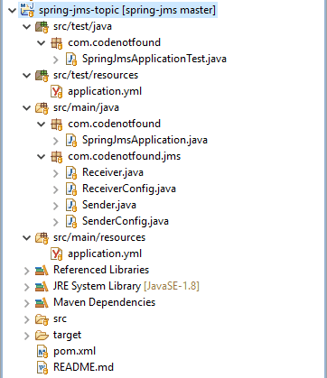

This code sample will show you how to send a JMS message to a topic.

So if you want a to know how to **publish/subscribe** with [Spring JMS](https://docs.spring.io/spring/docs/5.1.7.RELEASE/spring-framework-reference/integration.html#jms).

Keep reading…


If you want to learn more about Spring JMS - head on over to the [Spring JMS tutorials]() page.


## What is a Topic?

A [JMS topic](http://activemq.apache.org/how-does-a-queue-compare-to-a-topic.html) is a destination that delivers messages to multiple subscribers.

It implements publish and subscribe semantics. When you publish a message **it goes to all the subscribers** who are interested.

Let's build an example where we send a JMS message to a topic using Spring JMS. On the topic, we will register two subscribers who will each receive the message.

We start from a previous [Spring JMS sample application]().

## General Project Overview

We will use the following tools/frameworks:

* Spring JMS 5.1
* Spring Boot 2.1
* ActiveMQ 5.15
* Maven 3.6

Our project has the following directory structure:



## Publishing Messages to a JMS Topic

Spring JMS components distinguish between [two types of JMS domains](https://docs.spring.io/spring/docs/current/spring-framework-reference/integration.html#jms-destinations):

1. A point-to-point domain that uses queues
2. A publish-subscribe domain that uses topics

This means that when you [use the JmsTemplate to send JMS messages](), it can send to queues or topics but not both at the same time!

The boolean property `pubSubDomain` is used to configure the `JmsTemplate` with knowledge of what JMS domain is being used. By default, the value of this property is `false`. This indicates that`queues` are used.

As we want to send a message to a topic we need to update our `SenderConfig` configuration. Use the `setPubSubDomain()` method on the `JmsTemplate` to set `pubSubDomain` to `true`.

> If you are using the [autoconfigured JmsTemplate]() you can change the JMS domain by setting the `spring.jms.pub-sub-domain` [application property (# JMS section)](https://docs.spring.io/spring-boot/docs/current/reference/html/common-application-properties.html).

``` java
package com.codenotfound.jms;

import org.apache.activemq.ActiveMQConnectionFactory;
import org.springframework.beans.factory.annotation.Value;
import org.springframework.context.annotation.Bean;
import org.springframework.context.annotation.Configuration;
import org.springframework.jms.connection.CachingConnectionFactory;
import org.springframework.jms.core.JmsTemplate;

@Configuration
public class SenderConfig {

  @Value("${activemq.broker-url}")
  private String brokerUrl;

  @Bean
  public ActiveMQConnectionFactory senderActiveMQConnectionFactory() {
    ActiveMQConnectionFactory activeMQConnectionFactory =
        new ActiveMQConnectionFactory();
    activeMQConnectionFactory.setBrokerURL(brokerUrl);

    return activeMQConnectionFactory;
  }

  @Bean
  public CachingConnectionFactory cachingConnectionFactory() {
    return new CachingConnectionFactory(
        senderActiveMQConnectionFactory());
  }

  @Bean
  public JmsTemplate jmsTemplate() {
    JmsTemplate jmsTemplate =
        new JmsTemplate(cachingConnectionFactory());
    jmsTemplate.setPubSubDomain(true);

    return jmsTemplate;
  }
}
```

## Subscribing to messages from a JMS Topic

Also on the `ListenerContainer`, we need to indicate if we want to use queues or topics. You can configure this on the container or the factory used to create the container.

In this example, we use the `setPubSubDomain()` method on the `ListenerContainerFactory` to specify that we want to use topics.

``` java
package com.codenotfound.jms;

import org.apache.activemq.ActiveMQConnectionFactory;
import org.springframework.beans.factory.annotation.Value;
import org.springframework.context.annotation.Bean;
import org.springframework.context.annotation.Configuration;
import org.springframework.jms.annotation.EnableJms;
import org.springframework.jms.config.DefaultJmsListenerContainerFactory;

@Configuration
@EnableJms
public class ReceiverConfig {

  @Value("${activemq.broker-url}")
  private String brokerUrl;

  @Bean
  public ActiveMQConnectionFactory receiverActiveMQConnectionFactory() {
    ActiveMQConnectionFactory activeMQConnectionFactory =
        new ActiveMQConnectionFactory();
    activeMQConnectionFactory.setBrokerURL(brokerUrl);

    return activeMQConnectionFactory;
  }

  @Bean
  public DefaultJmsListenerContainerFactory jmsListenerContainerFactory() {
    DefaultJmsListenerContainerFactory factory =
        new DefaultJmsListenerContainerFactory();
    factory
        .setConnectionFactory(receiverActiveMQConnectionFactory());
    factory.setPubSubDomain(true);

    return factory;
  }
}
```

In the `Receiver` class we add an extra `receive()` method to demonstrate that we can receive the same message on different listeners.

Annotate the additional method with `@JmsListener` and specify the same destination. Spring will now create a dedicated subscription for each listener.

``` java
package com.codenotfound.jms;

import java.util.concurrent.CountDownLatch;
import org.slf4j.Logger;
import org.slf4j.LoggerFactory;
import org.springframework.jms.annotation.JmsListener;
import org.springframework.stereotype.Component;

@Component
public class Receiver {

  private static final Logger LOGGER =
      LoggerFactory.getLogger(Receiver.class);

  private CountDownLatch latch = new CountDownLatch(2);

  public CountDownLatch getLatch() {
    return latch;
  }

  @JmsListener(destination = "${destination.topic}")
  public void receive1(String message) {
    LOGGER.info("'subscriber1' received message='{}'", message);
    latch.countDown();
  }

  @JmsListener(destination = "${destination.topic}")
  public void receive2(String message) {
    LOGGER.info("'subscriber2' received message='{}'", message);
    latch.countDown();
  }
}
```

## Testing the JMS Topic

To test the setup we simply reuse the same test case.

In the `Receiver` we increased the value of the `CountDownLatch` to `2`. This means that if we send one message it should be received in both our subscribers.

``` java
package com.codenotfound;

import static org.assertj.core.api.Assertions.assertThat;
import java.util.concurrent.TimeUnit;
import org.junit.Test;
import org.junit.runner.RunWith;
import org.springframework.beans.factory.annotation.Autowired;
import org.springframework.boot.test.context.SpringBootTest;
import org.springframework.test.context.junit4.SpringRunner;
import com.codenotfound.jms.Receiver;
import com.codenotfound.jms.Sender;

@RunWith(SpringRunner.class)
@SpringBootTest
public class SpringJmsApplicationTest {

  @Autowired
  private Sender sender;

  @Autowired
  private Receiver receiver;

  @Test
  public void testReceive() throws Exception {
    sender.send("order-001");

    receiver.getLatch().await(10000, TimeUnit.MILLISECONDS);
    assertThat(receiver.getLatch().getCount()).isEqualTo(0);
  }
}
```

Open a command prompt in the root directory and fire up the test case.

``` bash
mvn test
```

In the logs, we see that the same message is received by both subscribers.

``` bash
 .   ____          _            __ _ _
/\\ / ___'_ __ _ _(_)_ __  __ _ \ \ \ \
( ( )\___ | '_ | '_| | '_ \/ _` | \ \ \ \
\\/  ___)| |_)| | | | | || (_| |  ) ) ) )
'  |____| .__|_| |_|_| |_\__, | / / / /
=========|_|==============|___/=/_/_/_/
:: Spring Boot ::        (v2.1.5.RELEASE)

2019-05-30 17:41:05.154  INFO 13300 --- [           main] c.codenotfound.SpringJmsApplicationTest  : Starting SpringJmsApplicationTest on DESKTOP-2RB3C1U with PID 13300 (started by Codenotfound in C:\Users\Codenotfound\repos\spring-jms\spring-jms-topic)
2019-05-30 17:41:05.156  INFO 13300 --- [           main] c.codenotfound.SpringJmsApplicationTest  : No active profile set, falling back to default profiles: default
2019-05-30 17:41:06.573  INFO 13300 --- [           main] o.apache.activemq.broker.BrokerService   : Using Persistence Adapter: MemoryPersistenceAdapter
2019-05-30 17:41:06.632  INFO 13300 --- [  JMX connector] o.a.a.broker.jmx.ManagementContext       : JMX consoles can connect to service:jmx:rmi:///jndi/rmi://localhost:1099/jmxrmi
2019-05-30 17:41:06.734  INFO 13300 --- [           main] o.apache.activemq.broker.BrokerService   : Apache ActiveMQ 5.15.9 (embedded-broker, ID:DESKTOP-2RB3C1U-59830-1559230866604-0:1) is starting
2019-05-30 17:41:06.741  INFO 13300 --- [           main] o.apache.activemq.broker.BrokerService   : Apache ActiveMQ 5.15.9 (embedded-broker, ID:DESKTOP-2RB3C1U-59830-1559230866604-0:1) started
2019-05-30 17:41:06.741  INFO 13300 --- [           main] o.apache.activemq.broker.BrokerService   : For help or more information please see: http://activemq.apache.org
2019-05-30 17:41:06.780  INFO 13300 --- [           main] o.a.activemq.broker.TransportConnector   : Connector vm://embedded-broker started
2019-05-30 17:41:06.836  INFO 13300 --- [           main] c.codenotfound.SpringJmsApplicationTest  : Started SpringJmsApplicationTest in 2.088 seconds (JVM running for 3.197)
2019-05-30 17:41:07.172  INFO 13300 --- [           main] com.codenotfound.jms.Sender              : sending message='order-001' to destination='topic.t'
2019-05-30 17:41:07.206  INFO 13300 --- [enerContainer-1] com.codenotfound.jms.Receiver            : 'subscriber2' received message='order-001'
2019-05-30 17:41:07.206  INFO 13300 --- [enerContainer-1] com.codenotfound.jms.Receiver            : 'subscriber1' received message='order-001'
[INFO] Tests run: 1, Failures: 0, Errors: 0, Skipped: 0, Time elapsed: 3.213 s - in com.codenotfound.SpringJmsApplicationTest
2019-05-30 17:41:07.291  INFO 13300 --- [MQ ShutdownHook] o.apache.activemq.broker.BrokerService   : Apache ActiveMQ 5.15.9 (embedded-broker, ID:DESKTOP-2RB3C1U-59830-1559230866604-0:1) is shutting down
2019-05-30 17:41:07.305  INFO 13300 --- [MQ ShutdownHook] o.a.activemq.broker.TransportConnector   : Connector vm://embedded-broker stopped
2019-05-30 17:41:07.318  INFO 13300 --- [MQ ShutdownHook] o.apache.activemq.broker.BrokerService   : Apache ActiveMQ 5.15.9 (embedded-broker, ID:DESKTOP-2RB3C1U-59830-1559230866604-0:1) uptime 0.998 seconds
2019-05-30 17:41:07.318  INFO 13300 --- [MQ ShutdownHook] o.apache.activemq.broker.BrokerService   : Apache ActiveMQ 5.15.9 (embedded-broker, ID:DESKTOP-2RB3C1U-59830-1559230866604-0:1) is shutdown
[INFO]
[INFO] Results:
[INFO]
[INFO] Tests run: 1, Failures: 0, Errors: 0, Skipped: 0
[INFO]
[INFO] ------------------------------------------------------------------------
[INFO] BUILD SUCCESS
[INFO] ------------------------------------------------------------------------
[INFO] Total time:  8.267 s
[INFO] Finished at: 2019-05-30T17:41:07+02:00
[INFO] ------------------------------------------------------------------------
```


If you would like to run the above code sample you can get the [full source code on GitHub](https://github.com/code-not-found/spring-jms/tree/master/spring-jms-topic).


In this topic subscriber example, you learned how to configure Spring JMS so it send/receive a message to/from a topic.

Drop a line if you have any questions.

Or just to let me know you found this post useful.

Thanks!
