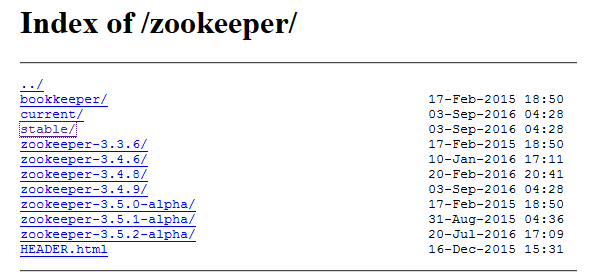
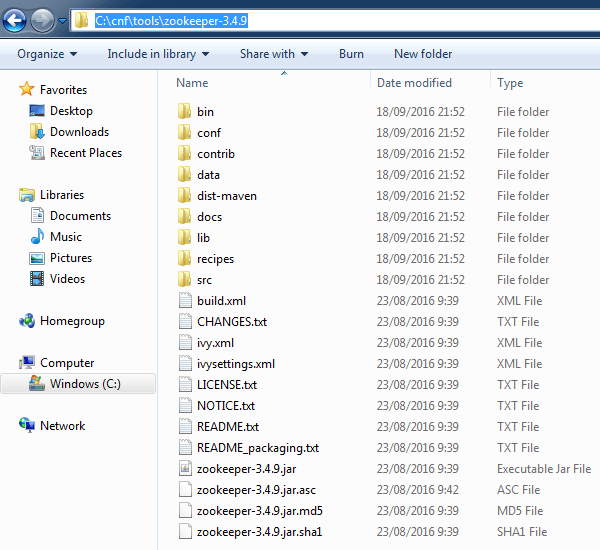
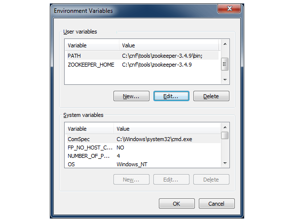
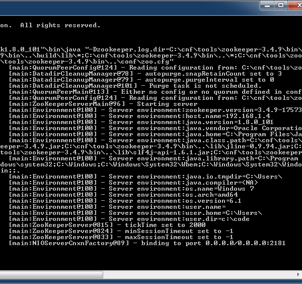
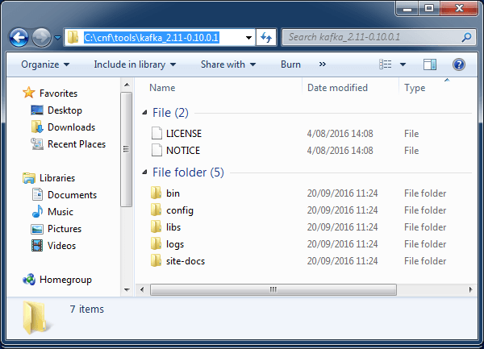
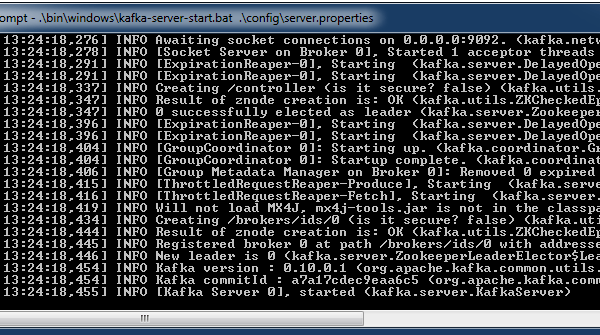

[Apache Kafka](http://kafka.apache.org/) is an open-source message broker project developed by the Apache Software Foundation written in Scala. The project aims to provide a high-throughput, low-latency platform capable of handling hundreds of megabytes of reads and writes per second from thousands of clients.

Following tutorial shows how to download and install Apache Kafka on Windows and perform a start/stop of the installed instance.


If you want to learn more about how to connect to Apache Kafka - head on over to the [Spring Kafka tutorials page](/spring-kafka-tutorials).


It is important to note that Kafka will not work without [Apache ZooKeeper](https://zookeeper.apache.org/), which is essentially a distributed hierarchical key-value store. Like Kafka, ZooKeeper is a software project of the Apache Software Foundation. Kafka uses ZooKeeper for [electing a controller, cluster membership, topic configuration, quotas and ACLs](https://www.quora.com/What-is-the-actual-role-of-ZooKeeper-in-Kafka).

Note that for running Kafka and ZooKeeper, a [Java Runtime Environment needs to be installed and configured](http://www.oracle.com/technetwork/java/javase/downloads/index.html) (with JAVA_HOME correctly set). If you are not sure if Java is installed on your machine, open a console and execute the following command:

``` bash
java -version
```

## Download and Setup ZooKeeper


Head over to the [Apache ZooKeeper download](https://zookeeper.apache.org/releases.html) page and and click on the download link in the `Download` section. This will redirect to a mirror site, click on the suggested mirror link and from the `index` select the `stable` directory as shown below. Download the gzipped TAR file.

At the moment of writing this tutorial, the latest stable release was [zookeeper-3.4.9](http://www-us.apache.org/dist/zookeeper/stable/).



Extract the archive that was downloaded in the previous step. The extracted root directory should contain a number of files and subdirectories as shown below. From now on we will refer to this directory as: `[zookeeper_install_dir]`.



Follow the below steps in order to setup a minimal working ZooKeeper configuration:

1. Navigate to the ZooKeeper configuration directory located under `[zookeeper_install_dir]/conf`.
2. Copy the file `zoo_sample.cfg` and rename to `zoo.cfg`.
3. Open the newly created `zoo.cfg` in a text editor.
4. Find the `dataDir=/tmp/zookeeper` entry and change it to `dataDir=C:/temp/zookeeper`. Make sure to use forward slashes in the path name!
5. Next, set the `ZOOKEEPER_HOME` and corresponding `PATH` environment variables. Click the Windows Start button and then type `env` without quotes in the search box. Select the `Edit environment variables for your account` entry, this will open the environment variables window.
    * Add a new variable using `ZOOKEEPER_HOME` as name and `[zookeeper_install_dir]` as value. Click `OK` to to save.
    * Edit (or add if it doesn't exist) the variable with name `PATH` and add `;%ZOOKEEPER_HOME%\bin` to the end of the value. Click `OK` to save.



Now that ZooKeeper is configured, let's go ahead and start it. Open a command prompt by clicking on the Windows Start button and typing `cmd` followed by pressing `ENTER`. Use the following command to startup ZooKeeper:

``` bash
zkserver
```

By default, ZooKeeper will generate a number of log statements at start-up as shown below. One of the log entries will mention `binding to port 0.0.0.0/0.0.0.0:2181`. This indicates that ZooKeeper was successfully started.



## Download and Setup Kafka

Open the [Kafka releases page](http://kafka.apache.org/downloads.html) which contains the latest binary downloads. Kafka is written in [Scala](https://www.scala-lang.org/), which is a programming language that has full support for functional programming. Scala source code is intended to be compiled to Java bytecode so that the resulting executable code runs on a Java virtual machine.

You'll notice that the release page contains multiple versions of Scala for a specific Kafka release. This only matters if you are using Scala yourself. If not the case, go ahead and choose the highest supported version.

At the moment of writing the latest stable release was [kafka_2.11-0.10.0.1.tgz](https://www.apache.org/dyn/closer.cgi?path=/kafka/0.10.0.1/kafka_2.11-0.10.0.1.tgz).

Extract the gzipped TAR file, downloaded in the previous step. The extracted root directory should contain a number of files and subdirectories as shown below. From now on we will refer to this directory as: `[kafka_install_dir]`.

> Make sure to extract to a directory path that does not contain spaces.



Follow the below steps in order to setup a minimal working Kakfa configuration:

1. Navigate to the Kafka configuration directory located under `[kafka_install_dir]/config`.
2. Edit the file `server.properties` in a text editor.
3. Find the `log.dirs=/tmp/kafka-logs` entry and change it to `log.dirs=C:/temp/kafka-logs`. Make sure to use forward slashes in the path name!

> Make sure Zookeeper is up and running before starting Kafka.

In order to start Kafka, open a command prompt by clicking on the Windows Start button and typing `cmd` followed by pressing `ENTER`. Navigate to the `[kafka_install_dir]`. Use following command to startup Kafka:

``` bash
.\bin\windows\kafka-server-start.bat .\config\server.properties
```

When starting, Kafka will generate a number of log statements as shown below. The last log entries will mention `[Kafka Server 01], started`. This means that a Kafka instance is up and running.



This concludes installing ZooKeeper and Kafka on Windows.

If you found this post helpful or have any questions or remarks, please leave a comment.
