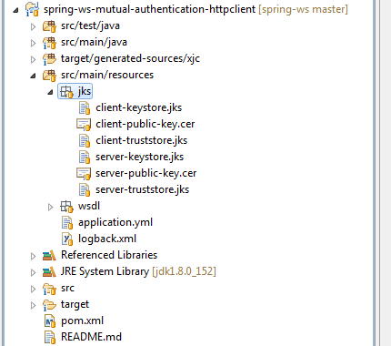

[Mutual authentication or two-way authentication](https://en.wikipedia.org/wiki/Mutual_authentication) refers to **two parties authenticating each other** at the same time. In other words, the client must prove its identity to the server, and the server must prove its identity to the client before any traffic is sent over the client-to-server connection.

This example shows how to configure both client and server so that mutual authentication using certificates is enabled on a web service using Spring-WS, Spring Boot, and Maven.


If you want to learn more about Spring WS - head on over to the [Spring WS tutorials](/spring-ws-tutorials) page.


## General Project Setup

Tools used:

* Spring-WS 2.4
* HttpClient 4.5
* Spring Boot 1.5
* Maven 3.5

The setup of the project is based on a previous [Spring WS HTTPS example](/spring-ws-https-client-server-example.html) in which we configured the server authentication part. We will extend this setup so that the client also authenticates itself towards the server.

We will again use the `HttpComponentsMessageSender` implementation in below example as it contains more advanced and easy-to-use functionality. On GitHub, however, we have also added a [mutual authentication example that uses the HttpsUrlConnectionMessageSender implementation](https://github.com/code-not-found/spring-ws/tree/master/spring-ws-mutual-authentication) in case a dependency on the `HttpClient` is not desired.

[Keytool](http://docs.oracle.com/javase/6/docs/technotes/tools/windows/keytool.html) is used to generate the different [Java KeyStores](https://en.wikipedia.org/wiki/Keystore) (JKS) which contain the key pairs and public certificates for both client and server.

Subsequently execute the following three commands in order to generate the `server-keystore.jks` and `client-truststore.jks` needed to configure the server and client.

> Note that we are specifying a DNS subject alternative name entry (`-ext san=dns:localhost`) matching the `localhost` hostname on the first keytool command. This way we do not need to override the `HostnameVerifier` like we did in the [HTTPS client example](/spring-ws-https-client-server-example.html).

``` bash
keytool -genkeypair -alias server-keypair -keyalg RSA -keysize 2048 -validity 3650 -dname "CN=server,O=codenotfound.com" -keypass server-key-p455w0rd -keystore server-keystore.jks -storepass server-keystore-p455w0rd -ext san=dns:localhost
```

``` bash
keytool -exportcert -alias server-keypair -file server-public-key.cer -keystore server-keystore.jks -storepass server-keystore-p455w0rd
```

``` bash
keytool -importcert -keystore client-truststore.jks -alias server-public-key -file server-public-key.cer -storepass client-truststore-p455w0rd -noprompt
```

Next execute following three commands to generate the `client-keystore.jks` and `server-truststore.jks` that will be used to setup the client and server.

``` bash
keytool -genkeypair -alias client-keypair -keyalg RSA -keysize 2048 -validity 3650 -dname "CN=client,O=codenotfound.com" -keypass client-key-p455w0rd -keystore client-keystore.jks -storepass client-keystore-p455w0rd
```

``` bash
keytool -exportcert -alias client-keypair -file client-public-key.cer -keystore client-keystore.jks -storepass client-keystore-p455w0rd
```

``` bash
keytool -importcert -keystore server-truststore.jks -alias client-public-key -file client-public-key.cer -storepass server-truststore-p455w0rd -noprompt
```

Now (if needed) move the created JKS files into `src/main/resources`. The result should be as shown below:



If you would like to visualize the content of the above-generated artifacts you can use a tool like [Portecle](http://portecle.sourceforge.net/) which is a Java-based GUI for managing keystores.

## Setup the Client Keystore and Truststore

The details on the keystore and trustore are injected in the `ClientConfig` class using the `@Value` annotation. The values are defined in the `application.yml` properties file which is located under `src/main/resources`.

``` yml
client:
  default-uri: https://localhost:9443/codenotfound/ws/ticketagent
  ssl:
    key-store: classpath:jks/client-keystore.jks
    key-store-password: client-keystore-p455w0rd
    key-password: client-key-p455w0rd
    trust-store: classpath:jks/client-truststore.jks
    trust-store-password: client-truststore-p455w0rd
```

As the client needs to authenticate itself, a keystore needs to be configured that contains the private/public key pair of the client that was generated in the previous section.

Similar to the trustore setup, we use a `loadKeyMaterial()` method to load the keystore when building the `SSLContext`. The JKS file and password in addition to the password of the private key are specified.

``` java
package com.codenotfound.ws.client;

import javax.net.ssl.SSLContext;

import org.apache.http.client.HttpClient;
import org.apache.http.conn.ssl.NoopHostnameVerifier;
import org.apache.http.conn.ssl.SSLConnectionSocketFactory;
import org.apache.http.impl.client.HttpClientBuilder;
import org.apache.http.ssl.SSLContextBuilder;
import org.springframework.beans.factory.annotation.Value;
import org.springframework.context.annotation.Bean;
import org.springframework.context.annotation.Configuration;
import org.springframework.core.io.Resource;
import org.springframework.oxm.jaxb.Jaxb2Marshaller;
import org.springframework.ws.client.core.WebServiceTemplate;
import org.springframework.ws.transport.http.HttpComponentsMessageSender;
import org.springframework.ws.transport.http.HttpComponentsMessageSender.RemoveSoapHeadersInterceptor;

@Configuration
public class ClientConfig {

  @Value("${client.default-uri}")
  private String defaultUri;

  @Value("${client.ssl.trust-store}")
  private Resource trustStore;

  @Value("${client.ssl.trust-store-password}")
  private String trustStorePassword;

  @Value("${client.ssl.key-store}")
  private Resource keyStore;

  @Value("${client.ssl.key-store-password}")
  private String keyStorePassword;

  @Value("${client.ssl.key-password}")
  private String keyPassword;

  @Bean
  Jaxb2Marshaller jaxb2Marshaller() {
    Jaxb2Marshaller jaxb2Marshaller = new Jaxb2Marshaller();
    jaxb2Marshaller.setContextPath("org.example.ticketagent");

    return jaxb2Marshaller;
  }

  @Bean
  public WebServiceTemplate webServiceTemplate() throws Exception {
    WebServiceTemplate webServiceTemplate = new WebServiceTemplate();
    webServiceTemplate.setMarshaller(jaxb2Marshaller());
    webServiceTemplate.setUnmarshaller(jaxb2Marshaller());
    webServiceTemplate.setDefaultUri(defaultUri);
    webServiceTemplate.setMessageSender(httpComponentsMessageSender());

    return webServiceTemplate;
  }

  @Bean
  public HttpComponentsMessageSender httpComponentsMessageSender() throws Exception {
    HttpComponentsMessageSender httpComponentsMessageSender = new HttpComponentsMessageSender();
    httpComponentsMessageSender.setHttpClient(httpClient());

    return httpComponentsMessageSender;
  }

  public HttpClient httpClient() throws Exception {
    return HttpClientBuilder.create().setSSLSocketFactory(sslConnectionSocketFactory())
        .addInterceptorFirst(new RemoveSoapHeadersInterceptor()).build();
  }

  public SSLConnectionSocketFactory sslConnectionSocketFactory() throws Exception {
    // NoopHostnameVerifier essentially turns hostname verification off as otherwise following error
    // is thrown: java.security.cert.CertificateException: No name matching localhost found
    return new SSLConnectionSocketFactory(sslContext(), NoopHostnameVerifier.INSTANCE);
  }

  public SSLContext sslContext() throws Exception {
    return SSLContextBuilder.create()
        .loadKeyMaterial(keyStore.getFile(), keyStorePassword.toCharArray(),
            keyPassword.toCharArray())
        .loadTrustMaterial(trustStore.getFile(), trustStorePassword.toCharArray()).build();
  }
}
```

## Setup the Server Keystore and Truststore

In addition to the setup of the server authentication we need to specify some additional [Spring Boot web properties](https://docs.spring.io/spring-boot/docs/current/reference/html/common-application-properties.html) in the application properties file in order to trust the client that will connect to the exposed ticketing web service.

The `'client-auth'` property specifies whether client authentication is wanted ("want") or needed ("need"). In this example we set it to `'need'` as we want to assure two-way SSL is established. The server's truststore and the corresponding password are also configured so that the public certificate of the client is trusted.

``` yml
server:
  port: 9443
  ssl:
    client-auth: need
    key-store: classpath:jks/server-keystore.jks
    key-store-password: server-keystore-p455w0rd
    key-alias: server-keypair
    key-password: server-key-p455w0rd
    trust-store: classpath:jks/server-truststore.jks
    trust-store-password: server-truststore-p455w0rd
```

## Testing Spring WS Two Way TLS (SSL)

In order to test the above setup, we can trigger the existing `SpringWsApplicationTests` unit test case by executing following Maven command.

``` bash
mvn test
```

This triggers a test run which validates that mutual authentication between client and server is successfully achieved.

``` bash
  .   ____          _            __ _ _
 /\\ / ___'_ __ _ _(_)_ __  __ _ \ \ \ \
( ( )\___ | '_ | '_| | '_ \/ _` | \ \ \ \
 \\/  ___)| |_)| | | | | || (_| |  ) ) ) )
  '  |____| .__|_| |_|_| |_\__, | / / / /
 =========|_|==============|___/=/_/_/_/
 :: Spring Boot ::        (v1.5.9.RELEASE)

07:46:17.288 [main] INFO  c.c.ws.SpringWsApplicationTests - Starting SpringWsApplicationTests on cnf-pc with PID 1164 (started by CodeNotFound in c:\code\spring-ws\spring-ws-mutual-authentication)
07:46:17.291 [main] INFO  c.c.ws.SpringWsApplicationTests - No active profile set, falling back to default profiles: default
07:46:20.176 [main] INFO  c.c.ws.SpringWsApplicationTests - Started SpringWsApplicationTests in 3.18 seconds (JVM running for 3.827)
Tests run: 1, Failures: 0, Errors: 0, Skipped: 0, Time elapsed: 3.59 sec - in com.codenotfound.ws.SpringWsApplicationTests

Results :

Tests run: 1, Failures: 0, Errors: 0, Skipped: 0

[INFO] ------------------------------------------------------------------------
[INFO] BUILD SUCCESS
[INFO] ------------------------------------------------------------------------
[INFO] Total time: 6.833 s
[INFO] Finished at: 2017-07-17T07:46:20+02:00
[INFO] Final Memory: 33M/295M
[INFO] ------------------------------------------------------------------------
```


If you would like to run the above code sample you can get the [full source code on GitHub](https://github.com/code-not-found/spring-ws/tree/master/spring-ws-mutual-authentication-httpclient).


In this tutorial, we covered setting up mutual certificate authentication using Spring WS and Spring Boot.

Drop a line below if you encounter some problems or just to say thanks.
