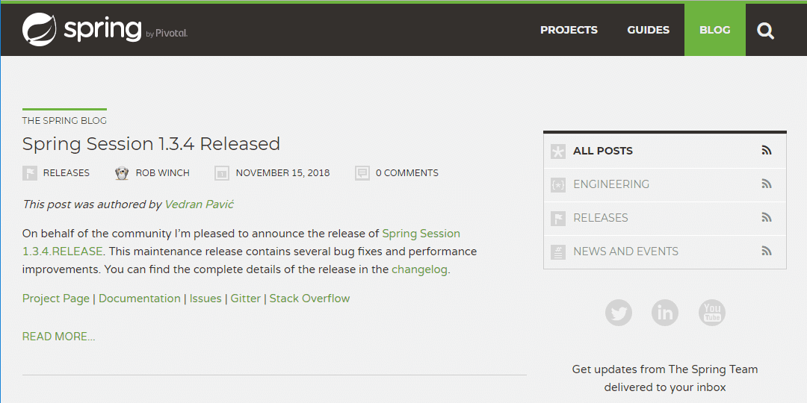
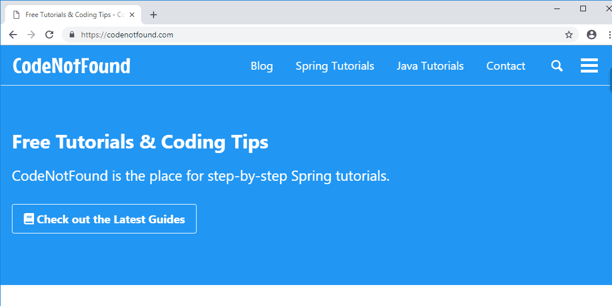
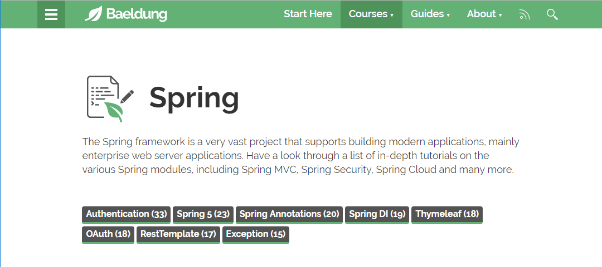
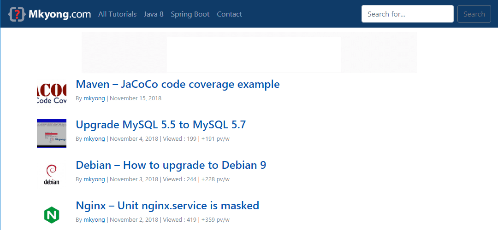
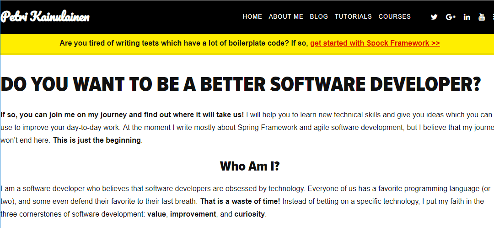

Looking for a list of the best blogs on [Spring](https://spring.io/)?

Then look no further.

As today I'm sharing my favorite resources for learning about the Spring framework.

So without further ado, let's get started…

## 1. [The Spring Blog](https://spring.io/blog)

This one might be an obvious pick as the Spring Team maintains a Spring blog.

It contains the newest releases of the different Spring frameworks. You'll also find several tutorials and detailed how-to guides. As well as announcements and the latest news and events around the Spring community.

Favorite post(s): [This week in Spring posts by Josh Long](https://spring.io/team/joshlong)

## 2. [CodeNotFound](https://codenotfound.com/blog/)

Good news. You already know this one, as you're reading it right now :-). For those that haven't read my posts, I focus on Spring tutorials.

Favorite post: [Spring Kafka - Consumer Producer Example](https://www.codenotfound.com/spring-kafka-consumer-producer-example.html)

## 3. [Baeldung](https://www.baeldung.com/category/spring/)

Eugen Paraschiv started the Baeldung blog back in September 2011. Chances are you have already visited his site as it has a ton of tutorials on Spring.

Favorite post: [Spring Security for a REST API](https://www.baeldung.com/securing-a-restful-web-service-with-spring-security)

## 4. [Mkyong](https://www.mkyong.com/tutorials/spring-boot-tutorials/)

Mkyong has been around for almost 10 years. Yong Mook Kim, aka Mkyong, is the author of the site. The blog has a huge amount of articles. Even though some articles are a bit dated they still provide a good starting point to learn.

Favorite post: [Spring Boot + Hibernate Search example](http://www.mkyong.com/spring-boot/spring-boot-hibernate-search-example/)

## 5. [Spring Framework Guru](https://springframework.guru/blog/)

Spring Framework Guru is run by John Thompson. You'll find lots of detailed Spring tutorials. Not only that but it is the only Spring blog with such an iconic logo.

Favorite post: [Using Logback With Spring Boot](https://springframework.guru/using-logback-spring-boot/)

## 6. [Petri Kainulainen](https://www.petrikainulainen.net/tutorials/)

Petri Kainulainen is a software developer who lives in Tampere, Finland. Lately, he focusses on Java testing although there are still a lot of Spring guides on his site.

Favorite post: [Spring Batch Tutorial: Creating a Custom ItemReader](https://www.petrikainulainen.net/programming/spring-framework/spring-batch-tutorial-creating-a-custom-itemreader/)

This concludes our roundup of Spring blogs.

_Have fun reading!_

Don't see your favorite blog on the list? Then **suggest it in the comments below**.

In order for a blog to be listed, I use the following criteria:

* The blog is mostly about Java/Spring
* Domain Authority > 25 (using the [Link Explorer](https://analytics.moz.com/pro/link-explorer/home) from Moz)
* Has recent activity (at least 10 relevant – Spring – articles in the last 3 months)
* More text than Ads on the page
* Useful (in my view)
